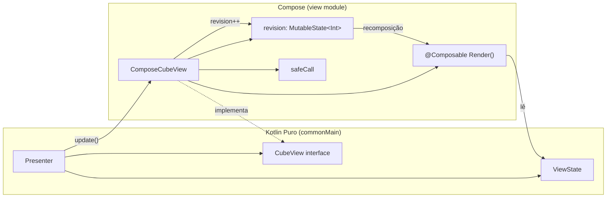
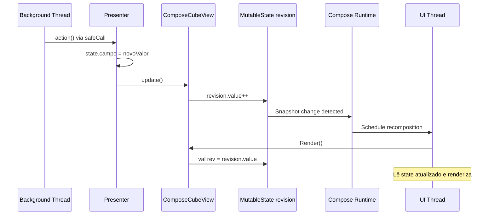
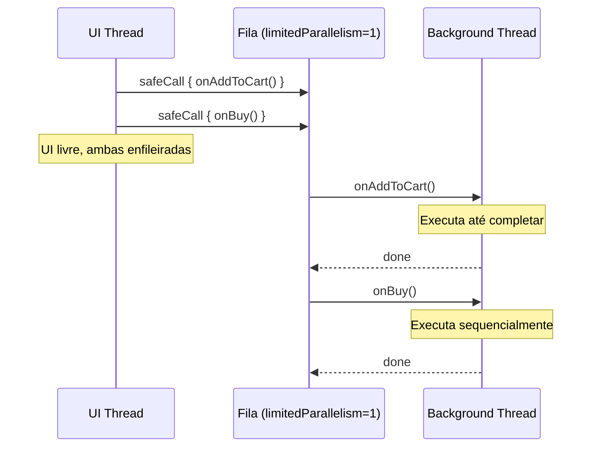
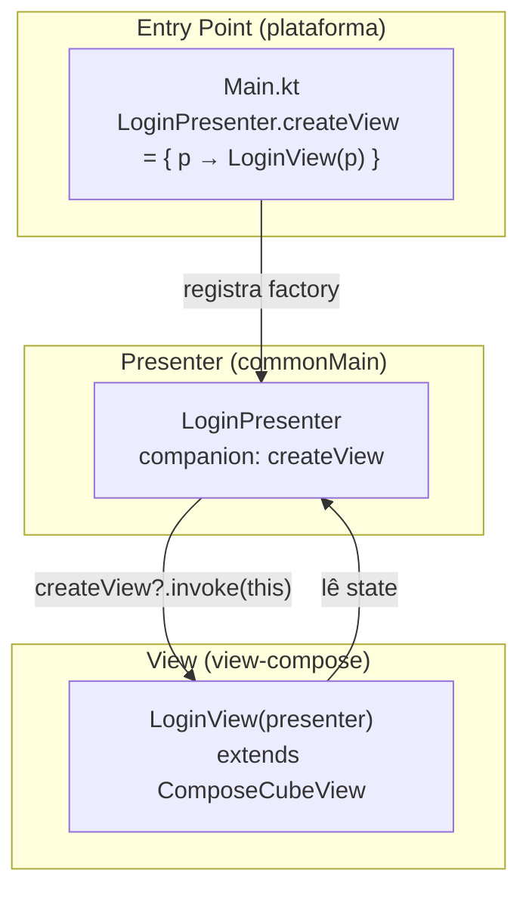
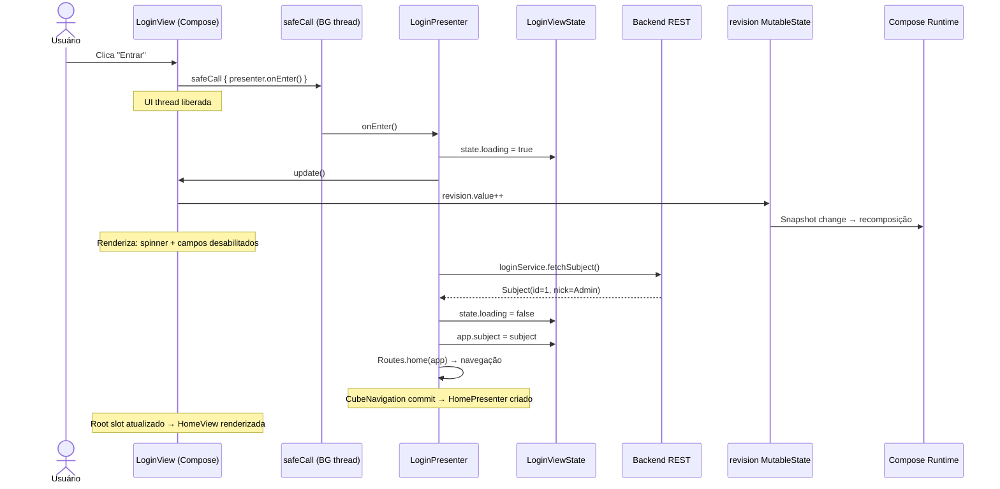
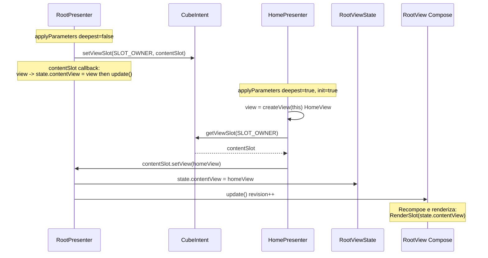
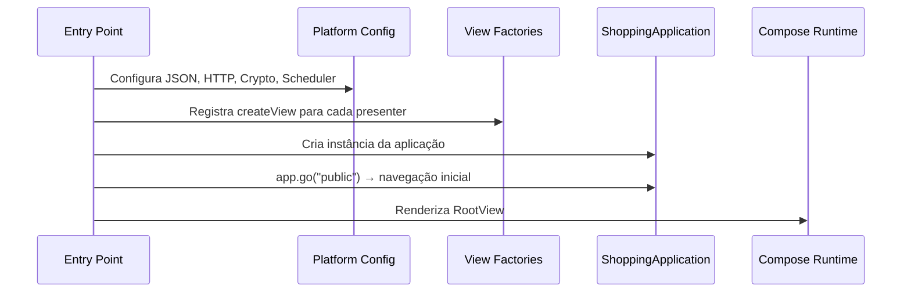
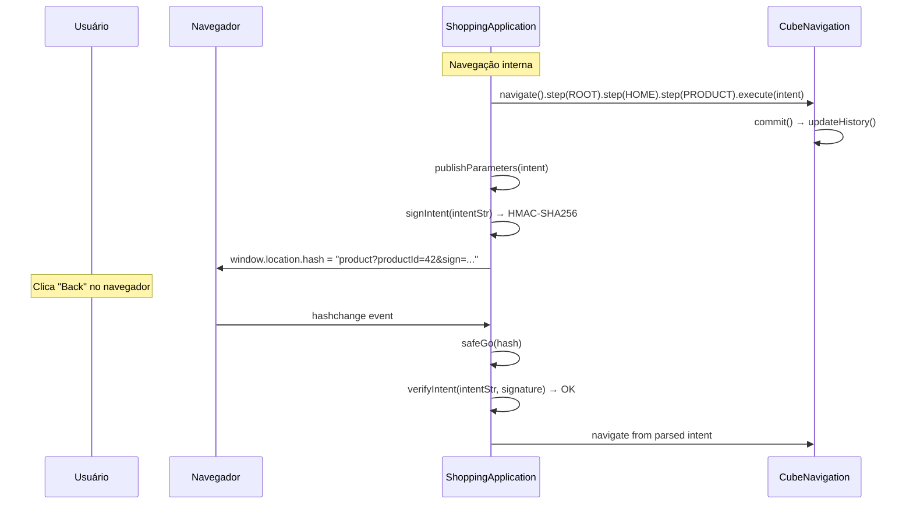
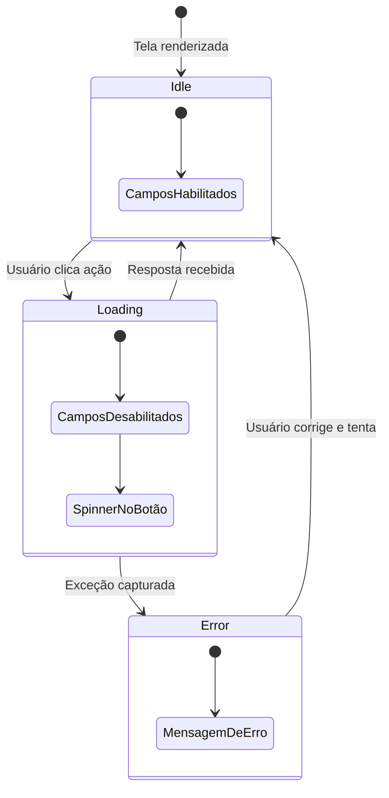

# Arquitetura Cube + Compose — Integração com Compose Multiplatform

## Sumário

- [Visão Geral](#visão-geral)
- [Camada de Ponte — ComposeCubeView](#camada-de-ponte--composecubeview)
  - [Revision Counter](#revision-counter)
  - [safeCall — Execução Assíncrona Serializada](#safecall--execução-assíncrona-serializada)
  - [RenderSlot — Composição de Views](#renderslot--composição-de-views)
- [Registro de View Factories](#registro-de-view-factories)
- [Fluxo Completo: Da Ação ao Pixel](#fluxo-completo-da-ação-ao-pixel)
- [Padrão de Implementação de uma View](#padrão-de-implementação-de-uma-view)
- [Mecanismo de Slots no Compose](#mecanismo-de-slots-no-compose)
- [Inicialização por Plataforma](#inicialização-por-plataforma)
  - [Desktop (JVM)](#desktop-jvm)
  - [Web (wasmJs)](#web-wasmjs)
  - [Android](#android)
  - [iOS](#ios)
- [Deep-Linking e Histórico (Web)](#deep-linking-e-histórico-web)
- [Padrão de Loading](#padrão-de-loading)

---

## Visão Geral

A integração do Cube com Compose Multiplatform é feita por uma **camada de ponte** mínima — a classe `ComposeCubeView`. Essa camada resolve três problemas:

1. **Recomposição** — como notificar o Compose que o estado mudou, sem depender de `MutableState` nos presenters
2. **Threading** — como executar lógica de presenter fora da UI thread, mantendo a UI responsiva
3. **Composição hierárquica** — como renderizar views filhas dentro de views pais, sem acoplamento

O presenter permanece **Kotlin puro** — não conhece Compose, não importa nenhum pacote `androidx`. Toda a dependência do Compose fica concentrada na view.



---

## Camada de Ponte — ComposeCubeView

### Revision Counter

O `ComposeCubeView` implementa `CubeView` e expõe um `MutableState<Int>` chamado `revision`. O presenter chama `update()`, que incrementa `revision.value`. Como o `@Composable Render()` lê esse valor, o Compose detecta a mudança e agenda uma recomposição.

```kotlin
abstract class ComposeCubeView(
    private val id: String,
    protected val app: ShoppingApplication
) : CubeView {

    val revision: MutableState<Int> = mutableIntStateOf(0)

    override fun update() {
        revision.value++  // Thread-safe, dispara recomposição
    }

    @Composable
    abstract fun Render()
}
```

**Por que funciona:**



1. O `MutableState` do Compose é **thread-safe** — mudanças em qualquer thread são detectadas pelo snapshot system
2. A leitura de `revision.value` no `@Composable` cria uma **subscrição** automática
3. Quando o valor muda, o Compose agenda uma **recomposição** na UI thread
4. Múltiplas chamadas a `update()` no mesmo frame são **coalescidas** em uma única recomposição

### safeCall — Execução Assíncrona Serializada

O `safeCall` despacha a ação do presenter para uma **coroutine com paralelismo limitado a 1**:

```kotlin
protected fun safeCall(action: () -> Unit) {
    presenterScope.launch {
        try {
            action()
        } catch (e: Exception) {
            app.alertUnexpectedError(LOG, "Erro inesperado em $id", e)
        }
    }
}

companion object {
    private val presenterScope = CoroutineScope(
        Dispatchers.Default.limitedParallelism(1)
    )
}
```

Isso garante:

| Propriedade | Como |
|-------------|------|
| **UI thread livre** | A ação roda em background — a interface permanece responsiva |
| **Execução serial** | `limitedParallelism(1)` — as mutações de estado nunca concorrem entre si |
| **Código síncrono no presenter** | O presenter escreve código linear, sem callbacks ou suspending functions |
| **Erros capturados** | Exceções não tratadas são delegadas ao `RootPresenter.alertUnexpectedError()` |



### RenderSlot — Composição de Views

A função `RenderSlot` converte um `CubeView` genérico em uma chamada `@Composable`:

```kotlin
@Composable
fun RenderSlot(view: CubeView) {
    (view as? ComposeCubeView)?.Render()
}
```

É usada nas views pai para renderizar views filhas sem conhecer seu tipo concreto. A view pai apenas sabe que o `ViewState` contém um `CubeView`:

```kotlin
// Dentro de RootView.Render():
val contentView = state.contentView
if (contentView != null) {
    RenderSlot(contentView)
}
```

---

## Registro de View Factories

Cada presenter declara uma variável estática `createView` que aceita uma factory function:

```kotlin
// No presenter (Kotlin puro — sem dependência de Compose):
class LoginPresenter(app: ShoppingApplication) : AbstractCubePresenter<ShoppingApplication>(app) {

    companion object {
        var createView: ((LoginPresenter) -> CubeView)? = null
    }

    override fun applyParameters(intent: CubeIntent, initialization: Boolean, deepest: Boolean): Boolean {
        if (initialization) {
            view = createView?.invoke(this)  // ← chama a factory
        }
        // ...
    }
}
```

No **entry point** de cada plataforma, as factories são registradas ligando presenters a views concretas:

```kotlin
// Na inicialização (ex: Desktop Main.kt):
RootPresenter.createView     = { p -> RootView(p) }
LoginPresenter.createView    = { p -> LoginView(p) }
HomePresenter.createView     = { p -> HomeView(p) }
CartPresenter.createView     = { p -> CartView(p) }
ProductPresenter.createView  = { p -> ProductView(p) }
ReceiptPresenter.createView  = { p -> ReceiptView(p) }
ProductsPanelPresenter.createView  = { p -> ProductsPanelView(p) }
PurchasesPanelPresenter.createView = { p -> PurchasesPanelView(p) }
```



Esse mecanismo permite que:

- O presenter **não conheça** a classe da view concreta
- Diferentes plataformas possam registrar **views diferentes** para o mesmo presenter
- Em testes, a factory pode ser `null` — o presenter funciona sem view
- Na modalidade React, as factories não são registradas — os Skeletons assumem o papel da view

---

## Fluxo Completo: Da Ação ao Pixel

O diagrama abaixo mostra o fluxo completo desde uma ação do usuário até a renderização:



---

## Padrão de Implementação de uma View

Toda view Compose segue o mesmo padrão:

```kotlin
class LoginView(private val presenter: LoginPresenter)
    : ComposeCubeView("login-view", presenter.app) {

    @Composable
    override fun Render() {
        // (1) Subscreve para recomposição
        @Suppress("UNUSED_VARIABLE")
        val rev = revision.value

        // (2) Lê o estado do presenter
        val state = presenter.state
        val loading = state.loading

        // (3) Usa remember para estado local de UI (campos de texto)
        var userName by remember { mutableStateOf(state.userName ?: "") }

        // (4) Renderiza UI lendo o ViewState
        OutlinedTextField(
            value = userName,
            onValueChange = {
                userName = it
                state.userName = it  // ← mutação direta no ViewState
            },
            enabled = !loading,
        )

        // (5) Ações delegam ao presenter via safeCall
        Button(
            onClick = { safeCall { presenter.onEnter() } },
            enabled = !loading,
        ) {
            if (loading) {
                CircularProgressIndicator()
            } else {
                Text("Entrar")
            }
        }
    }
}
```

**Pontos-chave:**

| Passo | O que faz | Por que |
|-------|-----------|---------|
| `revision.value` | Cria subscrição Compose | Sem isso, a view não recompõe quando `update()` é chamado |
| `presenter.state` | Acessa o ViewState mutável | O estado é lido diretamente — sem cópias, sem mapping |
| `remember` | Mantém estado local de UI | Campos de texto precisam de estado local para digitação fluida |
| `state.userName = it` | Mutação direta | O ViewState é mutável por design — simplicidade > cerimônia |
| `safeCall { ... }` | Despacha ação para background | UI thread livre, execução serial garantida |

---

## Mecanismo de Slots no Compose

O slot conecta views pai e filho sem acoplamento direto. O fluxo:



**No código do RootPresenter:**

```kotlin
class RootPresenter(app: ShoppingApplication) : AbstractCubePresenter<ShoppingApplication>(app) {

    val state = RootViewState()

    // Callback que recebe a view filha e a armazena no state
    private val contentSlot = CubeViewSlot { v -> setContentView(v) }

    override fun applyParameters(intent: CubeIntent, initialization: Boolean, deepest: Boolean): Boolean {
        if (initialization) {
            view = createView?.invoke(this)
        }
        // Publica o slot no intent para que o próximo step o use
        intent.setViewSlot(PlaceAttributes.SLOT_OWNER, contentSlot)
        return true
    }

    private fun setContentView(view: CubeView) {
        if (state.contentView !== view) {
            state.contentView = view
            update()  // ← dispara recomposição do RootView
        }
    }
}
```

**No código do RootView (Compose):**

```kotlin
class RootView(private val presenter: RootPresenter)
    : ComposeCubeView("root-view", presenter.app) {

    @Composable
    override fun Render() {
        val rev = revision.value

        val contentView = presenter.state.contentView
        if (contentView != null) {
            RenderSlot(contentView)  // ← renderiza a view filha
        }
    }
}
```

O `RootViewState.contentView` é do tipo `CubeView` — a view pai não sabe se é `HomeView`, `LoginView` ou outra. Apenas chama `RenderSlot` e o Compose renderiza o conteúdo correto.

---

## Inicialização por Plataforma

Cada plataforma possui um entry point que segue o mesmo padrão:



### Desktop (JVM)

```kotlin
fun main() {
    initializePlatform(baseUrl)  // JSON, HTTP, Crypto, Scheduler, View Factories

    val app = DesktopShoppingApplication()
    app.go("public")

    application {
        Window(title = "Shopping", ...) {
            ShoppingTheme {
                val rootView = app.getRootPresenter()?.view() as? RootView
                rootView?.Render()
            }
        }
    }
}
```

- `ScheduledExecutor`: Swing `javax.swing.Timer`
- `SessionStorage`: `java.util.prefs.Preferences`
- `updateHistory()`: no-op (sem navegador)

### Web (wasmJs)

```kotlin
fun main() {
    initializePlatform(baseUrl)

    val app = ComposeShoppingApplication()
    restoreAuthState(app)

    val hash = getLocationHash()
    if (hash.isNotBlank()) app.safeGo(hash) else app.go("public")

    jsOnHashChange {
        val newHash = getLocationHash()
        if (newHash != app.fragment) app.safeGo(newHash)
    }

    ComposeViewport(document.getElementById("ComposeTarget")!!) {
        ShoppingTheme {
            val rootView = app.getRootPresenter()?.view() as? RootView
            rootView?.Render()
        }
    }
}
```

- `ScheduledExecutor`: `setTimeout` / `setInterval`
- `SessionStorage`: `window.sessionStorage`
- `updateHistory()`: atualiza `window.location.hash` com intent assinado via HMAC

### Android

```kotlin
class MainActivity : ComponentActivity() {
    override fun onCreate(savedInstanceState: Bundle?) {
        initializePlatform(baseUrl)

        val app = AndroidShoppingApplication(this)
        app.go("public")

        setContent {
            ShoppingTheme {
                val rootView = app.getRootPresenter()?.view() as? RootView
                rootView?.Render()
            }
        }
    }
}
```

- `ScheduledExecutor`: Android `Handler` + `Looper`
- `SessionStorage`: `SharedPreferences`
- `updateHistory()`: no-op

### iOS

```kotlin
fun MainViewController() = ComposeUIViewController {
    initializePlatform(baseUrl)

    val app = IosShoppingApplication()
    app.go("public")

    ShoppingTheme {
        val rootView = app.getRootPresenter()?.view() as? RootView
        rootView?.Render()
    }
}
```

- `ScheduledExecutor`: `dispatch_queue`
- `SessionStorage`: `NSUserDefaults`
- `updateHistory()`: no-op

---

## Deep-Linking e Histórico (Web)

Na plataforma Web, a navegação Cube é sincronizada com o `location.hash` do navegador, permitindo deep-linking e botões back/forward.



A assinatura HMAC garante que URLs manipulados manualmente sejam rejeitados. O segredo de assinatura é:
- **Antes do login:** chave fixa anônima
- **Após o login:** segredo por sessão recebido do servidor

---

## Padrão de Loading

Com o `safeCall` executando fora da UI thread, indicadores de carregamento são naturais:



**No presenter** (código síncrono, linear):

```kotlin
fun onEnter() {
    state.loading = true
    update()  // → UI mostra spinner

    try {
        val subject = loginService.fetchSubject(state.userName ?: "", state.password ?: "")
        state.loading = false

        if (subject?.id != null) {
            app.subject = subject
            Routes.home(app)
        } else {
            state.errorMessage = "Usuário ou senha não reconhecido!"
            update()
        }
    } catch (caught: Exception) {
        state.loading = false
        state.errorMessage = "Falha de comunicação."
        update()
    }
}
```

**Na view** (Compose reage automaticamente):

```kotlin
Button(
    onClick = { safeCall { presenter.onEnter() } },
    enabled = !loading,
) {
    if (loading) CircularProgressIndicator() else Text("Entrar")
}
```

O presenter muda `state.loading`, chama `update()`, e o Compose recompõe automaticamente. Sem callbacks, sem observers, sem bindings explícitos.
