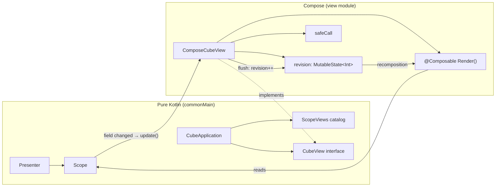
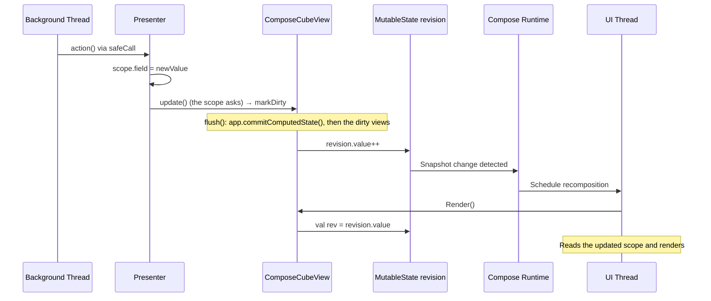
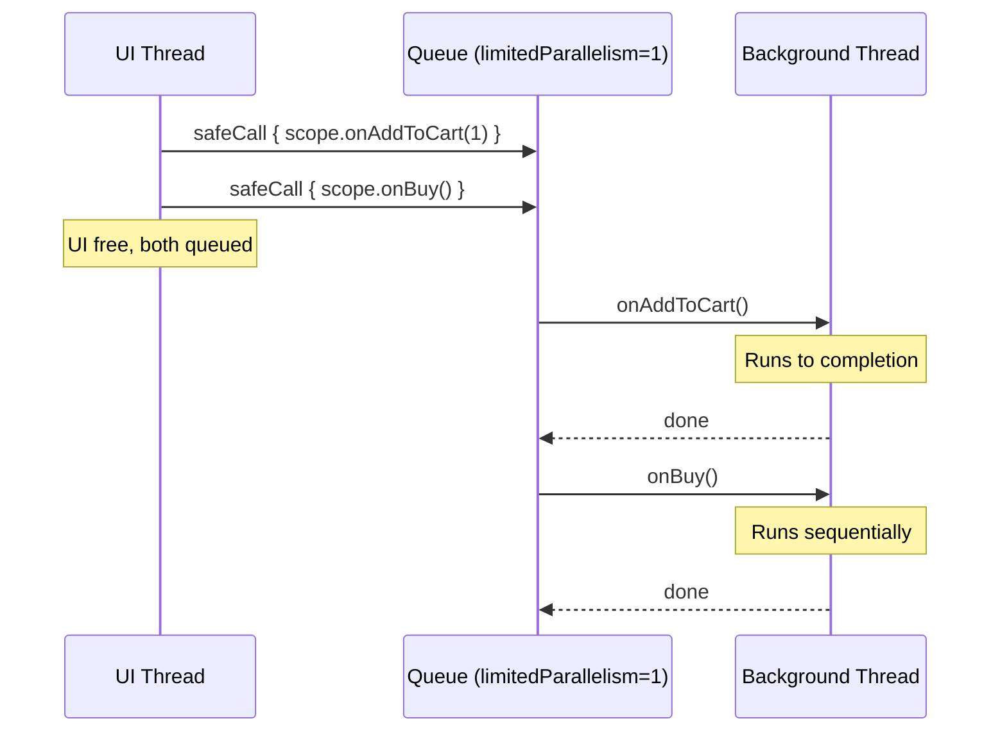
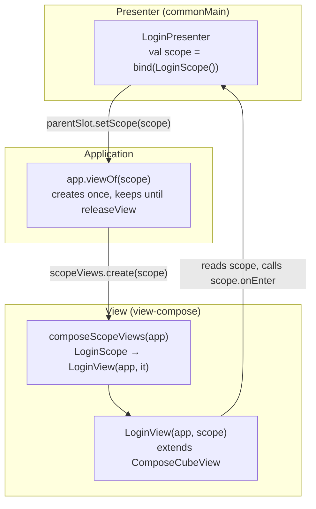
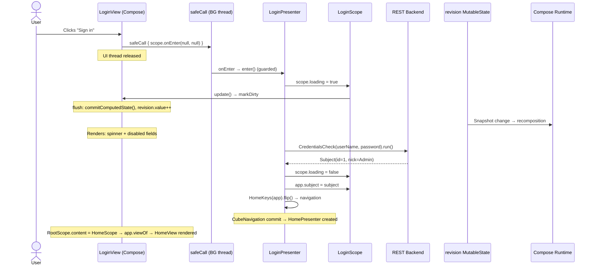
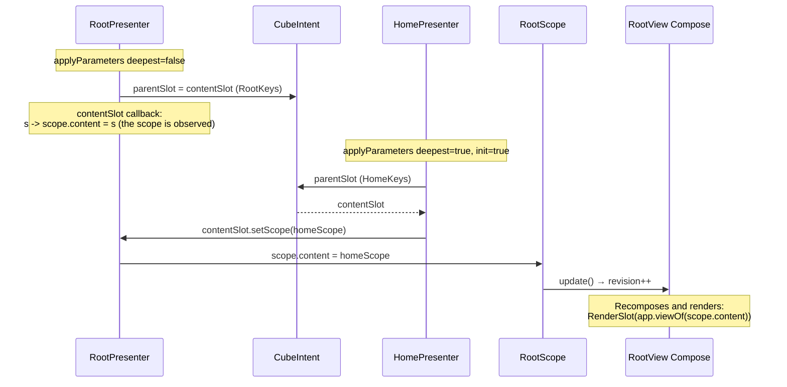
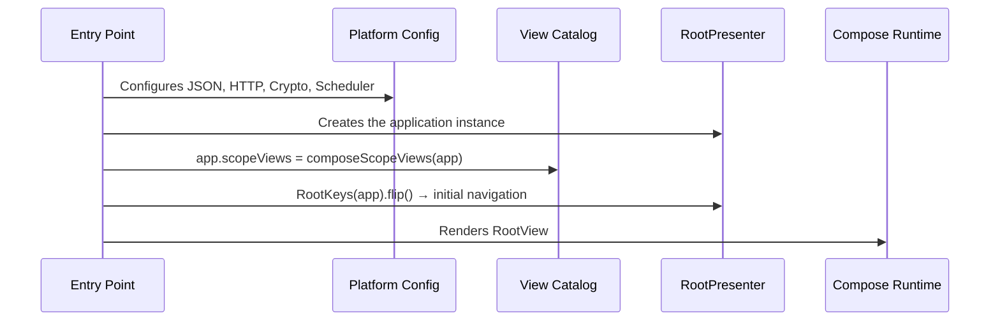
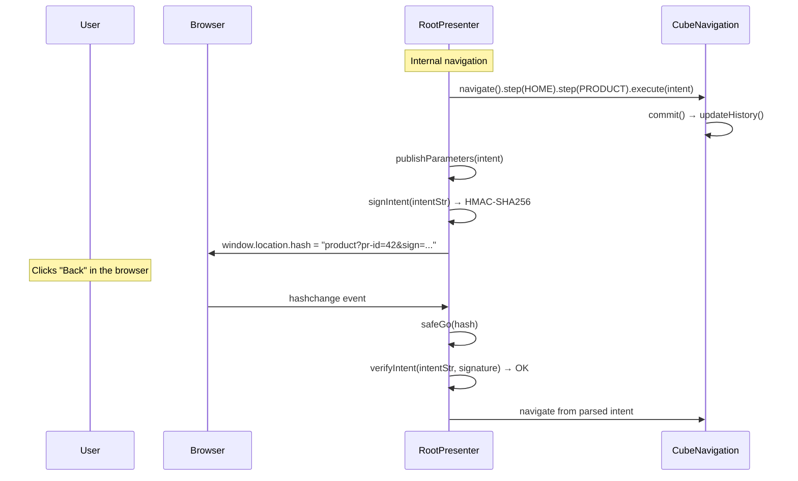
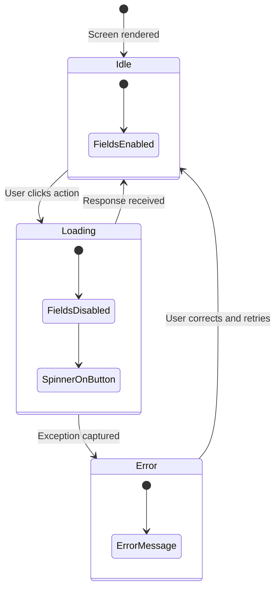

# Cube + Compose Architecture — Integration with Compose Multiplatform

## Contents

- [Overview](#overview)
- [Bridge Layer — ComposeCubeView](#bridge-layer--composecubeview)
  - [Revision Counter](#revision-counter)
  - [safeCall — Serialized Asynchronous Execution](#safecall--serialized-asynchronous-execution)
  - [RenderSlot — View Composition](#renderslot--view-composition)
- [The View Catalog](#the-view-catalog)
- [Complete Flow: From Action to Pixel](#complete-flow-from-action-to-pixel)
- [View Implementation Pattern](#view-implementation-pattern)
- [Slot Mechanism in Compose](#slot-mechanism-in-compose)
- [Per-Platform Initialization](#per-platform-initialization)
  - [Desktop (JVM)](#desktop-jvm)
  - [Web (wasmJs)](#web-wasmjs)
  - [Android](#android)
  - [iOS](#ios)
- [Deep-Linking and History (Web)](#deep-linking-and-history-web)
- [Loading Pattern](#loading-pattern)

---

## Overview

Cube integrates with Compose Multiplatform through a minimal **bridge layer** — the `ComposeCubeView` class. This layer solves three problems:

1. **Recomposition** — how to notify Compose that state has changed, without relying on `MutableState` in presenters
2. **Threading** — how to run presenter logic off the UI thread, keeping the UI responsive
3. **Hierarchical composition** — how to render child views inside parent views, without coupling

The presenter stays **pure Kotlin** — it knows nothing about Compose and imports no `androidx` package. The whole Compose dependency is concentrated in the view.


```mermaid
graph LR
    subgraph "Pure Kotlin (commonMain)"
        P[Presenter] --> S[Scope]
        APP[CubeApplication] --> SV[ScopeViews catalog]
        APP --> CV[CubeView interface]
    end

    subgraph "Compose (view module)"
        CCV[ComposeCubeView] -.->|implements| CV
        CCV --> REV["revision: MutableState&lt;Int&gt;"]
        CCV --> SC[safeCall]
        CCV --> RND["@Composable Render()"]
    end

    S -->|"field changed → update()"| CCV
    CCV -->|"flush: revision++"| REV
    REV -->|"recomposition"| RND
    RND -->|"reads"| S
```

---

## Bridge Layer — ComposeCubeView

### Revision Counter

`ComposeCubeView<S : Scope>` implements `CubeView`, draws one scope of the application, and exposes a `MutableState<Int>` named `revision`. A change in a field of the scope calls the view's `update()`, which marks it dirty in the `ViewUpdateScheduler`; the scheduler's flush runs the application's `commitComputedState()` once (every live presenter's), then increments `revision.value` of each dirty view. Because `@Composable Render()` reads that value, Compose detects the change and schedules a recomposition.

```kotlin
abstract class ComposeCubeView<S : Scope>(
    private val id: String,
    protected val app: RootPresenter,
    protected val scope: S,
) : CubeView {

    val revision: MutableState<Int> = mutableIntStateOf(0)

    override fun update() {
        ViewUpdateScheduler.markDirty(this)  // the flush increments revision, once per cycle
    }

    @Composable
    abstract fun Render()
}
```

**Why it works:**


```mermaid
sequenceDiagram
    participant BG as Background Thread
    participant P as Presenter
    participant V as ComposeCubeView
    participant REV as MutableState revision
    participant C as Compose Runtime
    participant UI as UI Thread

    BG->>P: action() via safeCall
    P->>P: scope.field = newValue
    P->>V: update() (the scope asks) → markDirty
    Note over V: flush(): app.commitComputedState(), then the dirty views
    V->>REV: revision.value++
    REV->>C: Snapshot change detected
    C->>UI: Schedule recomposition
    UI->>V: Render()
    V->>REV: val rev = revision.value
    Note over UI: Reads the updated scope and renders
```

1. Compose's `MutableState` is **thread-safe** — changes on any thread are detected by the snapshot system
2. Reading `revision.value` inside the `@Composable` creates an automatic **subscription**
3. When the value changes, Compose schedules a **recomposition** on the UI thread
4. Multiple calls to `update()` in the same frame are **coalesced** into a single recomposition

### safeCall — Serialized Asynchronous Execution

`safeCall` dispatches a scope action to the application's **coroutine with parallelism limited to 1** (`RootPresenter.presenterScope`, reached through the scheduler):

```kotlin
protected fun safeCall(action: suspend () -> Unit) {
    ViewUpdateScheduler.presenterScope.launch {
        try {
            action()
        } catch (e: Exception) {
            app.alertUnexpectedError(LOG, "Unexpected error in $id", e)
        } finally {
            ViewUpdateScheduler.flush()
        }
    }
}
```

The view calls the action fields of its scope: `safeCall { scope.onBuy() }`. Each action has its own guard in the presenter (an unhandled failure becomes `"Unexpected error: <cause>"`), so the `catch` above only sees failures of the view's own code.

This guarantees:

| Property | How |
|----------|-----|
| **Free UI thread** | The action runs in the background — the interface stays responsive |
| **Serial execution** | `limitedParallelism(1)` — scope mutations never run concurrently |
| **Linear code in the presenter** | The presenter writes linear `suspend` code, with no callbacks |
| **Captured errors** | Unhandled exceptions are delegated to `RootPresenter.alertUnexpectedError()` |


```mermaid
sequenceDiagram
    participant UI as UI Thread
    participant Q as Queue (limitedParallelism=1)
    participant BG as Background Thread

    UI->>Q: safeCall { scope.onAddToCart(1) }
    UI->>Q: safeCall { scope.onBuy() }
    Note over UI: UI free, both queued

    Q->>BG: onAddToCart()
    Note over BG: Runs to completion
    BG-->>Q: done

    Q->>BG: onBuy()
    Note over BG: Runs sequentially
    BG-->>Q: done
```

### RenderSlot — View Composition

The `RenderSlot` function turns a generic `CubeView` into a `@Composable` call:

```kotlin
@Composable
fun RenderSlot(view: CubeView) {
    (view as? ComposeCubeView<*>)?.Render()
}
```

Parent views use it to render child views without knowing their concrete type. The parent's scope holds the child's **scope**; the parent view asks the application for its view (`app.viewOf`, which gives the same instance for the same scope, so Compose skips the call while the slot keeps its scope):

```kotlin
// Inside RootView.Render():
val contentView = scope.content?.let(app::viewOf)
if (contentView != null) {
    RenderSlot(contentView)
}
```

---

## The View Catalog

Presenters do not create views. The Compose view layer has **one catalog** (`ScopeViews`: scope class → view factory), in `views/ComposeScopeViews.kt`, and every Compose entry point (web, desktop, Android, iOS) assigns it to the application before the first navigation:

```kotlin
fun composeScopeViews(app: RootPresenter): ScopeViews = ScopeViews()
    .register<RootScope> { RootView(app, it) }
    .register<LoginScope> { LoginView(app, it) }
    .register<HomeScope> { HomeView(app, it) }
    .register<CartScope> { CartView(app, it) }
    .register<CartItemScope> { CartItemView(app, it) }
    .register<ProductScope> { ProductView(app, it) }
    .register<ReceiptScope> { ReceiptView(app, it) }
    .register<ProductsPanelScope> { ProductsPanelView(app, it) }
    .register<PurchasesPanelScope> { PurchasesPanelView(app, it) }

// in each entry point
app.scopeViews = composeScopeViews(app)
```


```mermaid
graph TD
    subgraph "Presenter (commonMain)"
        LP["LoginPresenter<br/>val scope = bind(LoginScope())"]
    end

    subgraph "Application"
        APP["app.viewOf(scope)<br/>creates once, keeps until releaseView"]
    end

    subgraph "View (view-compose)"
        CAT["composeScopeViews(app)<br/>LoginScope → LoginView(app, it)"]
        LV["LoginView(app, scope)<br/>extends ComposeCubeView"]
    end

    LP -->|"parentSlot.setScope(scope)"| APP
    APP -->|"scopeViews.create(scope)"| CAT
    CAT --> LV
    LV -->|"reads scope, calls scope.onEnter"| LP
```

This mechanism lets:

- The presenter **not know** any view: it only shows its scope
- Different view layers register **different views** for the same scope (Compose, native, the remote React skeleton)
- A new screen be registered **once per view layer**, not once per entry point; a scope with no view in the catalog fails naming its class
- Tests register a catalog of mocks (`RootPresenterMock`) and call the scope's actions directly

---

## Complete Flow: From Action to Pixel

The diagram below shows the complete flow from a user action to rendering:


```mermaid
sequenceDiagram
    actor User as User
    participant View as LoginView (Compose)
    participant SC as safeCall (BG thread)
    participant P as LoginPresenter
    participant S as LoginScope
    participant API as REST Backend
    participant Rev as revision MutableState
    participant CR as Compose Runtime

    User->>View: Clicks "Sign in"
    View->>SC: safeCall { scope.onEnter(null, null) }
    Note over View: UI thread released

    SC->>P: onEnter → enter() (guarded)
    P->>S: scope.loading = true
    S->>View: update() → markDirty
    Note over View: flush: commitComputedState(), revision.value++
    Rev->>CR: Snapshot change → recomposition
    Note over View: Renders: spinner + disabled fields

    P->>API: CredentialsCheck(userName, password).run()
    API-->>P: Subject(id=1, nick=Admin)

    P->>S: scope.loading = false
    P->>S: app.subject = subject
    P->>P: HomeKeys(app).flip() → navigation
    Note over P: CubeNavigation commit → HomePresenter created
    Note over View: RootScope.content = HomeScope → app.viewOf → HomeView rendered
```

---

## View Implementation Pattern

Every Compose view follows the same pattern:

```kotlin
class LoginView(app: RootPresenter, scope: LoginScope) :
    ComposeCubeView<LoginScope>("login-view", app, scope) {

    @Composable
    override fun Render() {
        // (1) Subscribes to recomposition
        @Suppress("UNUSED_VARIABLE")
        val rev = revision.value

        // (2) Reads the scope it draws
        val loading = scope.loading

        // (3) Uses remember for local UI state (text fields)
        var userName by remember { mutableStateOf(scope.userName ?: "") }

        // (4) Renders the UI by reading the scope
        OutlinedTextField(
            value = userName,
            onValueChange = {
                userName = it
                scope.userName = it  // ← direct mutation of the scope
            },
            enabled = !loading,
        )

        // (5) Actions are fields of the scope, called via safeCall
        Button(
            onClick = { safeCall { scope.onEnter(null, null) } },
            enabled = !loading,
        ) {
            if (loading) {
                CircularProgressIndicator()
            } else {
                Text("Sign in")
            }
        }
    }
}
```

**Key points:**

| Step | What it does | Why |
|------|--------------|-----|
| `revision.value` | Creates a Compose subscription | Without it, the view does not recompose when `update()` is called |
| `scope` | The scope the view was created for | The scope is read directly — no copies, no mapping, no reference to the presenter |
| `remember` | Keeps local UI state | Text fields need local state for smooth typing |
| `scope.userName = it` | Direct mutation | The scope is mutable by design — simplicity > ceremony |
| `safeCall { scope.onX(...) }` | Dispatches the action to the background | Free UI thread, guaranteed serial execution |

---

## Slot Mechanism in Compose

The slot connects parent and child presenters without direct coupling: the child hands its **scope** to the parent, and the parent's view asks the application for the view of that scope. The flow:


```mermaid
sequenceDiagram
    participant Root as RootPresenter
    participant Intent as CubeIntent
    participant Home as HomePresenter
    participant RootScope
    participant RootView as RootView Compose

    Note over Root: applyParameters deepest=false
    Root->>Intent: parentSlot = contentSlot (RootKeys)
    Note over Root: contentSlot callback:<br/>s -> scope.content = s (the scope is observed)

    Note over Home: applyParameters deepest=true, init=true
    Home->>Intent: parentSlot (HomeKeys)
    Intent-->>Home: contentSlot
    Home->>Root: contentSlot.setScope(homeScope)
    Root->>RootScope: scope.content = homeScope
    RootScope->>RootView: update() → revision++
    Note over RootView: Recomposes and renders:<br/>RenderSlot(app.viewOf(scope.content))
```

**In the RootPresenter code** (the root presenter is the application: it extends `CubeApplication`, is the root of the place tree and the presenter of the root view):

```kotlin
abstract class RootPresenter : CubeApplication(PLACES), PresenterBase {

    val scope = RootScope().also { it.observe(::update) }

    // The root view: the view the catalog gives for the scope, created on the first navigation
    val view: CubeView? get() = viewOrNull(scope)

    // Callback that receives the child's scope and stores it in the root scope (observed: the root view repaints)
    private val contentSlot = ScopeSlot { if (scope.content !== it) scope.content = it }

    fun update() {
        viewOrNull(scope)?.update()
    }

    // Runs in every navigation, before the first step
    override suspend fun applyParameters(intent: CubeIntent, initialization: Boolean, deepest: Boolean): Boolean {
        if (initialization) {
            viewOf(scope)
            restoreSubjectFromSession()
        }
        if (deepest) {                       // navigation to the root itself: go on to the home
            HomeKeys(this, intent).flip()
            return false
        }
        // Publishes the slot in the intent so the first step can use it
        RootKeys(this, intent).parentSlot = contentSlot
        return true
    }
}
```

**In the RootView code (Compose):**

```kotlin
class RootView(app: RootPresenter, scope: RootScope) :
    ComposeCubeView<RootScope>("root-view", app, scope) {

    @Composable
    override fun Render() {
        val rev = revision.value

        Box(modifier = Modifier.fillMaxSize()) {
            val contentView = scope.content?.let(app::viewOf)
            if (contentView != null) {
                RenderSlot(contentView)  // ← renders the child view
            }
            // scope.errorMessage → Snackbar (the unexpected-error alert)
        }
    }
}
```

`RootScope.content` has type `Scope` — neither the root presenter nor the root view knows whether it is the home or the login. The view asks `app.viewOf` for its view and calls `RenderSlot`, and Compose renders the right content. The same holds for the Home's content and its two panels (segments: `HomeScope.productsPanel`, `purchasesPanel`), and for the cart rows (`CartScope.rows`, each drawn by `CartItemView`).

---

## Per-Platform Initialization

Each platform has an entry point that follows the same pattern:


```mermaid
sequenceDiagram
    participant Main as Entry Point
    participant Plat as Platform Config
    participant Factories as View Catalog
    participant App as RootPresenter
    participant Compose as Compose Runtime

    Main->>Plat: Configures JSON, HTTP, Crypto, Scheduler
    Main->>App: Creates the application instance
    Main->>Factories: app.scopeViews = composeScopeViews(app)
    Main->>App: RootKeys(app).flip() → initial navigation
    Main->>Compose: Renders RootView
```

### Desktop (JVM)

```kotlin
fun main() {
    initializePlatform(baseUrl)  // JSON, HTTP, Crypto, Scheduler

    val app = DesktopRootPresenter()
    app.scopeViews = composeScopeViews(app)
    ViewUpdateScheduler.initialize { app }
    runBlocking { RootKeys(app).flip() }

    application {
        Window(title = "Storefront", ...) {
            ShoppingTheme {
                (app.view as? RootView)?.Render()
            }
        }
    }
}
```

- `ScheduledExecutor`: Swing `javax.swing.Timer`
- `SessionStorage`: `java.util.prefs.Preferences`
- `updateHistory()`: no-op (no browser)

### Web (wasmJs)

```kotlin
fun main() {
    initializePlatform(baseUrl)

    val app = ComposeRootPresenter()
    app.scopeViews = composeScopeViews(app)
    ViewUpdateScheduler.initialize { app }
    restoreAuthState(app)

    val hash = getLocationHash()
    if (hash.isNotBlank()) app.safeGo(hash) else RootKeys(app).flip()

    jsOnHashChange {
        val newHash = getLocationHash()
        if (newHash != app.fragment) app.safeGo(newHash)
    }

    ComposeViewport(document.getElementById("ComposeTarget")!!) {
        ShoppingTheme {
            (app.view as? RootView)?.Render()
        }
    }
}
```

- `ScheduledExecutor`: `setTimeout` / `setInterval`
- `SessionStorage`: `window.sessionStorage`
- `updateHistory()`: updates `window.location.hash` with an HMAC-signed intent

### Android

```kotlin
class MainActivity : ComponentActivity() {
    override fun onCreate(savedInstanceState: Bundle?) {
        initializePlatform(baseUrl)

        val app = AndroidRootPresenter(this)
        app.scopeViews = composeScopeViews(app)
        ViewUpdateScheduler.initialize { app }
        runBlocking { RootKeys(app).flip() }

        setContent {
            ShoppingTheme {
                (app.view as? RootView)?.Render()
            }
        }
    }
}
```

- `ScheduledExecutor`: Android `Handler` + `Looper`
- `SessionStorage`: `SharedPreferences`
- `updateHistory()`: no-op

### iOS

```kotlin
fun MainViewController() = ComposeUIViewController {
    initializePlatform(baseUrl)

    val app = IosRootPresenter()
    app.scopeViews = composeScopeViews(app)
    ViewUpdateScheduler.initialize { app }
    runBlocking { RootKeys(app).flip() }

    ShoppingTheme {
        (app.view as? RootView)?.Render()
    }
}
```

- `ScheduledExecutor`: `dispatch_queue`
- `SessionStorage`: `NSUserDefaults`
- `updateHistory()`: no-op

---

## Deep-Linking and History (Web)

On the Web platform, Cube navigation is synchronized with the browser's `location.hash`, enabling deep-linking and the back/forward buttons.


```mermaid
sequenceDiagram
    participant User as User
    participant Browser as Browser
    participant App as RootPresenter
    participant Nav as CubeNavigation

    Note over App: Internal navigation
    App->>Nav: navigate().step(HOME).step(PRODUCT).execute(intent)
    Nav->>Nav: commit() → updateHistory()
    App->>App: publishParameters(intent)
    App->>App: signIntent(intentStr) → HMAC-SHA256
    App->>Browser: window.location.hash = "product?pr-id=42&sign=..."

    Note over User: Clicks "Back" in the browser
    Browser->>App: hashchange event
    App->>App: safeGo(hash)
    App->>App: verifyIntent(intentStr, signature) → OK
    App->>Nav: navigate from parsed intent
```

The HMAC signature ensures that manually tampered URLs are rejected. The signing secret is:
- **Before login:** a fixed anonymous key
- **After login:** a per-session secret received from the server

---

## Loading Pattern

With `safeCall` running off the UI thread, loading indicators come naturally:


```mermaid
stateDiagram-v2
    [*] --> Idle: Screen rendered
    Idle --> Loading: User clicks action
    Loading --> Idle: Response received
    Loading --> Error: Exception captured
    Error --> Idle: User corrects and retries

    state Idle {
        [*] --> FieldsEnabled
    }

    state Loading {
        [*] --> FieldsDisabled
        FieldsDisabled --> SpinnerOnButton
    }

    state Error {
        [*] --> ErrorMessage
    }
```

**In the presenter** (linear code; the body of the `onEnter` action, bound in the constructor with `scope.onEnter = actionOf2 { userName: String?, password: String? -> enter(userName, password) }`):

```kotlin
private suspend fun enter(userName: String?, password: String?) {
    if (userName != null) scope.userName = userName
    if (password != null) scope.password = password

    scope.loading = true  // → UI shows spinner (the scope is observed: no update() call)

    try {
        val subject = CredentialsCheck(scope.userName ?: "", scope.password ?: "").run()
        scope.loading = false

        if (subject?.id != null) {
            app.subject = subject
            HomeKeys(app).flip()
        } else {
            scope.errorMessage = "Username or password not recognized!"
        }
    } catch (caught: Exception) {
        scope.loading = false
        scope.errorMessage = "Failed to communicate with the server. Check your connection."
    }
}
```

**In the view** (Compose reacts automatically):

```kotlin
Button(
    onClick = { safeCall { scope.onEnter(null, null) } },
    enabled = !loading,
) {
    if (loading) CircularProgressIndicator() else Text("Sign in")
}
```

The presenter changes `scope.loading`; the observed `Scope` calls `update()`, and Compose recomposes. No callbacks, no observers, no explicit bindings.
