# Arquitetura Cube — Mecanismo de Navegação

## Sumário

- [Visão Geral](#visão-geral)
- [Componentes Fundamentais](#componentes-fundamentais)
  - [CubePlace](#cubeplace)
  - [CubePresenter](#cubepresenter)
  - [CubeIntent](#cubeintent)
  - [CubeViewSlot](#cubeviewslot)
  - [CubeView](#cubeview)
  - [CubeApplication](#cubeapplication)
  - [CubeNavigation](#cubenavigation)
- [Modelo de Dados Interno](#modelo-de-dados-interno)
- [Ciclo de Navegação — Passo a Passo](#ciclo-de-navegação--passo-a-passo)
  - [1. Montagem da Rota](#1-montagem-da-rota)
  - [2. Execução dos Steps](#2-execução-dos-steps)
  - [3. Commit — Navegação Bem-Sucedida](#3-commit--navegação-bem-sucedida)
  - [4. Rollback — Falha na Navegação](#4-rollback--falha-na-navegação)
- [Interrupção e Redirect](#interrupção-e-redirect)
  - [O Problema](#o-problema)
  - [A Solução — Migração de Presenters](#a-solução--migração-de-presenters)
  - [Fluxo Detalhado de uma Interrupção](#fluxo-detalhado-de-uma-interrupção)
  - [Interrupções Encadeadas](#interrupções-encadeadas)
- [Garantias do Mecanismo](#garantias-do-mecanismo)
- [Ordem de Release — Leaf-First](#ordem-de-release--leaf-first)
- [Proteção contra Recursão Infinita](#proteção-contra-recursão-infinita)
- [Cenários Completos](#cenários-completos)
  - [Navegação Normal com Reutilização](#navegação-normal-com-reutilização)
  - [Redirect durante Navegação](#redirect-durante-navegação)
  - [Rollback após Exceção](#rollback-após-exceção)
- [Suspend e Coroutines no Cube MVP](#suspend-e-coroutines-no-cube-mvp)
  - [O Modelo de Execução](#o-modelo-de-execução)
  - [O presenterScope — Serialização de Ações](#o-presenterscope--serialização-de-ações)
  - [A Fronteira Suspend / Síncrono](#a-fronteira-suspend--síncrono)
  - [O Padrão safeCall — Bridge entre View e Presenter](#o-padrão-safecall--bridge-entre-view-e-presenter)
  - [Ciclo de Vida dos Presenters e Suspend](#ciclo-de-vida-dos-presenters-e-suspend)
  - [Child Presenters — Inicialização Assíncrona](#child-presenters--inicialização-assíncrona)
  - [Quando Usar e Quando NÃO Usar Suspend](#quando-usar-e-quando-não-usar-suspend)
  - [Regras Práticas para o Desenvolvedor](#regras-práticas-para-o-desenvolvedor)
  - [Disparo Assíncrono Paralelo — Fire-and-Forget com Retorno](#disparo-assíncrono-paralelo--fire-and-forget-com-retorno)

---

## Visão Geral

O Cube é uma solução de **gerenciamento de estado de aplicação** baseada no padrão MVP (Model-View-Presenter). Diferente de abordagens que exigem estado imutável e unidirecional, o Cube adota **estados de view mutáveis** — os presenters manipulam diretamente objetos de estado (`ViewState`) e notificam a view para re-renderizar. Essa decisão simplifica o código de apresentação, eliminando a cerimônia de cópias imutáveis e reducers.

Um princípio central da arquitetura é o **desacoplamento total entre a lógica de apresentação e a tecnologia de visualização**. Os presenters são classes Kotlin puras, sem nenhuma dependência de framework de UI. A tecnologia de renderização — seja Compose Multiplatform, React, SwiftUI ou qualquer outra — é uma **escolha do projeto**, não uma imposição do framework. Isso permite que o mesmo código de apresentação seja compartilhado entre plataformas distintas, com cada uma implementando apenas a camada de view.

O `CubeNavigation` é o motor de navegação do framework. Ele orquestra o **ciclo de vida dos presenters** durante transições de tela, tratando a navegação como uma **transação atômica**: ou todos os steps são aplicados com sucesso (commit), ou o estado anterior é restaurado (rollback).

O mecanismo foi projetado para lidar com um cenário crítico: **redirects durante a navegação**. Um presenter pode, dentro de `applyParameters()`, iniciar uma nova navegação (por exemplo, redirecionar um usuário não autenticado para a tela de login). Isso **interrompe** a navegação corrente e inicia outra, e o framework garante que nenhum presenter criado seja perdido sem ter `release()` chamado.

---

## Componentes Fundamentais

### CubePlace

Representa um **destino de navegação**. Cada Place possui:

- **`id: Int`** — identificador numérico único, usado como chave no mapa de presenters
- **`placeName: String`** — nome simbólico para deep-linking (ex: `"home"`, `"product"`)
- **`presenterFactory()`** — factory function que cria a instância de `CubePresenter` associada

```kotlin
interface CubePlace {
    val id: Int
    val placeName: String
    fun <A : CubeApplication> presenterFactory(): (A) -> CubePresenter
}
```

Os IDs seguem uma **convenção hierárquica**: IDs menores representam nós mais próximos da raiz, e IDs maiores representam folhas. Essa convenção é explorada na ordem de release (leaf-first, ou seja, IDs maiores primeiro).

### CubePresenter

Interface que todo presenter deve implementar. Define o contrato do ciclo de vida:

```kotlin
interface CubePresenter {
    fun applyParameters(intent: CubeIntent, initialization: Boolean, deepest: Boolean): Boolean
    fun publishParameters(intent: CubeIntent)
    fun commitComputedState()
    fun release()
}
```

| Método | Quando é chamado | Responsabilidade |
|--------|-----------------|------------------|
| `applyParameters` | Durante `execute()` | Receber parâmetros, criar view (se `initialization=true`), conectar slots. Retorna `true` para continuar, `false` para interromper. |
| `publishParameters` | Durante `newIntent()` | Exportar o estado atual do presenter para o intent (para deep-linking e histórico). |
| `commitComputedState` | Após commit da navegação | Finalizar cálculos derivados que dependem do estado completo da navegação. |
| `release` | Quando o presenter é descartado | Liberar recursos (views, listeners, conexões). **Chamado exatamente uma vez.** |

### CubeIntent

Container de dados que trafega pela hierarquia de navegação. Carrega dois tipos de dados:

- **Parameters** (`MutableMap<String, Any?>`) — dados serializáveis de rota, usados para deep-linking e histórico do navegador (ex: `productId=42`)
- **Attributes** (`MutableMap<String, Any?>`) — dados efêmeros da transação, como `CubeViewSlot`s para conexão pai-filho

```kotlin
class CubeIntent {
    var place: CubePlace?
    // Parameters: getParameterAsString(), setParameter(), etc.
    // Attributes: setAttribute(), getAttribute(), setViewSlot(), getViewSlot()
}
```

### CubeViewSlot

Mecanismo de composição de views. Um presenter pai cria um slot e o publica no intent. O presenter filho obtém o slot e insere sua view nele, sem acoplamento direto entre pai e filho.

```kotlin
fun interface CubeViewSlot {
    fun setView(view: CubeView)
}
```

### CubeView

Interface para a camada de renderização. Cada tecnologia de UI (Compose, React, etc.) implementa esta interface:

```kotlin
interface CubeView {
    fun instanceId(): String
    fun update()
    fun release()
}
```

### CubeApplication

Classe base abstrata que mantém o estado global da aplicação:

- **`presenterMap`** — mapa `<Int, CubePresenter>` com os presenters ativos (chave = `Place.id`)
- **`lastPlace`** — último place navegado (para deep-linking)
- **`navigation`** — referência à navegação em andamento (ou `null` se nenhuma)
- **`navigate()`** — ponto de entrada para iniciar uma navegação

```kotlin
abstract class CubeApplication {
    internal var presenterMap: MutableMap<Int, CubePresenter>
    internal var lastPlace: CubePlace?
    internal var navigation: CubeNavigation<*>?

    fun <T : CubeApplication> navigate(): CubeNavigation<T>
    fun newIntent(): CubeIntent
    fun getPresenter(placeId: Int): CubePresenter?
    fun release()
    abstract fun updateHistory()
}
```

### CubeNavigation

O orquestrador da transação de navegação. Criado por `CubeApplication.navigate()`, gerencia dois mapas de presenters e conduz o fluxo de `execute()` → `commit()` ou `rollback()`.

---

## Modelo de Dados Interno

O `CubeNavigation` mantém dois mapas internos, cada um com um papel bem definido:

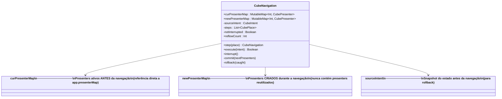
```mermaid
classDiagram
    class CubeNavigation {
        +curPresenterMap : MutableMap~Int‚ CubePresenter~
        +newPresenterMap : MutableMap~Int‚ CubePresenter~
        -sourceIntent : CubeIntent
        -steps : List~CubePlace~
        -notInterrupted : Boolean
        +reflowCount : Int
        +step(place) CubeNavigation
        +execute(intent) Boolean
        +interrupt()
        -commit(nextPresenters)
        -rollback(caught)
    }

    class curPresenterMap ["curPresenterMap\n─────────────────\nPresenters ativos ANTES da navegação\n(referência direta a app.presenterMap)"]
    class newPresenterMap ["newPresenterMap\n─────────────────\nPresenters CRIADOS durante a navegação\n(nunca contém presenters reutilizados)"]
    class sourceIntent ["sourceIntent\n─────────────────\nSnapshot do estado antes da navegação\n(para rollback)"]

    CubeNavigation --> curPresenterMap
    CubeNavigation --> newPresenterMap
    CubeNavigation --> sourceIntent
```

**Invariante fundamental:** os IDs em `newPresenterMap` **nunca colidem** com os de `curPresenterMap`. Um presenter só é adicionado a `newPresenterMap` quando ambos os lookups (`curPresenterMap[id]` e `newPresenterMap[id]`) retornam `null`. Se o presenter já existia, ele é reutilizado — sem inserção em `newPresenterMap`.

---

## Ciclo de Navegação — Passo a Passo

### 1. Montagem da Rota

A navegação começa com a construção da rota via API fluente:

```kotlin
app.navigate<ShoppingApp>()
    .step(Place.ROOT)       // id=0
    .step(Place.HOME)       // id=2
    .step(Place.PRODUCT)    // id=4
    .execute(intent)
```

Os `step()` registram a sequência de Places que compõem a rota hierárquica, do nó raiz até a folha.

### 2. Execução dos Steps

O `execute(intent)` itera sobre os steps na ordem declarada. Para cada step:

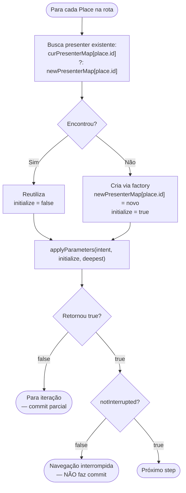
```mermaid
flowchart TD
    START([Para cada Place na rota]) --> LOOKUP["Busca presenter existente:\ncurPresenterMap[place.id]\n?: newPresenterMap[place.id]"]
    LOOKUP --> FOUND{Encontrou?}
    FOUND -->|Sim| REUSE["Reutiliza\ninitialize = false"]
    FOUND -->|Não| CREATE["Cria via factory\nnewPresenterMap[place.id] = novo\ninitialize = true"]
    REUSE --> APPLY["applyParameters(intent, initialize, deepest)"]
    CREATE --> APPLY
    APPLY --> GOAHEAD{Retornou true?}
    GOAHEAD -->|false| STOP_PARTIAL(["Para iteração\n— commit parcial"])
    GOAHEAD -->|true| INTERRUPTED{notInterrupted?}
    INTERRUPTED -->|false| STOP_INTERRUPT(["Navegação interrompida\n— NÃO faz commit"])
    INTERRUPTED -->|true| NEXT([Próximo step])
```

O parâmetro `deepest` é `true` apenas para o último step da rota.

### 3. Commit — Navegação Bem-Sucedida

Quando todos os steps completam sem interrupção:

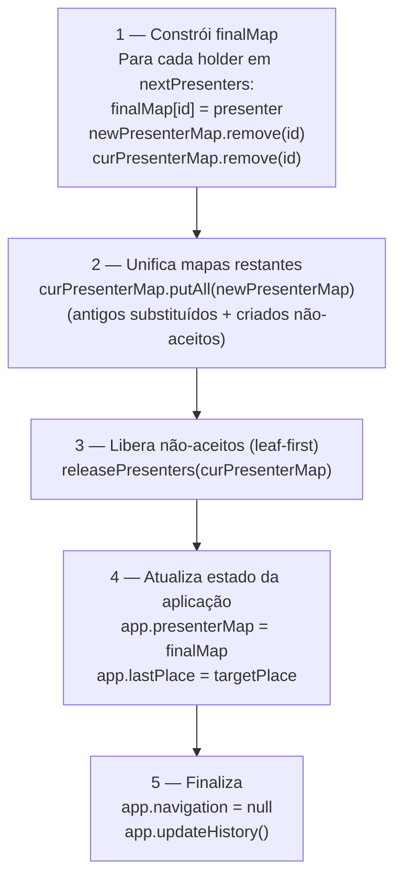
```mermaid
flowchart TD
    C1["1 — Constrói finalMap\nPara cada holder em nextPresenters:\nfinalMap[id] = presenter\nnewPresenterMap.remove(id)\ncurPresenterMap.remove(id)"] --> C2["2 — Unifica mapas restantes\ncurPresenterMap.putAll(newPresenterMap)\n(antigos substituídos + criados não-aceitos)"]
    C2 --> C3["3 — Libera não-aceitos (leaf-first)\nreleasePresenters(curPresenterMap)"]
    C3 --> C4["4 — Atualiza estado da aplicação\napp.presenterMap = finalMap\napp.lastPlace = targetPlace"]
    C4 --> C5["5 — Finaliza\napp.navigation = null\napp.updateHistory()"]
```

**Por que unificar os mapas antes de liberar?** Isso garante uma **única passada de release** com ordenação global leaf-first (IDs descendentes), incluindo tanto presenters antigos quanto criados que não entraram na rota final.

### 4. Rollback — Falha na Navegação

Se uma exceção ocorre em `applyParameters()`:

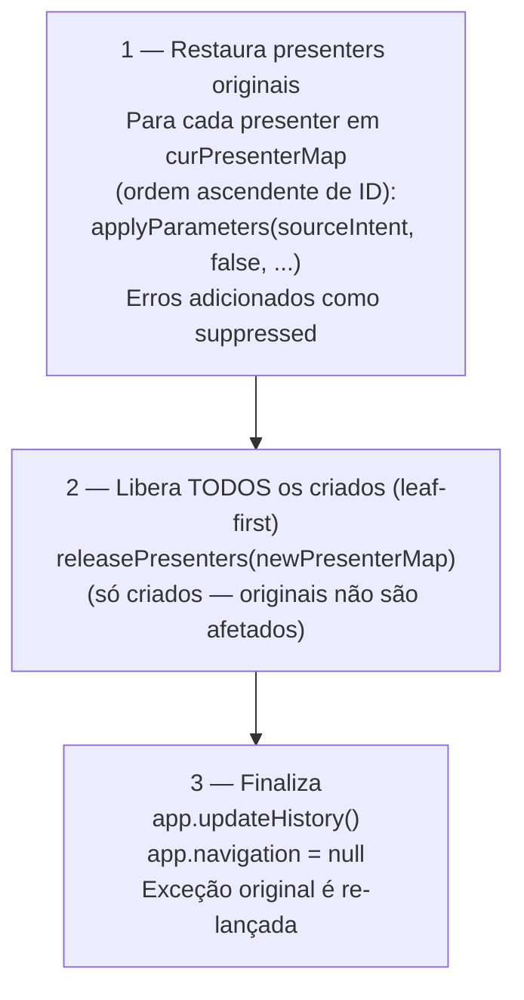
```mermaid
flowchart TD
    R1["1 — Restaura presenters originais\nPara cada presenter em curPresenterMap\n(ordem ascendente de ID):\napplyParameters(sourceIntent, false, ...)\nErros adicionados como suppressed"] --> R2["2 — Libera TODOS os criados (leaf-first)\nreleasePresenters(newPresenterMap)\n(só criados — originais não são afetados)"]
    R2 --> R3["3 — Finaliza\napp.updateHistory()\napp.navigation = null\nExceção original é re-lançada"]
```

O `sourceIntent` é capturado no momento da criação do `CubeNavigation` via `app.newIntent()`. Ele contém o snapshot dos parâmetros publicados por todos os presenters ativos antes da navegação.

---

## Interrupção e Redirect

### O Problema

Durante `applyParameters()`, um presenter pode decidir que o usuário deve ser redirecionado para outra tela. Exemplo clássico:

```kotlin
class HomePresenter(app: ShoppingApp) : AbstractCubePresenter<ShoppingApp>(app) {
    override fun applyParameters(intent: CubeIntent, initialization: Boolean, deepest: Boolean): Boolean {
        if (app.subject == null) {
            // Usuário não autenticado — redireciona para login
            Routes.login(app)  // ← chama app.navigate() internamente
            return false
        }
        // ...
        return true
    }
}
```

A chamada `Routes.login(app)` dispara `app.navigate()` **de dentro** da execução de outra navegação. Isso cria uma **recursão**: a navegação corrente precisa ser interrompida e uma nova precisa assumir, sem perder os presenters que já foram criados.

### A Solução — Migração de Presenters

Quando `navigate()` detecta que já existe uma navegação em andamento:

```kotlin
fun <T : CubeApplication> navigate(): CubeNavigation<T> {
    val current = navigation
    if (current != null) {
        // (1) Marca a navegação corrente como interrompida
        current.interrupt()

        // (2) Verifica limite de recursão
        if (current.reflowCount > 10) {
            throw AssertionError("Navigation recursion detected")
        }

        // (3) Cria novo contexto de navegação
        val newContext = CubeNavigation<T>(this)
        newContext.reflowCount = current.reflowCount + 1

        // (4) MIGRA os presenters criados pela navegação interrompida
        newContext.newPresenterMap.putAll(current.newPresenterMap)

        navigation = newContext
        return newContext
    }
    // ...
}
```

A **migração** (`putAll`) transfere os presenters criados para o novo contexto. Isso garante que:

- Se a nova navegação **reutilizar** um presenter criado pela interrompida, ele será encontrado via `newPresenterMap[id]` e não será criado novamente
- Se a nova navegação **não usar** o presenter, ele será liberado no commit ou rollback da nova navegação
- **Nenhum presenter criado é esquecido** — o `release()` é garantido

### Fluxo Detalhado de uma Interrupção

Considere o cenário: navegar para `ROOT → HOME → PRODUCT`, mas `HOME` redireciona para `ROOT → LOGIN`.

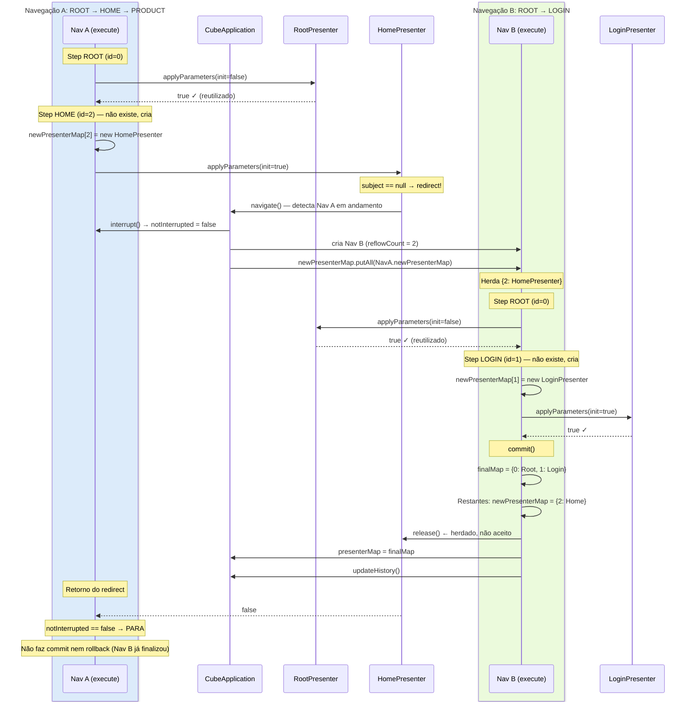
```mermaid
sequenceDiagram
    box rgb(220,235,250) Navegação A: ROOT → HOME → PRODUCT
        participant NavA as Nav A (execute)
    end
    participant App as CubeApplication
    participant Root as RootPresenter
    participant Home as HomePresenter
    box rgb(235,250,220) Navegação B: ROOT → LOGIN
        participant NavB as Nav B (execute)
    end
    participant Login as LoginPresenter

    Note over NavA: Step ROOT (id=0)
    NavA->>Root: applyParameters(init=false)
    Root-->>NavA: true ✓ (reutilizado)

    Note over NavA: Step HOME (id=2) — não existe, cria
    NavA->>NavA: newPresenterMap[2] = new HomePresenter
    NavA->>Home: applyParameters(init=true)

    Note over Home: subject == null → redirect!
    Home->>App: navigate() — detecta Nav A em andamento
    App->>NavA: interrupt() → notInterrupted = false
    App->>NavB: cria Nav B (reflowCount = 2)
    App->>NavB: newPresenterMap.putAll(NavA.newPresenterMap)
    Note over NavB: Herda {2: HomePresenter}

    Note over NavB: Step ROOT (id=0)
    NavB->>Root: applyParameters(init=false)
    Root-->>NavB: true ✓ (reutilizado)

    Note over NavB: Step LOGIN (id=1) — não existe, cria
    NavB->>NavB: newPresenterMap[1] = new LoginPresenter
    NavB->>Login: applyParameters(init=true)
    Login-->>NavB: true ✓

    Note over NavB: commit()
    NavB->>NavB: finalMap = {0: Root, 1: Login}
    NavB->>NavB: Restantes: newPresenterMap = {2: Home}
    NavB->>Home: release() ← herdado, não aceito
    NavB->>App: presenterMap = finalMap
    NavB->>App: updateHistory()

    Note over NavA: Retorno do redirect
    Home-->>NavA: false
    Note over NavA: notInterrupted == false → PARA
    Note over NavA: Não faz commit nem rollback (Nav B já finalizou)
```

### Interrupções Encadeadas

O mecanismo suporta múltiplas interrupções em cadeia. Se a navegação B for interrompida por uma navegação C, os presenters criados por A e B que estavam em `newPresenterMap` de B serão migrados para C:

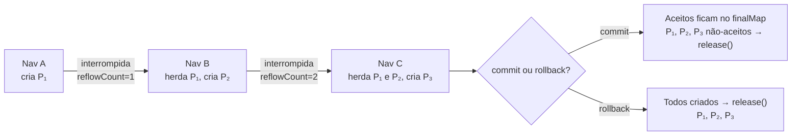
```mermaid
flowchart LR
    A["Nav A\ncria P₁"] -->|interrompida\nreflowCount=1| B["Nav B\nherda P₁, cria P₂"]
    B -->|interrompida\nreflowCount=2| C["Nav C\nherda P₁ e P₂, cria P₃"]
    C --> D{commit ou rollback?}
    D -->|commit| E["Aceitos ficam no finalMap\nP₁, P₂, P₃ não-aceitos → release()"]
    D -->|rollback| F["Todos criados → release()\nP₁, P₂, P₃"]
```

O `reflowCount` é incrementado a cada nível para detectar loops infinitos.

---

## Garantias do Mecanismo

| Garantia | Como é implementada |
|----------|-------------------|
| **Todo presenter criado terá `release()` chamado** | `newPresenterMap` só contém criados. No commit, os não-aceitos são liberados. No rollback, todos são liberados. Na interrupção, são migrados para a próxima navegação. |
| **Nenhum presenter é liberado duas vezes** | IDs de `newPresenterMap` nunca colidem com `curPresenterMap`. Reutilizados não entram em `newPresenterMap`. |
| **O estado original é restaurável** | `sourceIntent` captura o snapshot antes da navegação. No rollback, cada presenter original recebe `applyParameters(sourceIntent)`. |
| **Navegação é atômica** | Ou todos os steps aceitos entram no `finalMap` (commit), ou nenhum efeito permanece (rollback). |
| **Release é leaf-first** | `releasePresenters()` ordena IDs de forma descendente. Filhos (IDs maiores) são liberados antes de pais (IDs menores). |
| **Recursão é limitada** | `reflowCount > 10` lança `AssertionError`. |
| **Histórico é atualizado** | `updateHistory()` é chamado tanto no commit quanto no rollback (no bloco `finally`). |

---

## Ordem de Release — Leaf-First

A função `releasePresenters()` sempre libera presenters na ordem **descendente de ID**:

```kotlin
private fun releasePresenters(presenterMap: MutableMap<Int, CubePresenter>) {
    val presenterIds = presenterMap.keys.sortedDescending().toList()
    for (presenterId in presenterIds) {
        val presenter = presenterMap.remove(presenterId)
        presenter?.release()
    }
}
```

Isso garante que filhos (folhas, IDs maiores) sejam liberados antes dos pais (raiz, IDs menores), respeitando a hierarquia de dependências. Um presenter filho pode depender de recursos do pai, então o pai deve ser o último a ser liberado.

**Exemplo:** Se a rota ativa era `ROOT(0) → HOME(2) → PRODUCT(4)` e uma nova navegação vai para `ROOT(0) → LOGIN(1)`, os presenters `HOME(2)` e `PRODUCT(4)` precisam ser liberados. A ordem será: `PRODUCT(4)` primeiro, depois `HOME(2)`.

---

## Proteção contra Recursão Infinita

Se um presenter sempre redireciona durante `applyParameters()`, pode-se criar um loop infinito de interrupções. O framework protege contra isso com o `reflowCount`:

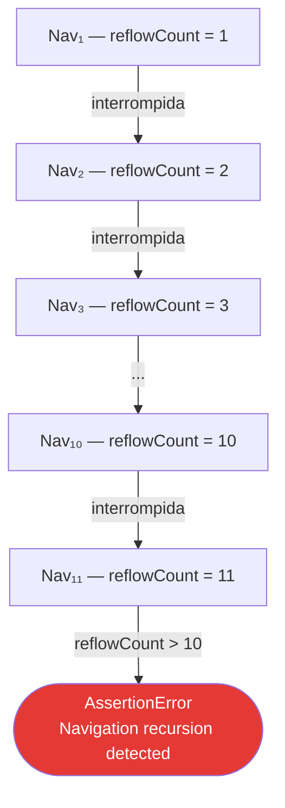
```mermaid
flowchart TD
    N1["Nav₁ — reflowCount = 1"] -->|interrompida| N2["Nav₂ — reflowCount = 2"]
    N2 -->|interrompida| N3["Nav₃ — reflowCount = 3"]
    N3 -->|...| N10["Nav₁₀ — reflowCount = 10"]
    N10 -->|interrompida| N11["Nav₁₁ — reflowCount = 11"]
    N11 -->|reflowCount > 10| ERR(["AssertionError\nNavigation recursion detected"])

    style ERR fill:#e53935,color:#fff
```

Esse limite de 10 níveis é suficiente para cenários legítimos de redirect encadeado, mas detecta bugs de loop infinito antes de causar stack overflow.

---

## Cenários Completos

### Navegação Normal com Reutilização

Estado inicial: `presenterMap = {0: RootPresenter, 2: HomePresenter}`
Navegação: `ROOT(0) → HOME(2) → PRODUCT(4)`

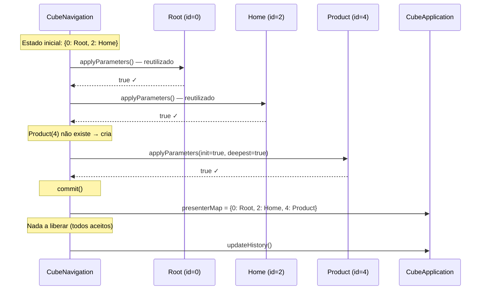
```mermaid
sequenceDiagram
    participant Nav as CubeNavigation
    participant Root as Root (id=0)
    participant Home as Home (id=2)
    participant Prod as Product (id=4)
    participant App as CubeApplication

    Note over Nav: Estado inicial: {0: Root, 2: Home}

    Nav->>Root: applyParameters() — reutilizado
    Root-->>Nav: true ✓

    Nav->>Home: applyParameters() — reutilizado
    Home-->>Nav: true ✓

    Note over Nav: Product(4) não existe → cria
    Nav->>Prod: applyParameters(init=true, deepest=true)
    Prod-->>Nav: true ✓

    Note over Nav: commit()
    Nav->>App: presenterMap = {0: Root, 2: Home, 4: Product}
    Note over Nav: Nada a liberar (todos aceitos)
    Nav->>App: updateHistory()
```

### Redirect durante Navegação

Estado inicial: `presenterMap = {0: RootPresenter, 1: LoginPresenter}`
Navegação A: `ROOT(0) → HOME(2)`, mas HOME redireciona para `ROOT(0) → LOGIN(1)`

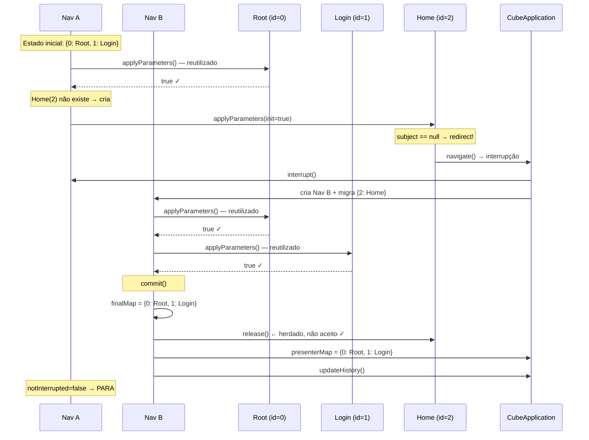
```mermaid
sequenceDiagram
    participant NavA as Nav A
    participant NavB as Nav B
    participant Root as Root (id=0)
    participant Login as Login (id=1)
    participant Home as Home (id=2)
    participant App as CubeApplication

    Note over NavA: Estado inicial: {0: Root, 1: Login}

    NavA->>Root: applyParameters() — reutilizado
    Root-->>NavA: true ✓

    Note over NavA: Home(2) não existe → cria
    NavA->>Home: applyParameters(init=true)
    Note over Home: subject == null → redirect!
    Home->>App: navigate() → interrupção
    App->>NavA: interrupt()
    App->>NavB: cria Nav B + migra {2: Home}

    NavB->>Root: applyParameters() — reutilizado
    Root-->>NavB: true ✓
    NavB->>Login: applyParameters() — reutilizado
    Login-->>NavB: true ✓

    Note over NavB: commit()
    NavB->>NavB: finalMap = {0: Root, 1: Login}
    NavB->>Home: release() ← herdado, não aceito ✓
    NavB->>App: presenterMap = {0: Root, 1: Login}
    NavB->>App: updateHistory()

    Note over NavA: notInterrupted=false → PARA
```

### Rollback após Exceção

Estado inicial: `presenterMap = {0: RootPresenter, 2: HomePresenter}`
Navegação: `ROOT(0) → HOME(2) → CART(5)`, mas CART lança exceção

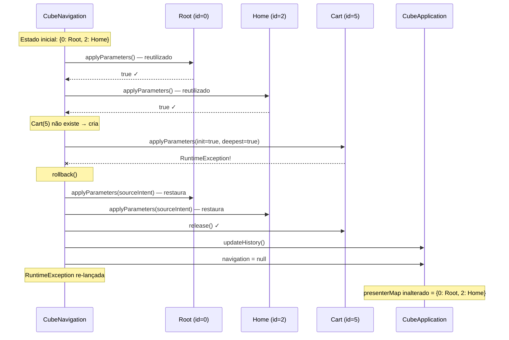
```mermaid
sequenceDiagram
    participant Nav as CubeNavigation
    participant Root as Root (id=0)
    participant Home as Home (id=2)
    participant Cart as Cart (id=5)
    participant App as CubeApplication

    Note over Nav: Estado inicial: {0: Root, 2: Home}

    Nav->>Root: applyParameters() — reutilizado
    Root-->>Nav: true ✓
    Nav->>Home: applyParameters() — reutilizado
    Home-->>Nav: true ✓

    Note over Nav: Cart(5) não existe → cria
    Nav->>Cart: applyParameters(init=true, deepest=true)
    Cart--xNav: RuntimeException!

    Note over Nav: rollback()
    Nav->>Root: applyParameters(sourceIntent) — restaura
    Nav->>Home: applyParameters(sourceIntent) — restaura
    Nav->>Cart: release() ✓
    Nav->>App: updateHistory()
    Nav->>App: navigation = null
    Note over Nav: RuntimeException re-lançada
    Note over App: presenterMap inalterado = {0: Root, 2: Home}
```

---

## Suspend e Coroutines no Cube MVP

O Cube MVP adota **Kotlin coroutines** como mecanismo de concorrência. A escolha de quais métodos são `suspend` e quais são síncronos segue uma regra fundamental: **suspend marca operações que cruzam fronteiras de I/O ou navegação; mutação de estado e notificação de view são sempre síncronas.**

### O Modelo de Execução

A arquitetura define dois "mundos" de execução que se complementam:

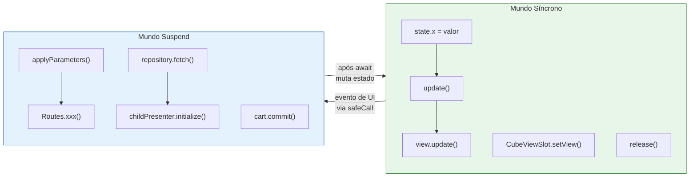
```mermaid
flowchart LR
    subgraph SYNC["Mundo Síncrono"]
        direction TB
        S1["state.x = valor"]
        S2["update()"]
        S3["view.update()"]
        S4["CubeViewSlot.setView()"]
        S5["release()"]
        S1 --> S2 --> S3
    end

    subgraph SUSPEND["Mundo Suspend"]
        direction TB
        A1["applyParameters()"]
        A2["Routes.xxx()"]
        A3["repository.fetch()"]
        A4["childPresenter.initialize()"]
        A5["cart.commit()"]
        A1 --> A2
        A3 --> A4
    end

    SUSPEND -->|"após await\nmuta estado"| SYNC
    SYNC -->|"evento de UI\nvia safeCall"| SUSPEND

    style SYNC fill:#e8f5e9,stroke:#2e7d32
    style SUSPEND fill:#e3f2fd,stroke:#1565c0
```

**Princípio:** O código suspend **nunca muta estado diretamente na view**. Ele faz o I/O, obtém dados, e então muta o `ViewState` e chama `update()` — ambos síncronos.

### O presenterScope — Serialização de Ações

O `ShoppingApplication` define um `CoroutineScope` com paralelismo limitado a 1:

```kotlin
val presenterScope = CoroutineScope(Dispatchers.Default.limitedParallelism(1))
```

Isso garante que **todas as ações de presenter executam serialmente**, eliminando condições de corrida sem necessidade de locks ou mutexes:

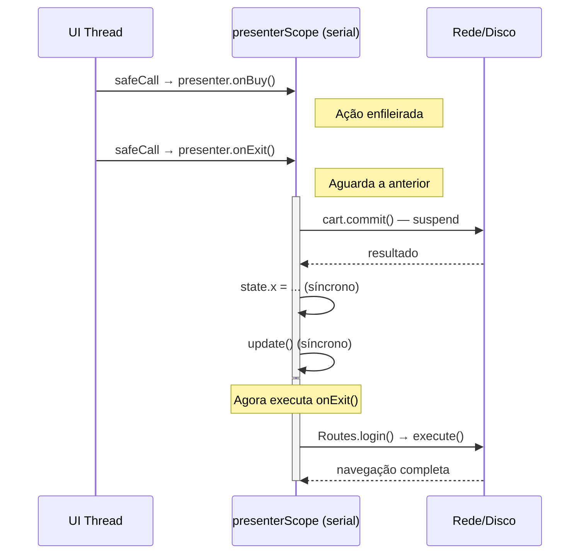
```mermaid
sequenceDiagram
    participant UI as UI Thread
    participant Q as presenterScope (serial)
    participant IO as Rede/Disco

    UI->>Q: safeCall → presenter.onBuy()
    Note right of Q: Ação enfileirada

    UI->>Q: safeCall → presenter.onExit()
    Note right of Q: Aguarda a anterior

    activate Q
    Q->>IO: cart.commit() — suspend
    IO-->>Q: resultado
    Q->>Q: state.x = ... (síncrono)
    Q->>Q: update() (síncrono)
    deactivate Q

    activate Q
    Note over Q: Agora executa onExit()
    Q->>IO: Routes.login() → execute()
    IO-->>Q: navegação completa
    deactivate Q
```

**Consequência prática:** O desenvolvedor pode programar os presenters como se fossem single-threaded — lê e escreve no `state` sem preocupações de concorrência.

### A Fronteira Suspend / Síncrono

A tabela abaixo resume quais operações do framework são `suspend` e quais são síncronas:

| Operação | Suspend? | Por quê |
|----------|:--------:|---------|
| `state.campo = valor` | ❌ | Pura atribuição em memória |
| `update()` | ❌ | Notifica a view para re-renderizar (síncrono) |
| `CubeView.update()` | ❌ | Apenas marca dirty / recompõe |
| `CubeViewSlot.setView(view)` | ❌ | Conecta view ao slot do pai (atribuição) |
| `release()` | ❌ | Libera recursos locais |
| `commitComputedState()` | ❌ | Cálculo derivado síncrono |
| `CubeNavigation.execute()` | ✅ | Chama `applyParameters()` de cada presenter |
| `CubePresenter.applyParameters()` | ✅ | Pode inicializar child presenters (I/O) |
| `AbstractChildPresenter.initialize()` | ✅ | Chama `onInitialize()` que pode carregar dados |
| `Routes.xxx(app)` | ✅ | Chama `navigate().execute()` |
| `repository.fetch/insert/update()` | ✅ | Acesso a rede ou banco de dados |
| Ações do usuário com I/O (`onBuy()`) | ✅ | Chamam repositórios ou navegam |
| Ações do usuário sem I/O (`onModifyQuantity()`) | ❌ | Apenas mutam estado local |

### O Padrão safeCall — Bridge entre View e Presenter

A camada de view **nunca chama funções suspend diretamente**. Ela usa o padrão `safeCall` para despachar ações no `presenterScope`:

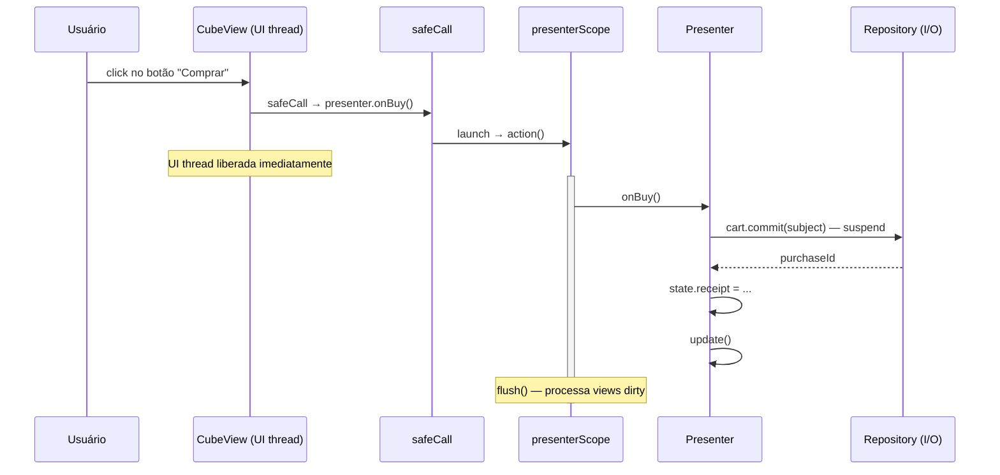
```mermaid
sequenceDiagram
    participant User as Usuário
    participant View as CubeView (UI thread)
    participant Safe as safeCall
    participant Scope as presenterScope
    participant Pres as Presenter
    participant Repo as Repository (I/O)

    User->>View: click no botão "Comprar"
    View->>Safe: safeCall → presenter.onBuy()
    Safe->>Scope: launch → action()
    Note over View: UI thread liberada imediatamente

    activate Scope
    Scope->>Pres: onBuy()
    Pres->>Repo: cart.commit(subject) — suspend
    Repo-->>Pres: purchaseId
    Pres->>Pres: state.receipt = ...
    Pres->>Pres: update()
    Note over Scope: flush() — processa views dirty
    deactivate Scope
```

A implementação de `safeCall` é idêntica em todas as plataformas:

```kotlin
// Em ComposeCubeView, ReactCubeView, AbstractViewAndroid
protected fun safeCall(action: suspend () -> Unit) {
    app.presenterScope.launch {
        try {
            action()
        } catch (e: Exception) {
            app.alertUnexpectedError(LOG, "Erro inesperado", e)
        } finally {
            ViewUpdateScheduler.flush()  // Processa views dirty
        }
    }
}
```

**Na prática, na view:**

```kotlin
// Compose
Button(onClick = { safeCall { presenter.onBuy() } }) { Text("Comprar") }

// Native Android
buyButton.setOnClickListener { safeAction("onBuy") { presenter.onBuy() } }

// Native Web (React/MUI via Kotlin/JS)
onClick = { safeCall { presenter.onOpenProduct(productId) } }
```

### Ciclo de Vida dos Presenters e Suspend

O `applyParameters()` é o único método do ciclo de vida que é `suspend`. Isso permite que presenters façam trabalho assíncrono durante a navegação:

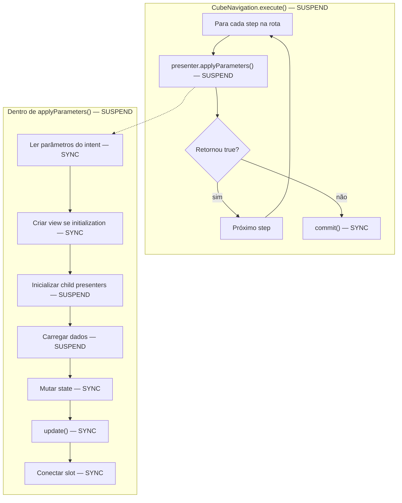
```mermaid
flowchart TD
    subgraph "CubeNavigation.execute() — SUSPEND"
        direction TB
        E1["Para cada step na rota"]
        E2["presenter.applyParameters() — SUSPEND"]
        E3{Retornou true?}
        E4["Próximo step"]
        E5["commit() — SYNC"]

        E1 --> E2 --> E3
        E3 -->|sim| E4 --> E1
        E3 -->|não| E5
    end

    subgraph "Dentro de applyParameters() — SUSPEND"
        direction TB
        AP1["Ler parâmetros do intent — SYNC"]
        AP2["Criar view se initialization — SYNC"]
        AP3["Inicializar child presenters — SUSPEND"]
        AP4["Carregar dados — SUSPEND"]
        AP5["Mutar state — SYNC"]
        AP6["update() — SYNC"]
        AP7["Conectar slot — SYNC"]

        AP1 --> AP2 --> AP3 --> AP4 --> AP5 --> AP6 --> AP7
    end

    E2 -.-> AP1
```

**Exemplo concreto — ReceiptPresenter:**

```kotlin
override suspend fun applyParameters(intent: CubeIntent, initialization: Boolean, deepest: Boolean): Boolean {
    val pPurchaseId = intent.getParameterAsLong(PlaceParameters.PURCHASE_ID, purchaseId)
        ?: throw AssertionError("Missing PURCHASE_ID")

    // (1) Carrega dados do servidor — SUSPEND (I/O)
    if (state.receipt == null || pPurchaseId != purchaseId) {
        val receipt = receiptService.loadReceipt(pPurchaseId)  // ← suspend
        purchaseId = pPurchaseId
        state.receipt = receipt   // ← sync: muta estado
        update()                  // ← sync: notifica view
    }

    // (2) Cria view e conecta slot — SYNC
    if (initialization) {
        ownerSlot = intent.getViewSlot(PlaceAttributes.SLOT_OWNER)
        view = createView?.invoke(this)
        update()
    }

    ownerSlot?.setView(view!!)   // ← sync: conecta ao pai
    return true
}
```

### Child Presenters — Inicialização Assíncrona

Presenters filhos (painéis embutidos) seguem um padrão de dois passos:

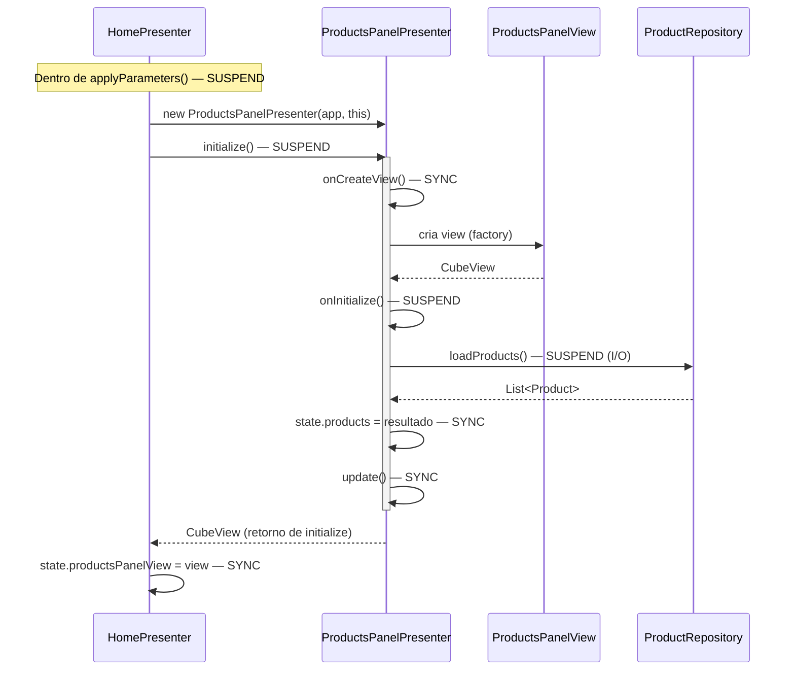
```mermaid
sequenceDiagram
    participant Parent as HomePresenter
    participant Child as ProductsPanelPresenter
    participant View as ProductsPanelView
    participant Repo as ProductRepository

    Note over Parent: Dentro de applyParameters() — SUSPEND

    Parent->>Child: new ProductsPanelPresenter(app, this)
    Parent->>Child: initialize() — SUSPEND

    activate Child
    Child->>Child: onCreateView() — SYNC
    Child->>View: cria view (factory)
    View-->>Child: CubeView

    Child->>Child: onInitialize() — SUSPEND
    Child->>Repo: loadProducts() — SUSPEND (I/O)
    Repo-->>Child: List<Product>
    Child->>Child: state.products = resultado — SYNC
    Child->>Child: update() — SYNC
    deactivate Child

    Child-->>Parent: CubeView (retorno de initialize)
    Parent->>Parent: state.productsPanelView = view — SYNC
```

```kotlin
// AbstractChildPresenter — ciclo de vida
abstract class AbstractChildPresenter<A : CubeApplication>(override val app: A) : PresenterBase {

    suspend fun initialize(): CubeView {
        val v = onCreateView()       // SYNC — cria instância da view
        view = v
        onInitialize()               // SUSPEND — pode fazer I/O
        return v
    }

    protected abstract fun onCreateView(): CubeView           // SYNC
    protected abstract suspend fun onInitialize()             // SUSPEND
}
```

**A separação é intencional:** `onCreateView()` é síncrono porque criar uma view é rápido e não envolve I/O. `onInitialize()` é suspend porque tipicamente carrega dados iniciais do servidor.

### Quando Usar e Quando NÃO Usar Suspend

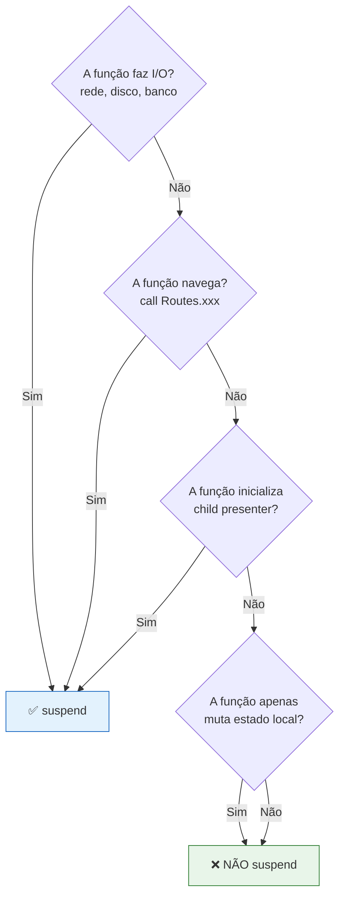
```mermaid
flowchart TD
    Q1{A função faz I/O?\nrede, disco, banco}
    Q2{A função navega?\ncall Routes.xxx}
    Q3{A função inicializa\nchild presenter?}
    Q4{A função apenas\nmuta estado local?}

    Q1 -->|Sim| SUSPEND["✅ suspend"]
    Q1 -->|Não| Q2
    Q2 -->|Sim| SUSPEND
    Q2 -->|Não| Q3
    Q3 -->|Sim| SUSPEND
    Q3 -->|Não| Q4
    Q4 -->|Sim| NOSUSPEND["❌ NÃO suspend"]
    Q4 -->|Não| NOSUSPEND

    style SUSPEND fill:#e3f2fd,stroke:#1565c0
    style NOSUSPEND fill:#e8f5e9,stroke:#2e7d32
```

**Exemplos no CartPresenter:**

```kotlin
// ❌ NÃO suspend — apenas opera no carrinho local (in-memory)
fun onModifyQuantity(productId: Long?, quantity: Int?) {
    val found = cart.modifyProductQuantity(productId, quantity)  // sync
    if (found) {
        state.items = cart.getCartItems()  // sync
        update()                            // sync
    }
}

// ✅ suspend — pode navegar (Routes.home)
suspend fun onRemoveProduct(productId: Long?) {
    val modified = cart.removeProduct(productId)  // sync
    if (modified) {
        if (cart.getSize() == 0) {
            Routes.home(app)  // ← suspend: navega
        } else {
            state.items = cart.getCartItems()
            update()
        }
    }
}

// ✅ suspend — faz I/O (cart.commit) e navega (Routes.receipt)
suspend fun onBuy() {
    val purchaseId = cart.commit(app.subject!!)  // ← suspend: persiste compra
    val intent = app.newIntent()
    intent.setParameter(PlaceParameters.PURCHASE_ID, purchaseId)
    Routes.receipt(app, intent)                  // ← suspend: navega
}
```

### Regras Práticas para o Desenvolvedor

1. **Marque como `suspend` se e somente se** a função chama outra suspend (repositório, Routes, initialize). Não adicione `suspend` "por precaução".

2. **Nunca chame `runBlocking` dentro de um presenter.** O `presenterScope` já é a coroutine — usar `runBlocking` dentro dele causa deadlock.

3. **Views nunca são suspend.** Os métodos `update()`, `release()`, `setView()` e toda a construção de UI são síncronos. Use `safeCall` para despachar ações suspend a partir de eventos de UI.

4. **`safeCall` é fire-and-forget.** Não há valor de retorno. Se precisa do resultado de uma operação async para atualizar a UI, mute o `state` dentro do bloco e chame `update()`.

5. **Listeners podem ser suspend.** O `CartManager` suporta `suspend () -> Unit` como listener de commit. O framework chama esses listeners sequencialmente com `await`.

6. **`CubeViewSlot.setView()` é síncrono.** É uma atribuição de view ao slot do pai — nunca envolve I/O.

7. **Ações de navegação (Routes) são sempre suspend.** Qualquer método que pode navegar deve ser marcado como `suspend`, pois `CubeNavigation.execute()` é suspend.

8. **O fluxo típico dentro de um `safeCall`:**

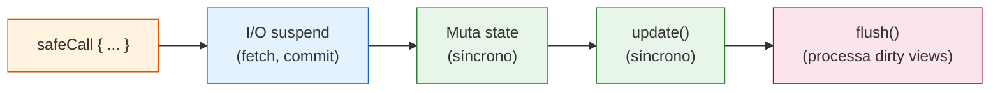
```mermaid
flowchart LR
    A["safeCall { ... }"] --> B["I/O suspend\n(fetch, commit)"]
    B --> C["Muta state\n(síncrono)"]
    C --> D["update()\n(síncrono)"]
    D --> E["flush()\n(processa dirty views)"]

    style A fill:#fff3e0,stroke:#e65100
    style B fill:#e3f2fd,stroke:#1565c0
    style C fill:#e8f5e9,stroke:#2e7d32
    style D fill:#e8f5e9,stroke:#2e7d32
    style E fill:#fce4ec,stroke:#880e4f
```

### Disparo Assíncrono Paralelo — Fire-and-Forget com Retorno

Há cenários em que o presenter precisa disparar uma operação de I/O **sem bloquear** a ação corrente — por exemplo, pré-carregar dados, enviar telemetria, ou buscar informações secundárias enquanto a UI já exibe o conteúdo principal.

Como o `presenterScope` é serial (`limitedParallelism(1)`), usar `app.presenterScope.launch { ... }` apenas **enfileira** a tarefa para depois. Se o objetivo é execução **realmente paralela**, deve-se usar um scope separado e, ao obter o resultado, despachar de volta para o `presenterScope` para mutar o estado com segurança.

O `presenterScope` está acessível nos presenters via `app.presenterScope` (definido em `ShoppingApplication`).

#### Padrão: Scope Paralelo com Retorno ao presenterScope

```kotlin
// Dentro de um presenter (app é ShoppingApplication)
suspend fun onEnter() {
    // Exibe imediatamente com dados parciais
    state.loading = true
    update()

    // Dispara operação pesada em paralelo — NÃO bloqueia
    CoroutineScope(Dispatchers.Default).launch {
        try {
            val extra = repository.fetchExtraInfo(id)  // I/O paralelo

            // Retorna ao presenterScope para mutar estado
            app.presenterScope.launch {
                state.extraInfo = extra
                state.loading = false
                update()
            }
        } catch (e: Exception) {
            app.presenterScope.launch {
                state.errorMessage = e.message
                state.loading = false
                update()
            }
        }
    }
}
```

#### Diagrama de Sequência

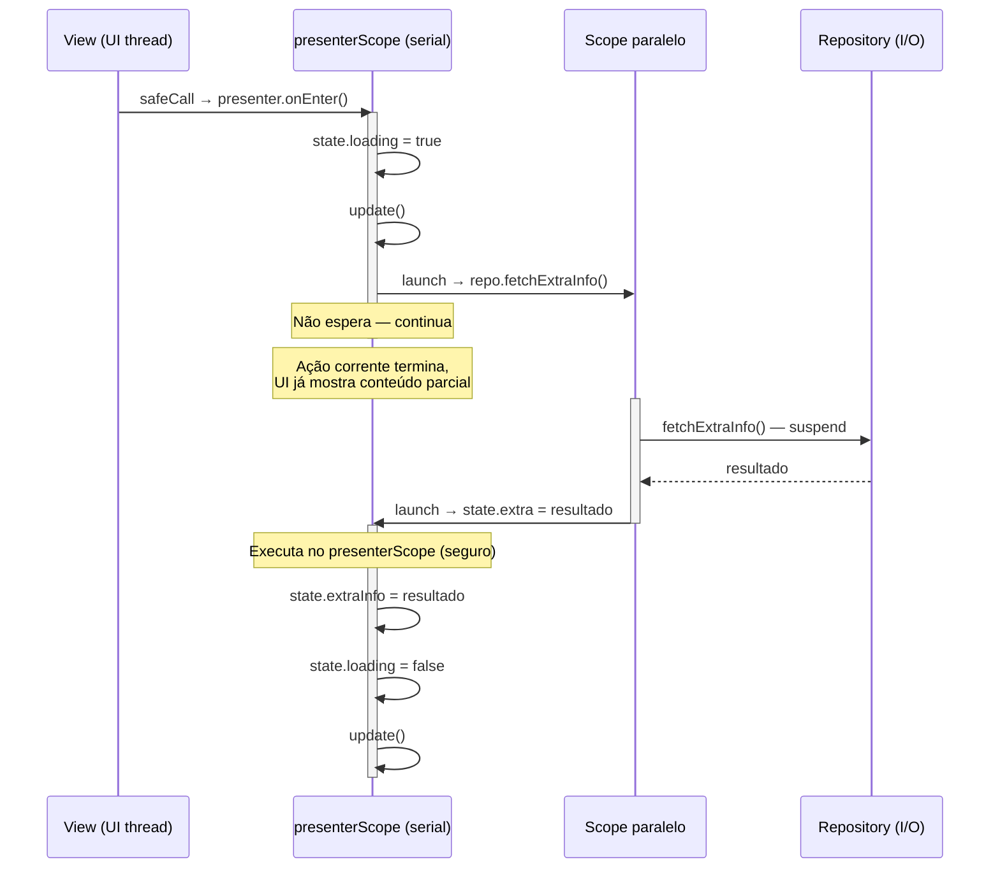
```mermaid
sequenceDiagram
    participant UI as View (UI thread)
    participant PS as presenterScope (serial)
    participant BG as Scope paralelo
    participant Repo as Repository (I/O)

    UI->>PS: safeCall → presenter.onEnter()
    activate PS
    PS->>PS: state.loading = true
    PS->>PS: update()
    PS->>BG: launch → repo.fetchExtraInfo()
    Note over PS: Não espera — continua
    deactivate PS
    Note over PS: Ação corrente termina,<br/>UI já mostra conteúdo parcial

    activate BG
    BG->>Repo: fetchExtraInfo() — suspend
    Repo-->>BG: resultado
    BG->>PS: launch → state.extra = resultado
    deactivate BG

    activate PS
    Note over PS: Executa no presenterScope (seguro)
    PS->>PS: state.extraInfo = resultado
    PS->>PS: state.loading = false
    PS->>PS: update()
    deactivate PS
```

#### Contraste com o Modo Serial (enfileirado)

Se a operação não precisa ser paralela — apenas desacoplada da ação corrente — basta enfileirar no próprio `presenterScope`:

```kotlin
// Enfileirado — executa APÓS a ação corrente terminar (serial, sem paralelismo)
app.presenterScope.launch {
    val data = repository.sendAnalytics(payload)
    // Pode mutar state diretamente aqui (já está no presenterScope)
    state.analyticsConfirmed = true
    update()
}
```

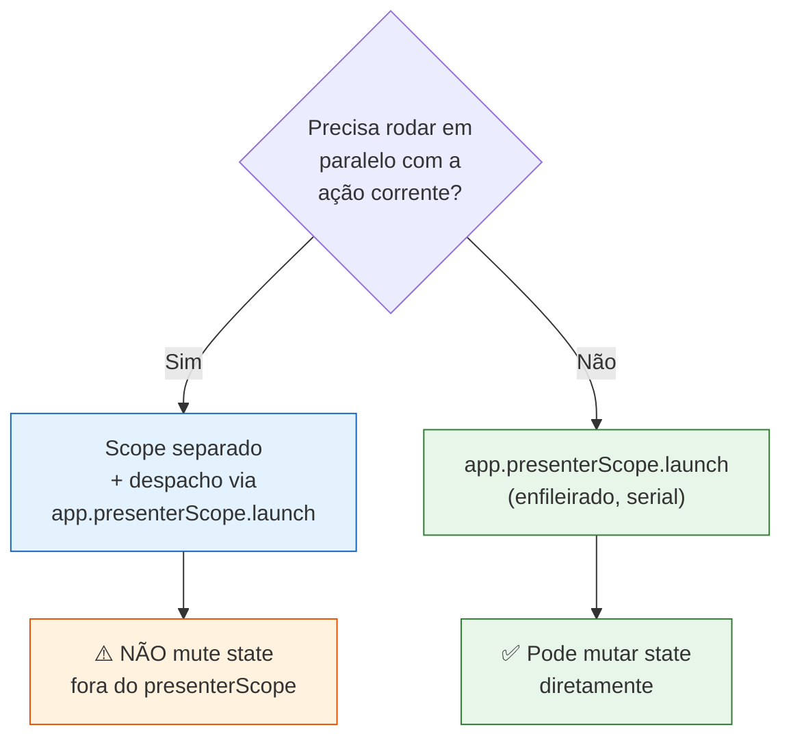
```mermaid
flowchart TD
    Q{Precisa rodar em<br/>paralelo com a<br/>ação corrente?}
    Q -->|Sim| PAR["Scope separado<br/>+ despacho via<br/>app.presenterScope.launch"]
    Q -->|Não| SER["app.presenterScope.launch<br/>(enfileirado, serial)"]

    PAR --> R1["⚠️ NÃO mute state<br/>fora do presenterScope"]
    SER --> R2["✅ Pode mutar state<br/>diretamente"]

    style PAR fill:#e3f2fd,stroke:#1565c0
    style SER fill:#e8f5e9,stroke:#2e7d32
    style R1 fill:#fff3e0,stroke:#e65100
    style R2 fill:#e8f5e9,stroke:#2e7d32
```

#### Regra de Segurança

> **Toda mutação de `state` e chamada a `update()` deve acontecer dentro do `presenterScope`.**
>
> Se o código está executando em um scope paralelo, ele deve despachar de volta via `app.presenterScope.launch { ... }` antes de tocar no estado do presenter. Violar essa regra causa condições de corrida silenciosas.
