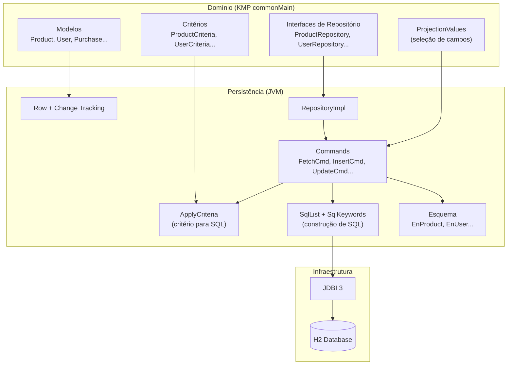
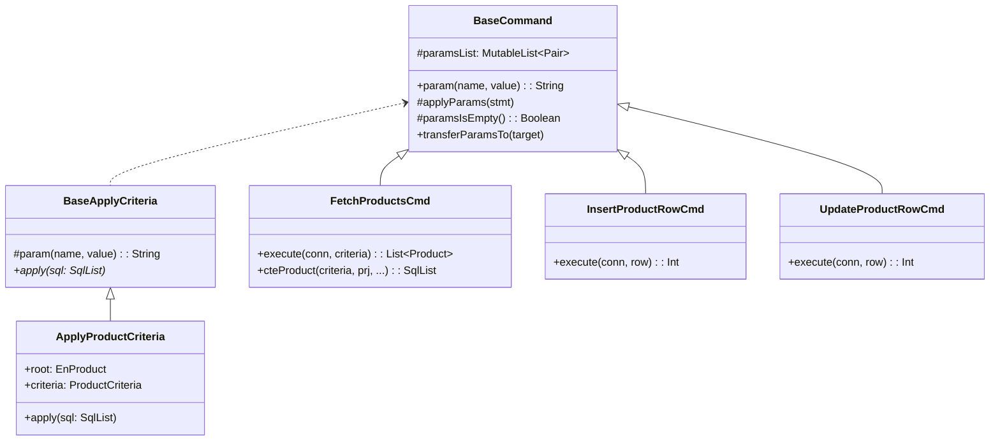
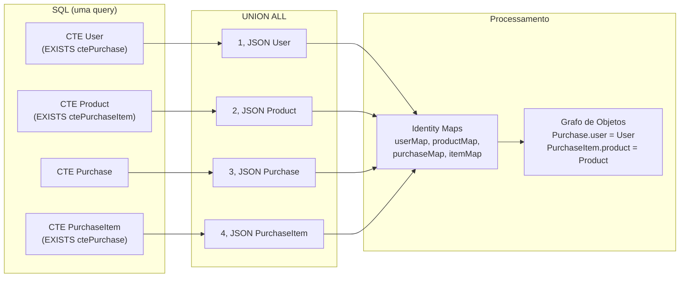

# Arquitetura de Persistência — Repositórios com Critérios

## Sumário

- [Visão Geral](#visão-geral)
- [Camadas](#camadas)
- [Modelos de Domínio](#modelos-de-domínio)
- [Classes de Critério](#classes-de-critério)
- [Interface de Repositório](#interface-de-repositório)
- [Projeção](#projeção)
- [Esquema de Banco — DbTable e DbField](#esquema-de-banco--dbtable-e-dbfield)
- [Row com Change Tracking](#row-com-change-tracking)
- [Padrão Command](#padrão-command)
- [Construção de SQL — SqlList e SqlKeywords](#construção-de-sql--sqllist-e-sqlkeywords)
- [Aplicação de Critérios em SQL](#aplicação-de-critérios-em-sql)
- [Fetch com CTE e JSON](#fetch-com-cte-e-json)
- [Insert e Update com Change Tracking](#insert-e-update-com-change-tracking)
- [Transações](#transações)
- [Bootstrap e Service Locator](#bootstrap-e-service-locator)
- [Resumo dos Padrões](#resumo-dos-padrões)

---

## Visão Geral

A camada de persistência segue uma arquitetura orientada a **critérios** (Query Object Pattern), onde cada operação de consulta, contagem ou deleção recebe um objeto de critério que descreve os filtros desejados. Isso cria uma API de repositório **uniforme e extensível** — novos filtros são adicionados ao critério sem alterar a assinatura dos métodos.



---

## Camadas

A arquitetura separa em três camadas:

| Camada | Localização | Responsabilidade |
|--------|-------------|------------------|
| **Domínio** | `shopping-domain` (KMP commonMain) | Modelos, critérios, interfaces de repositório, projeção |
| **Persistência** | `shopping-persistence` (JVM) | Esquema, commands, SQL, implementações de repositório |
| **Infraestrutura** | JDBI 3 + H2 | Acesso JDBC e banco de dados |

O domínio é **multiplataforma** — as mesmas interfaces e critérios são usados tanto nos presenters Compose (via REST) quanto nos presenters React (via acesso direto JDBC).

---

## Modelos de Domínio

Modelos são classes mutáveis com campos anuláveis. Não são data classes — isso permite uso como objetos parciais para projeções.

```kotlin
class Product {
    var id: Long? = null
    var name: String? = null
    var price: Double? = null
    var description: String? = null
    var image: ByteArray? = null
}
```

A anulabilidade de cada campo tem duplo propósito:
1. **Dados opcionais** — campo pode não estar preenchido
2. **Projeção** — campo `null` significa "não inclua no SELECT"

---

## Classes de Critério

Cada entidade tem uma classe de critério com **campos anuláveis** representando filtros opcionais e um **builder fluente**:

```kotlin
class ProductCriteria {
    var projection: Product? = null     // Quais campos retornar
    var offset: Int? = null             // Paginação
    var limit: Int? = null              // Paginação
    var productId: Long? = null         // Filtro por ID
    var orderBy: OrderBy? = null        // Ordenação

    fun withProjection(projection: Product?) = apply { this.projection = projection }
    fun withOffset(offset: Int?) = apply { this.offset = offset }
    fun withLimit(limit: Int?) = apply { this.limit = limit }
    fun withProductId(productId: Long?) = apply { this.productId = productId }
    fun withOrderBy(orderBy: OrderBy?) = apply { this.orderBy = orderBy }

    enum class OrderBy { ACENDING, DESCENDING }
}
```

Critérios mais complexos incluem filtros de entidades relacionadas. Por exemplo, `PurchaseItemCriteria` permite filtrar itens de compra por `userId`, mesmo que o item não tenha relação direta com o usuário:

```kotlin
class PurchaseItemCriteria {
    var purchaseItemId: Long? = null
    var purchaseId: Long? = null
    var productId: Long? = null
    var userId: Long? = null      // Filtra via JOIN com Purchase
    var offset: Int? = null
    var limit: Int? = null
    var orderBy: OrderBy? = null
    var projection: PurchaseItem? = null
    // ... builders fluentes
}
```

A regra é: **campo `null` = filtro não aplicado**. Isso permite compor queries dinamicamente combinando qualquer subconjunto de filtros.

---

## Interface de Repositório

Todos os repositórios seguem um contrato uniforme:

```kotlin
interface ProductRepository {
    fun insert(product: Product): Boolean
    fun update(newProduct: Product, oldProduct: Product): Boolean
    fun insertOrUpdate(product: Product): Boolean
    fun delete(criteria: ProductCriteria): Int
    fun count(criteria: ProductCriteria): Int
    fun fetch(criteria: ProductCriteria): List<Product>
    fun fetchById(productId: Long, projection: Product?): Product?

    companion object {
        val BEAN = AtomicRef<ProductRepository>()
    }
}
```

| Método | Descrição |
|--------|-----------|
| `insert` | Insere uma entidade, gera ID via sequence se necessário |
| `update(new, old)` | Atualiza apenas campos que mudaram entre `new` e `old` |
| `insertOrUpdate` | Tenta inserir; se já existir, atualiza |
| `delete(criteria)` | Remove registros que atendem ao critério; retorna quantidade |
| `count(criteria)` | Conta registros que atendem ao critério |
| `fetch(criteria)` | Busca registros com filtros, projeção, paginação e ordenação |
| `fetchById` | Atalho para busca por chave primária com projeção opcional |

---

## Projeção

O mecanismo de projeção usa a **própria instância do modelo** como seletor de campos. Campos não-nulos no modelo de projeção indicam quais colunas incluir no SELECT.

```kotlin
// Buscar apenas id, nome e preço (sem description nem image)
val projection = Product().apply {
    name = ProjectionValues.str     // valor sentinela "dummy"
    price = ProjectionValues.f64    // valor sentinela 1.0
}

val products = repo.fetch(
    ProductCriteria()
        .withProjection(projection)
        .withLimit(10)
)
```

`ProjectionValues` é um objeto com valores sentinela por tipo:

```kotlin
object ProjectionValues {
    val i64: Long = 1L
    val f64: Double = 1.0
    val str: String = "dummy"
    val bin: ByteArray = ByteArray(0)
    // ...
}
```

Na implementação, a lista de campos SELECT é construída verificando quais campos da projeção são não-nulos:

```kotlin
fun fields(prj: Product?, en: EnProduct): List<DbField> {
    var p = prj
    if (p == null) {
        // Projeção padrão: tudo exceto campos pesados (ex: image)
        p = Product()
        p.name = pv.str
        p.price = pv.f64
        p.description = pv.str
    }
    p.id = pv.i64  // ID sempre incluído

    val fields = mutableListOf<DbField>()
    if (p.id != null) fields.add(en.id)
    if (p.name != null) fields.add(en.name)
    if (p.price != null) fields.add(en.price)
    if (p.description != null) fields.add(en.description)
    if (p.image != null) fields.add(en.image)
    return fields
}
```

---

## Esquema de Banco — DbTable e DbField

Cada entidade tem uma classe de esquema (`EnProduct`, `EnUser`, etc.) que estende `DbTable` e define os campos como instâncias de `DbField`:

```kotlin
class EnProduct(alias: String) : DbTable(alias) {
    val id = mkBigint("ID", false)
    val name = mkVarCharIgnoreCase("NAME", 1000000, false)
    val price = mkNumeric("PRICE", 20, 2, false)
    val description = mkVarChar("DESCRIPTION", 1000000, false)
    val image = mkBinary("IMAGE", 1000000, true)

    override fun tableName() = "EN_PRODUCT"

    companion object {
        val INSTANCE = EnProduct("")  // Sem alias, para queries simples
    }
}
```

O `alias` permite criar múltiplas instâncias da mesma tabela com aliases diferentes para CTEs e subqueries:

```kotlin
val p = EnProduct("P")         // Gera "P.ID", "P.NAME", etc.
val cte = EnProduct("cteProduct")  // Gera "cteProduct.ID", etc.
```

`DbField` fornece:
- `path` — nome qualificado (`alias.NAME`) para uso em SQL
- `declaration` — DDL completa (`NAME VARCHAR_IGNORECASE(1000000) NOT NULL`)
- `asc()` / `desc()` — expressões de ordenação

---

## Row com Change Tracking

Cada `EnXxx` contém uma inner class `Row` que rastreia quais campos foram alterados:

```kotlin
class Row : BaseRow() {
    var name: String? = null; private set
    var nameChanged = false; private set
    fun name(value: String?): Row {
        name = value; nameChanged = true; return this
    }

    override fun clearChanges() {
        nameChanged = false
        // ...
    }
}
```

O change tracking permite:
- **INSERT parcial** — inclui apenas colunas onde `xxxChanged == true`
- **UPDATE diferencial** — compara `new` vs `old`, marca apenas campos diferentes, gera SET mínimo

---

## Padrão Command

Cada operação SQL é encapsulada em uma classe Command que estende `BaseCommand`:



Cada entidade tem um conjunto completo de commands:

| Command | Operação |
|---------|----------|
| `FetchXxxCmd` | SELECT com CTE, projeção, JSON, paginação |
| `CountXxxCmd` | SELECT COUNT(*) com critérios |
| `DeleteXxxCmd` | DELETE com critérios |
| `InsertXxxRowCmd` | INSERT com change tracking |
| `UpdateXxxRowCmd` | UPDATE diferencial (new vs old) |

---

## Construção de SQL — SqlList e SqlKeywords

### SqlList

Builder line-by-line de SQL. Cada chamada a `ln()` adiciona uma linha:

```kotlin
val sql = SqlList()
sql.ln(SELECT)
sql.field(p.id)
sql.field(p.name)
sql.field(p.price)
sql.ln(FROM, p.tableRef())
sql.ln(WHERE_TRUE)
sql.ln(AND, p.id, EQUAL, param("productId", 42))
sql.ln(ORDER_BY(p.id.asc()))
sql.ln(LIMIT, 10)
```

Gera:
```sql
SELECT
 P.ID
,P.NAME
,P.PRICE
FROM EN_PRODUCT P
WHERE 1=1
AND P.ID = :productId
ORDER BY P.ID ASC
LIMIT 10
```

O `field()` gerencia automaticamente vírgulas — primeiro campo sem vírgula, demais com vírgula.

### SqlKeywords

Interface com constantes SQL e funções compostas:

```kotlin
interface SqlKeywords {
    val SELECT get() = "SELECT"
    val WHERE_TRUE get() = "WHERE 1=1"
    val AND get() = "AND"
    // ...

    fun EXISTS(builder: (SqlList) -> Unit): String
    fun ORDER_BY(vararg items: Any?): String
    fun COUNT(vararg items: Any?): String
}
```

O `WHERE 1=1` (WHERE_TRUE) permite encadear cláusulas AND incondicionalmente — cada critério simplesmente adiciona `AND condição` sem se preocupar se é o primeiro filtro.

---

## Aplicação de Critérios em SQL

Cada `ApplyXxxCriteria` traduz os campos não-nulos do critério para cláusulas WHERE:

```kotlin
class ApplyProductCriteria(cmd: BaseCommand) : BaseApplyCriteria(cmd) {
    lateinit var root: EnProduct
    lateinit var criteria: ProductCriteria

    override fun apply(sql: SqlList) {
        criteria.productId?.let {
            sql.ln(AND, root.id, EQUAL, param("productId", it))
        }
    }
}
```

Para filtros que envolvem entidades relacionadas, usa-se `EXISTS` com subquery:

```kotlin
// Em ApplyPurchaseItemCriteria
criteria.userId?.let {
    sql.ln(AND, EXISTS { subSql ->
        subSql.ln(SELECT, 1)
        subSql.ln(FROM, "EN_PURCHASE P")
        subSql.ln(WHERE, "P.ID", EQUAL, root.purchaseId)
        subSql.ln(AND, "P.USERID", EQUAL, param("userId", it))
    })
}
```

---

## Fetch com CTE e JSON

As consultas de busca usam **CTEs (Common Table Expressions)** com serialização JSON para carregar grafos de entidades em uma única query:

### Caso Simples (Product)

```sql
WITH cteProduct AS (
  SELECT P.ID, P.NAME, P.PRICE, P.DESCRIPTION
  FROM EN_PRODUCT P
  WHERE 1=1
  AND P.ID = :productId
  ORDER BY P.ID ASC
  LIMIT 10
)
SELECT JSON_OBJECT('ID': cteProduct.ID, 'NAME': cteProduct.NAME, ...) AS json_data
FROM cteProduct
```

### Caso Complexo (Purchase com entidades relacionadas)

```sql
WITH ctePurchase AS (
  SELECT B.ID, B.BUYDATE, B.USERID
  FROM EN_PURCHASE B WHERE 1=1 AND ...
),
cteUser AS (
  SELECT U.ID, U.USERNAME, U.NAME
  FROM EN_USER U WHERE 1=1
  AND EXISTS(SELECT 1 FROM ctePurchase WHERE ctePurchase.USERID = U.ID)
),
ctePurchaseItem AS (
  SELECT PI.ID, PI.AMOUNT, PI.PRICE, PI.PRODUCTID, PI.PURCHASEID
  FROM EN_PURCHASEITEM PI WHERE 1=1
  AND EXISTS(SELECT 1 FROM ctePurchase WHERE ctePurchase.ID = PI.PURCHASEID)
),
cteProduct AS (
  SELECT P.ID, P.NAME, P.PRICE
  FROM EN_PRODUCT P WHERE 1=1
  AND EXISTS(SELECT 1 FROM ctePurchaseItem WHERE ctePurchaseItem.PRODUCTID = P.ID)
)
          SELECT 1, JSON_OBJECT(...) FROM cteUser
UNION ALL SELECT 2, JSON_OBJECT(...) FROM cteProduct
UNION ALL SELECT 3, JSON_OBJECT(...) FROM ctePurchase
UNION ALL SELECT 4, JSON_OBJECT(...) FROM ctePurchaseItem
```

O processamento usa um **discriminador** (1=User, 2=Product, 3=Purchase, 4=PurchaseItem) para rotear cada linha JSON ao `fromJson()` correto. **Identity maps** (`MutableMap<Long, Entity>`) deduplicam e vinculam entidades por ID, reconstruindo o grafo de objetos em memória.



---

## Insert e Update com Change Tracking

### Insert

O `InsertXxxRowCmd` converte o modelo de domínio em um `Row` e gera INSERT apenas com campos marcados como `changed`:

```kotlin
fun execute(connection: Connection, row: EnProduct.Row): Int {
    val sql = SqlList()
    val places = mutableListOf<String>()

    sql.ln(INSERT_INTO, en.tableName(), '(')
    sql.ln(' ', en.id)
    places.add(param("id", row.id))

    if (row.nameChanged) {
        sql.ln(',', en.name)
        places.add(param("name", row.name))
    }
    // ...demais campos...

    sql.ln(")")
    sql.ln(VALUES)
    sql.ln("(${places.joinToString(",")})")
    // executa via JDBI
}
```

### Update Diferencial

O `UpdateXxxRowCmd` aceita `(newBean, oldBean)` e só marca como `changed` os campos que realmente diferem:

```kotlin
fun run(connection: Connection, newBean: Product, oldBean: Product): Boolean {
    val row = rowFromBean(oldBean)
    row.clearChanges()  // Limpa todas as flags

    var hasChanges = false
    if (row.name != newBean.name) {
        row.name(newBean.name)   // Marca nameChanged = true
        hasChanges = true
    }
    if (row.price != newPrice) {
        row.price(newPrice)      // Marca priceChanged = true
        hasChanges = true
    }
    // ...

    return if (hasChanges) execute(connection, row) > 0 else false
}
```

O SQL gerado contém apenas os campos alterados no SET:

```sql
UPDATE EN_PRODUCT SET
 NAME = :name
,PRICE = :price
WHERE ID = :id
```

Se nenhum campo mudou, o update **não é executado** — retorna `false` sem tocar no banco.

---

## Transações

`TransactionContext` implementa transações com propagação **REQUIRED** via `ThreadLocal`:

```kotlin
TransactionContext.begin().use { tx ->
    // Todas as operações compartilham a mesma conexão
    productRepo.insert(product)
    purchaseRepo.insert(purchase)
    purchaseItemRepo.insert(item)
    // Commit automático ao fechar (ou rollback se setRollbackOnly)
}
```

- Primeiro `begin()` → abre conexão, desativa autoCommit, torna-se **owner**
- `begin()` aninhado → retorna **participant** que reutiliza a mesma conexão
- `close()` do owner → commit (ou rollback se marcado) e fecha conexão
- `close()` do participant → no-op

---

## Bootstrap e Service Locator

Os repositórios usam `AtomicRef<T>` como service locator simples:

```kotlin
// No domínio
interface ProductRepository {
    companion object {
        val BEAN = AtomicRef<ProductRepository>()
    }
}

// No bootstrap
fun initialize() {
    ProductRepository.BEAN.set(ProductRepositoryImpl())
    UserRepository.BEAN.set(UserRepositoryImpl())
    // ...
}

// No código cliente
val repo = ProductRepository.BEAN.get()
val products = repo.fetch(ProductCriteria().withLimit(10))
```

O `RepositoryBootstrap` também suporta decoração com segurança:

```kotlin
fun initializeSecurity(jwtSecret: String) {
    // Wraps cada repo com SecuredXxxRepository
    ProductRepository.BEAN.set(
        SecuredProductRepository(rawRepo) { getSecurityContext() }
    )
}
```

---

## Resumo dos Padrões

| Padrão | Implementação |
|--------|---------------|
| **Query Object (Critério)** | Classes mutáveis com campos anuláveis e builders fluentes |
| **Projeção via modelo** | Instância do modelo com campos sentinela indica colunas no SELECT |
| **Command** | Cada operação SQL é uma classe standalone com `execute()` |
| **CTE + UNION ALL + JSON** | Busca eager de grafos em uma única query com discriminador |
| **Identity Map** | `MutableMap<Long, Entity>` deduplicação e linking no processamento |
| **Row Change Tracking** | Flags `xxxChanged` por campo para INSERT/UPDATE mínimos |
| **Update Diferencial** | Compara new vs old, gera SET apenas para campos alterados |
| **DSL SQL** | `SqlList` (line builder) + `SqlKeywords` (constantes/funções SQL) |
| **WHERE 1=1** | Permite encadear AND sem lógica condicional de primeiro filtro |
| **Decorator** | `SecuredXxxRepository` wraps repos com controle de acesso |
| **Service Locator** | `AtomicRef<T>` em companion objects, wired no bootstrap |
| **Transaction REQUIRED** | `ThreadLocal` com owner/participant e propagação automática |
