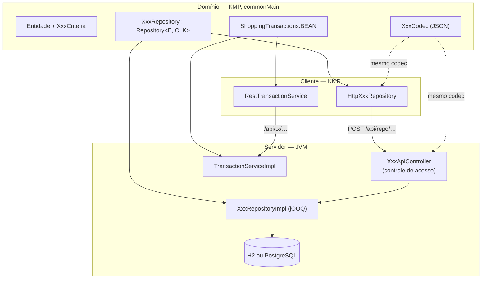

# Arquitetura de Persistência

Como o Shopping guarda e consulta dados: o contrato de repositório, os critérios, a projeção, as transações e o caminho REST. O mesmo caso de uso roda no servidor, falando com o banco, e num cliente, falando HTTP — é isso que esta arquitetura existe para garantir.

## Sumário

- [Visão geral](#visão-geral)
- [Módulos](#módulos)
- [Repositório](#repositório)
- [Critérios](#critérios)
- [Projeção](#projeção)
- [Implementação no servidor (jOOQ)](#implementação-no-servidor-jooq)
- [Esquema, migrações e codegen](#esquema-migrações-e-codegen)
- [Transações](#transações)
- [API REST](#api-rest)
- [Cliente HTTP](#cliente-http)
- [Segurança](#segurança)
- [Configuração e bancos suportados](#configuração-e-bancos-suportados)
- [Testes](#testes)
- [Como adicionar uma entidade](#como-adicionar-uma-entidade)

---

## Visão geral


```mermaid
graph TB
    subgraph "Domínio — KMP, commonMain"
        ENT["Entidade + XxxCriteria"]
        REPO["XxxRepository : Repository&lt;E, C, K&gt;"]
        CODEC["XxxCodec (JSON)"]
        TX["ShoppingTransactions.BEAN"]
    end

    subgraph "Servidor — JVM"
        IMPL["XxxRepositoryImpl (jOOQ)"]
        CTRL["XxxApiController<br/>(controle de acesso)"]
        TXS["TransactionServiceImpl"]
        DB[("H2 ou PostgreSQL")]
    end

    subgraph "Cliente — KMP"
        HTTP["HttpXxxRepository"]
        RTX["RestTransactionService"]
    end

    REPO --> IMPL
    REPO --> HTTP
    IMPL --> DB
    CTRL --> IMPL
    HTTP -- "POST /api/repo/…" --> CTRL
    CODEC -. "mesmo codec" .-> CTRL
    CODEC -. "mesmo codec" .-> HTTP
    TX --> TXS
    TX --> RTX
    RTX -- "/api/tx/…" --> TXS
```

Três ideias sustentam o desenho:

1. **Um contrato, duas implementações.** `Repository<E, C, K>` é implementado no servidor sobre jOOQ e no cliente sobre HTTP. Quem escreve um presenter ou um serviço não sabe de qual lado está.
2. **O mesmo codec nos dois lados.** Cada entidade tem um `XxxCodec` que lê e escreve a entidade e o critério em JSON. O controlador REST e o cliente HTTP usam a mesma classe, sem reflexão — o que um escreve, o outro lê.
3. **A transação é de quem conhece a unidade de trabalho.** Repositórios não abrem nem fecham transação: participam da que estiver aberta. Quem demarca é o caso de uso.

---

## Módulos

| Módulo | Plataforma | O que tem |
|---|---|---|
| `:framework-domain` | KMP | `Repository`, `Page`, critérios, projeção, codecs, contrato de transação, exceções |
| `:framework-persistence` | JVM | `TransactionServiceImpl` (JDBC), `TransactionScope`, coordenador de transações remotas |
| `:framework-jooq` | JVM | `JsonQueryBuilder`, dialetos H2 e PostgreSQL, `CriterionTranslator` |
| `:shopping-domain` | KMP | Entidades, `XxxCriteria`, `XxxCodec`, `XxxRepository`, `ShoppingTransactions` |
| `:shopping-persistence` | JVM | `XxxRepositoryImpl`, classes jOOQ geradas, autenticação, bootstrap |
| `:persistence-rest` | JVM | Controladores Javalin com o controle de acesso, `/api/tx`, `/api/auth`, `/openapi.json` |
| `:shopping-persistence-client` | KMP | `HttpRepository`, transportes por plataforma, `RestTransactionService` |
| `:shopping-scripts` | JVM | `DBCreate`, `DBReset`, migrações, gerador das classes jOOQ |

Os três módulos de persistência do Shopping ficam agrupados no diretório `br.com.wdc.kt.shopping.persistence/`, como `persistence.impl` (`:shopping-persistence`), `persistence.rest` e `persistence.client`.

No domínio, cada entidade ocupa um pacote: `domain.product`, `domain.user`, `domain.purchase`, `domain.purchaseitem`.

---

## Repositório

O contrato tem dois níveis: quem só consulta implementa (ou pede) o de leitura; o completo acrescenta a escrita.

```kotlin
interface ReadOnlyRepository<E, C, K> {
    suspend fun count(criteria: C): Int
    suspend fun fetch(criteria: C, offset: Int = 0, limit: Int = 0): List<E>
    suspend fun fetchPage(criteria: C, page: Int, pageSize: Int): Page<E>
    suspend fun fetchById(id: K, projection: E? = null): E?
    fun newProjection(): E
}

interface Repository<E, C, K> : ReadOnlyRepository<E, C, K> {
    suspend fun insert(bean: E): Boolean
    suspend fun update(newBean: E, oldBean: E? = null, projection: E? = null): Boolean
    suspend fun insertOrUpdate(newBean: E, oldBean: E?): Boolean
    suspend fun delete(criteria: C): Int
}
```

`ReadOnlyRepository` serve a duas situações:

- **Dados que não se gravam por aqui** — a visão de um painel, um relatório, um agregado calculado no banco. O repositório implementa só as consultas, sem ter de inventar o que fazer com um `insert`.
- **Código que só lê** — um serviço que declara depender de `ReadOnlyRepository` diz, pelo tipo, que não altera nada, e aceita tanto um repositório de leitura quanto um completo.

As quatro entidades do Shopping têm repositório completo.

- **`update` é parcial.** A `projection` diz quais campos considerar; com `oldBean`, só entram os que mudaram. Sem nenhuma das duas, vale a projeção padrão da entidade.
- **`insertOrUpdate`** insere quando `oldBean` é `null` e atualiza caso contrário — não consulta o banco para decidir.
- **`fetch`**: `0` em `offset` ou `limit` significa "sem salto" e "sem limite". Atenção à ordem posicional: `fetch(c, 10)` pula dez linhas; para limitar, nomeie — `fetch(c, limit = 10)`.
- **`fetchPage`** devolve `Page(items, page, totalPages, totalItems)`.
- **`delete` com critério vazio é recusado** (`InvalidRequestException`) nas quatro entidades. Apagar tudo por esquecimento de um filtro não é um caso de uso.
- **`fetchById`** é um default da interface de cada entidade: monta o critério pela chave e chama `fetch`. Buscar por id passa, assim, pelas mesmas regras de projeção, segurança e transação das outras consultas.

Os repositórios são registrados em holders (`ProductRepository.BEAN`, …) pelo composition root: o backend e os testes registram as implementações jOOQ; os clientes, as HTTP.

---

## Critérios

Cada entidade tem um `XxxCriteria` com um campo por filtro. O campo nasce com o critério e nunca é `null`; ele acumula **pedidos de comparação**.

```kotlin
val criteria = ProductCriteria()
    .withName("Bola Wilson")                       // igualdade
    .withOrderBy(ProductCriteria.OrderBy.CHEAPEST_FIRST)

criteria.price.between(10.5, 50.5)                 // intervalo
criteria.productId.isIn(listOf(1L, 2L, 3L))        // conjunto
criteria.name.or().startingWith("Bola")            // "ou" dentro do campo…
criteria.name.containing("veda")                   // …com este outro pedido
```

- Pedidos de **um mesmo campo** combinam com `AND`; depois de `or()`, com `OR`. **Campos diferentes combinam sempre com `AND`.**
- Um campo sem pedido não filtra. Os atalhos `withXxx(valor)` ignoram `null`.
- Há três famílias, e o compilador só oferece o que cada uma admite: `Criterion` (igualdade, `ne`, `isIn`, nulidade), `ComparableCriterion` (mais `gt`/`ge`/`lt`/`le`/`between`) e `TextCriterion` (mais `like`/`ilike`/`startingWith`/`containing`).
- A **ordenação é nomeada pelo efeito** — `NAME_A_TO_Z`, `MOST_RECENT_PURCHASE_FIRST` —, e não por coluna. É o repositório que traduz o nome em colunas e acrescenta o desempate pela chave. Cada ordenação tem um índice que a sustenta, declarado no `DBCreate`.
- Alguns campos não são coluna da própria tabela: `PurchaseCriteria.productId` (compras que contêm o produto) e `PurchaseItemCriteria.userId` (itens das compras do usuário) viram `EXISTS` sobre a outra tabela. Para quem monta o filtro, são campos como os outros.

No JSON, um critério é o objeto com os pedidos, e um valor solto é atalho para igualdade:

```json
{ "price": { "p": [ { "o": "GE", "v": [10.5] }, { "o": "LE", "v": [50.5] } ] },
  "name":  { "or": true, "p": [ { "o": "LIKE", "v": ["Bola%"] }, { "o": "EQ", "v": ["Fita"] } ] },
  "productId": 3,
  "orderBy": "CHEAPEST_FIRST" }
```

Um operador que o servidor não conhece é ignorado; um `orderBy` desconhecido é recusado com 400, dizendo o valor recebido e os aceitos.

---

## Projeção

A projeção é uma instância da própria entidade: **campo preenchido significa "traga este campo"**. Os valores vêm de `ProjectionValues` e são só marcadores.

```kotlin
val pv = ProjectionValues
val projection = Purchase().apply {
    id = pv.i64
    buyDate = pv.instant
    user = User().apply { id = pv.i64; name = pv.str }
    items = pv.singletonList(
        PurchaseItem().apply { id = pv.i64; price = pv.f64; product = Product().apply { name = pv.str } },
        PurchaseItemCriteria().withOrderBy(PurchaseItemCriteria.OrderBy.MOST_EXPENSIVE_FIRST),
    ).withLimit(3)
}
val purchases = repo.fetch(PurchaseCriteria().withUserId(userId).withProjection(projection))
```

- Uma **associação** (`user`) é projetada por outra instância. Quando ela pede só a chave, o valor sai da própria linha, sem subconsulta.
- Uma **coleção** (`items`) é projetada por uma lista de um elemento — a forma de cada item. Com `pv.singletonList(forma, critério)` a coleção também é filtrada, ordenada e recortada. Isso atravessa o REST: a coleção de projeção trafega como um envelope `{ shape, where, limit, offset }`.
- Sem projeção, cada repositório usa a sua padrão (`newProjection()`): os campos escalares e as chaves das associações. A imagem do produto e a senha do usuário ficam de fora.

---

## Implementação no servidor (jOOQ)

Cada `XxxRepositoryImpl` declara uma vez como a entidade se relaciona com a tabela:

```kotlin
val QUERY: JsonQuery<PurchaseItem, EnPurchaseitem> = JsonQueryBuilder<PurchaseItem, EnPurchaseitem>()
    .setAlias("pi")
    .setBeanFactory(::PurchaseItem)
    .setTableFactory { alias -> EN_PURCHASEITEM.`as`(alias) }
    .setDSLContextSupplier(BaseRepositoryImpl::dsl)
    .setOrdering(::orderingOf)
    .addI64("id", { it.id }, { b, v -> b.id = v }, { it.ID })
    .addI32("amount", { it.amount }, { b, v -> b.amount = v }, { it.AMOUNT })
    .addF64("price", { it.price }, { b, v -> b.price = v }, { it.PRICE })
    .lazy { qb ->
        qb.addBeanField("product", { it.product }, { b, v -> b.product = v }, ProductRepositoryImpl.QUERY,
            { cq -> cq.where().and(cq.childTable.ID.eq(cq.superTable.PRODUCTID)) },
            { key -> key.addI64("id") { it.PRODUCTID } })
    }
    .build()
```

A partir desse mapeamento e de uma projeção, o `JsonQuery` monta **uma única consulta** que devolve o grafo pedido como JSON — associações e coleções entram como subconsultas correlacionadas — e o lê de volta nas entidades. Não há N+1, e só as colunas projetadas são selecionadas.

- As relações ficam dentro de `lazy { }` porque compra e item se referenciam mutuamente.
- O `CriterionTranslator` traduz cada campo do critério numa condição jOOQ; valores são sempre *bind values*.
- O `DSLContext` do módulo (`ShoppingDSLContext.BEAN`) usa a conexão da transação corrente ou, fora de transação, uma conexão avulsa em autocommit.
- Os repositórios não embrulham exceções: a real sobe, e a camada REST a traduz em status.

---

## Esquema, migrações e codegen

**O DDL de `DBCreate` é a fonte de verdade do esquema.** Ele cria as tabelas que faltam, roda as migrações pendentes e, num banco novo, carrega os dados de demonstração (`DBReset`).

Para mudar o esquema:

1. Altere o DDL em `DBCreate`.
2. Escreva uma `Migration_NNNN_…` que leve os bancos existentes ao mesmo resultado e registre-a em `DBCreate.run()`.
3. Regenere as classes jOOQ e faça commit do que mudar:
   ```bash
   cd fontes && ./gradlew :shopping-scripts:generateJooqSchema
   ```

Dois testes guardam isso: `JooqSchemaTest` falha se as classes geradas divergirem do DDL, e `SchemaMigrationTest` compara um banco antigo migrado com um banco novo.

**Datas.** As colunas de data/hora são `TIMESTAMP` sem fuso e guardam o instante **em UTC**, na escrita e na leitura. No domínio, a data é `kotlin.time.Instant`.

Detalhes das migrações em [shopping-scripts](../fontes/br.com.wdc.kt.shopping/br.com.wdc.kt.shopping.scripts/README.md).

---

## Transações

O contrato é `TransactionService`, com as seis propagações usuais (`required`, `requiresNew`, `mandatory`, `supports`, `notSupported`, `never`). O bloco recebe um `TransactionContext`.

```kotlin
ShoppingTransactions.BEAN.get().required { tx ->
    purchaseRepo.insert(purchase)
    purchaseItemRepo.insert(item)
    // tx.setRollbackOnly() desfaz tudo sem lançar exceção
}
```

- **Retorno normal confirma; qualquer exceção desfaz** e sobe intacta, com o tipo original.
- O caso de uso deve tolerar a ausência do serviço — `ShoppingTransactions.BEAN.getOrNull()` — e executar direto nesse caso (testes sem persistência).
- É assim que o checkout funciona: `CartManager.doPurchase` grava a compra e os itens dentro de `required`. Uma falha no meio não deixa compra órfã.

Há duas implementações, e o caso de uso não sabe qual está usando:

| Onde | Implementação | O que faz |
|---|---|---|
| Servidor | `TransactionServiceImpl` | Transação JDBC na conexão do `DataSource` do módulo |
| Cliente REST | `RestTransactionService` | Abre uma **transação remota** no servidor e a fecha por HTTP |

### Transação remota

Um cliente REST que precise de várias escritas atômicas abre uma transação no servidor:

1. `POST /api/tx/begin` → `{ "txId": "…" }`
2. As escritas seguintes levam o cabeçalho `X-Tx-Id` e se juntam à mesma transação física.
3. `POST /api/tx/commit` ou `POST /api/tx/rollback` encerra. `GET /api/tx/status` diz o que houve, para quem perdeu a resposta.

O `RestTransactionService` faz isso por baixo de `required { }`. No servidor, um coordenador guarda as transações abertas e aplica as defesas:

- **Dono.** A transação pertence a quem a abriu — o usuário autenticado ou, sem segurança, o `X-Client-Id` — e ninguém mais a usa (403).
- **Cabeçalho perdido.** Uma escrita **sem** `X-Tx-Id` de quem tem transação aberta é recusada (409), em vez de confirmar sozinha fora da transação.
- **Abandono.** Transação ociosa é desfeita pelo servidor; há tetos de transações abertas, no total e por dono (429).
- **Repetição.** Repetir o mesmo desfecho é inócuo; pedir o oposto é conflito (409).

Dois limites para ter em mente:

- **Leituras não participam** da transação remota: dentro do bloco, um `fetch` enxerga só o que já foi confirmado.
- `notSupported` dentro de uma transação remota serve para ler, não para escrever — o servidor não distingue "transação suspensa" de "cabeçalho perdido". Para escrever por fora, use `requiresNew`.

A transação corrente do cliente é guardada por instância do serviço (uma por aplicação). As ações da apresentação rodam em série e o HTTP é bloqueante; por isso, **as chamadas de uma transação remota devem ser sequenciais**.

---

## API REST

Todas as entidades têm as mesmas operações, sob `/api/repo/<entidade>` (`user`, `product`, `purchase`, `purchase-item`):

| Rota | Transacional | Corpo | Resposta |
|---|---|---|---|
| `POST …/insert` | sim | entidade | `{success, id}` |
| `POST …/update` | sim | entidade parcial — as chaves presentes são os campos a atualizar | `{success}` |
| `POST …/delete` | sim | campos do critério | `{count}` |
| `POST …/count` | não | campos do critério | `{count}` |
| `POST …/fetch` | não | critério + `projection?` + `offset?` + `limit?` | `{items}` |
| `POST …/fetch-page` | não | critério + `projection?` + `page` + `pageSize` | `{items, totalItems}` |
| `POST …/fetch-by-id` | não | `{id, projection?}` | entidade ou 404 |
| `GET …/{id}` | não | — | entidade ou 404 |
| `GET product/{id}/image` | não (pública) | — | bytes; 204 sem imagem |
| `PUT product/{id}/image` | sim | bytes | `{success}` |

Toda escrita é atômica: roda na transação remota indicada por `X-Tx-Id` ou, sem ela, numa transação própria da requisição.

Erros voltam como `{"error": "…"}`:

| Status | Quando |
|---|---|
| 400 | Pedido inválido: `orderBy` desconhecido, `delete` sem filtro, `update` sem id |
| 401 | Token ausente ou inválido (com a segurança ligada) |
| 403 | Falta permissão, ou a linha está fora do alcance do usuário |
| 409 | Conflito de transação remota |
| 429 | Transações remotas abertas demais |

**A descrição completa está em `GET /openapi.json`** (OpenAPI 3). Os campos de critério, as ordenações e os operadores que ela lista são lidos do domínio em tempo de execução, e o `OpenApiSpecTest` confere que cada rota documentada existe.

---

## Cliente HTTP

`HttpReadOnlyRepository<E, C, K>` implementa as consultas uma vez para todas as entidades, e `HttpRepository<E, C, K>` o estende com a escrita; cada `HttpXxxRepository` só informa o codec e o caminho. Um repositório de somente leitura no cliente estende `HttpReadOnlyRepository` diretamente. O `HttpProductRepository` acrescenta a leitura e a gravação da imagem.

O `HttpTransport` tem uma implementação por plataforma — `OkHttpTransport` (JVM e Android), `JsHttpTransport`, `WasmHttpTransport` e `IosHttpTransport` —, todas bloqueantes. Cada uma:

- envia o token de acesso e, no 401, renova a sessão e repete a chamada uma vez;
- envia `X-Client-Id` sempre, e `X-Tx-Id` quando há transação remota corrente;
- transforma a resposta de erro na exceção que o servidor lançou — 400 `InvalidRequestException`, 403 `AccessDeniedException`, 409 `TransactionConflictException`, 429 `TransactionLimitExceededException`; o resto, `BusinessException`. A mensagem é sempre `HTTP <status>: <corpo>`.

`RestRepositoryBootstrap.initialize(config, cryptoProvider)` registra os quatro repositórios HTTP, o serviço de autenticação e o `RestTransactionService`. Todo entry point de cliente o chama.

---

## Segurança

**O controle de acesso fica na fronteira HTTP, e só nela.** Os repositórios não conferem permissão nem dono dos dados. Um repositório é chamado de dois lugares:

- **De um cliente** (Compose, nativo), pela API REST. O usuário controla o cliente e pode pedir o que quiser; por isso cada controlador confere o pedido antes de executá-lo.
- **De dentro do servidor**, pelos presenters da view remota. Ali o usuário não tem como chamar um repositório: só o que a apresentação pedir é executado. A garantia é a apresentação estar correta — pedir sempre os dados de quem está logado.

Com `security.jwt.secret` configurado, o backend exige autenticação em `/api/repo` e `/api/tx`, e cada controlador confere (`ApiSecurity`):

- a **permissão** (`<entidade>:read`, `:write`, `:delete`), dada pelos papéis do usuário;
- o **alcance**: quem não tem `data:all` só lê e escreve o que é seu — o próprio usuário, as próprias compras e os itens delas. Uma compra inserida por um cliente é sempre dele. Buscar pela chave passa pela mesma restrição: o que é de outro "não existe" (404).

**A senha nunca sai pela API.** Ela é aceita na escrita de usuário e retirada de toda projeção e de toda resposta, inclusive quando o usuário vem dentro de uma compra — com a segurança ligada ou não.

Sem o segredo, a API fica aberta e `/api/auth` não existe: é o modo de desenvolvimento e o dos testes que não tratam de segurança.

**Na apresentação**, o cuidado é com o que chega pela navegação: um parâmetro de rota é escolhido pelo usuário. Quando ele identifica um dado — o `purchaseId` do recibo, por exemplo —, o serviço busca restringindo a quem está logado (`ReceiptService.loadReceipt(purchaseId, userId)`), e nunca só pela chave.

---

## Configuração e bancos suportados

O backend roda em **H2** (padrão: arquivo no diretório de dados) ou em **PostgreSQL**; o banco é escolhido pela URL. As conexões vêm de um pool Agroal.

As chaves ficam na seção `[database]` do `config/application.toml`, no diretório de trabalho do backend: `url`, `username`, `password`, `schema` (só PostgreSQL), `reset`, `logSql`, `pool.*` e `remoteTransaction.*`. Todas, com os padrões, estão em [`application.example.toml`](../fontes/work/config/application.example.toml).

A ordem de subida, em `BusinessContext`:

1. Diretório de trabalho (obrigatório: `--workdir=<pasta>` ou `SHOPPING_WORKDIR`), log e configuração (`config/application.toml`); depois criptografia e executor.
2. `SqlDataSourceSupport` monta o pool.
3. `DBCreate` cria o que falta e roda as migrações.
4. `ShoppingRepositoryBootstrap.initialize(…)` registra o `DSLContext`, o `TransactionService` e os repositórios.
5. O coordenador de transações remotas é registrado.
6. `ShoppingRepositoryBootstrap.initializeSecurity(…)`, se houver segredo JWT: registra o serviço de autenticação.

---

## Testes

Os testes de repositório são escritos uma vez, em classes `AbstractXxxRepositoryTest`, e rodam em dois modos: **local** (repositório jOOQ direto) e **REST** (cliente HTTP → Javalin embutido → repositório). Assim o caminho REST prova que devolve o mesmo que o local.

```bash
cd fontes
./gradlew test                              # suíte em H2
./gradlew :shopping-tests:testPostgres      # a mesma suíte em PostgreSQL embutido
./gradlew check                             # as duas
```

- `testPostgres` sobe sozinho um PostgreSQL embutido. Com `SHOPPING_TEST_PG_URL` (e `SHOPPING_TEST_PG_USER`, `SHOPPING_TEST_PG_PASSWORD`) usa esse servidor — **e apaga os dados dele**; aponte para um esquema dedicado com `?currentSchema=…`.
- `RestTestEnvironment(nome, jwtSecret = "…")` sobe o servidor com a segurança ligada; `env.loginAs("admin")` autentica o cliente.
- `LiveBackendSmokeTest` exercita um backend no ar como um cliente REST faria (login, catálogo, checkout, extrato). Só roda com `SHOPPING_LIVE_BACKEND_URL` definida, e grava uma compra nesse backend.

---

## Como adicionar uma entidade

1. **Domínio** (`:shopping-domain`, pacote `domain.<entidade>`): a entidade (`KeyedEntity`, campos anuláveis), o `XxxCriteria` com os campos de filtro e o `OrderBy`, o `XxxCodec` e a interface `XxxRepository` com `newProjection()`, `fetchById` e o holder `BEAN`.
2. **Esquema** (`:shopping-scripts`): a tabela, a sequência e os índices das ordenações em `DBCreate`; a migração para os bancos existentes; a carga em `DBReset`, se couber. Regenere as classes jOOQ.
3. **Servidor** (`:shopping-persistence`): o `XxxRepositoryImpl` com o mapeamento `QUERY`, as condições e a ordenação; o registro em `ShoppingRepositoryBootstrap`.
4. **REST** (`:persistence-rest`): o `XxxApiController`, **com a conferência de permissão e de alcance** (`ApiSecurity`), e o registro em `RepositoryApiRoutes`; as permissões em `Role`; a entidade em `RepositoryApiDocs`.
5. **Cliente** (`:shopping-persistence-client`): o `HttpXxxRepository` e o registro em `RestRepositoryBootstrap`.
6. **Apresentação**: o acesso em `ShoppingApplication`. Nos serviços, peça sempre os dados de quem está logado.
7. **Testes**: um `AbstractXxxRepositoryTest` com as subclasses local e REST, e um teste REST com a segurança ligada.

Para dados de somente leitura (um painel, por exemplo), a interface estende `ReadOnlyRepository`, o cliente estende `HttpReadOnlyRepository`, e o controlador registra só `count`, `fetch`, `fetch-page` e `fetch-by-id`.

Os quatro repositórios existentes servem de modelo; `Product` é o mais simples e `Purchase`/`PurchaseItem` mostram associações, coleção e relação mútua.
