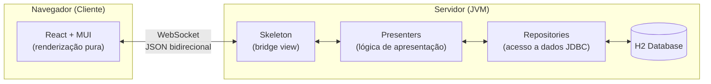
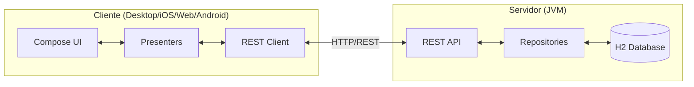
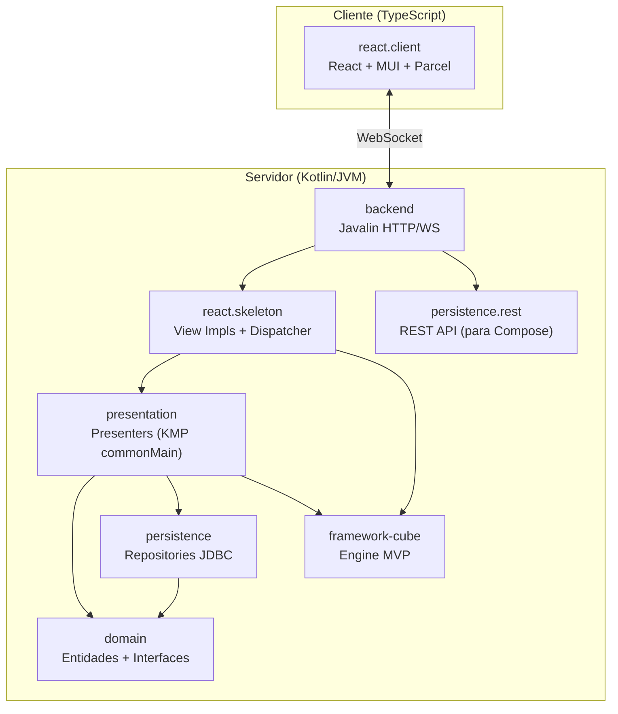
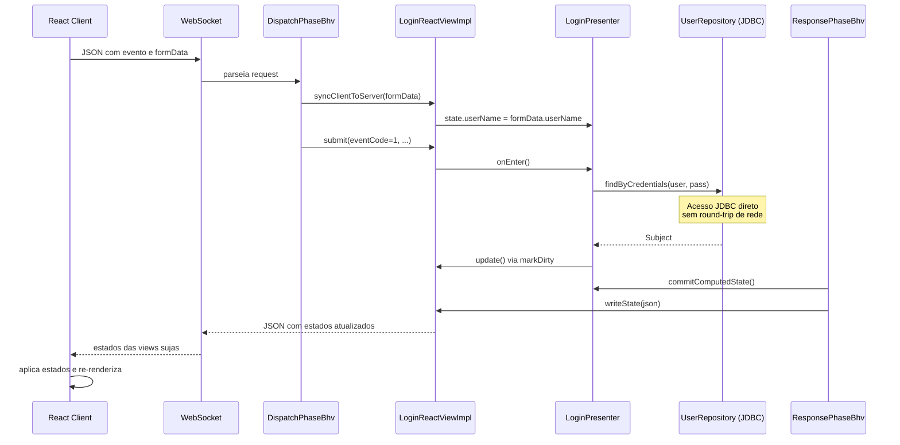
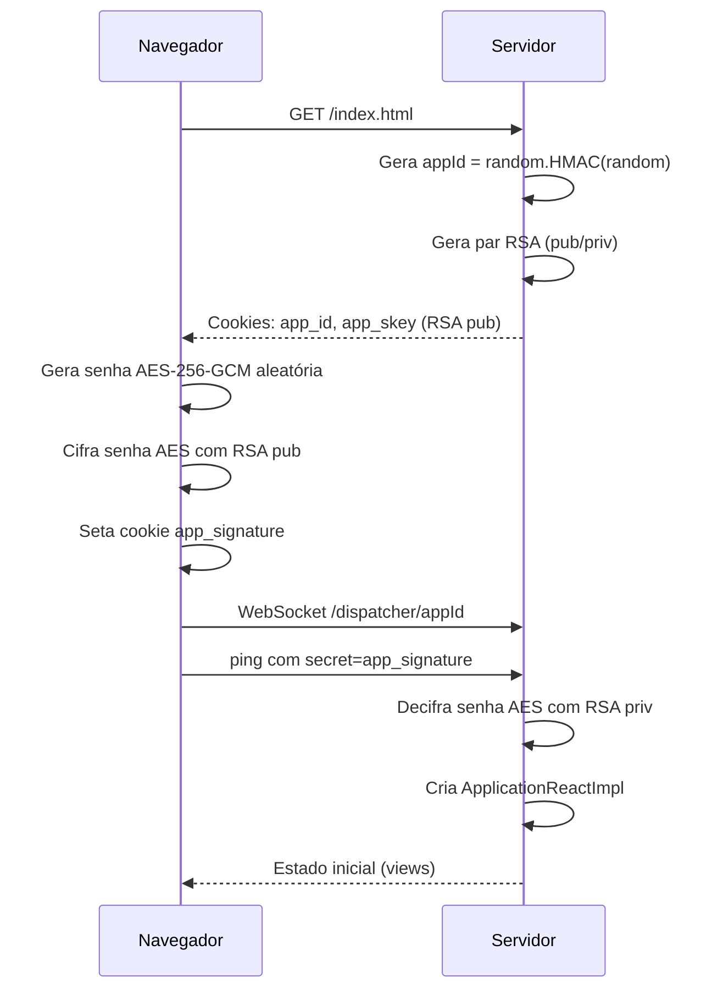
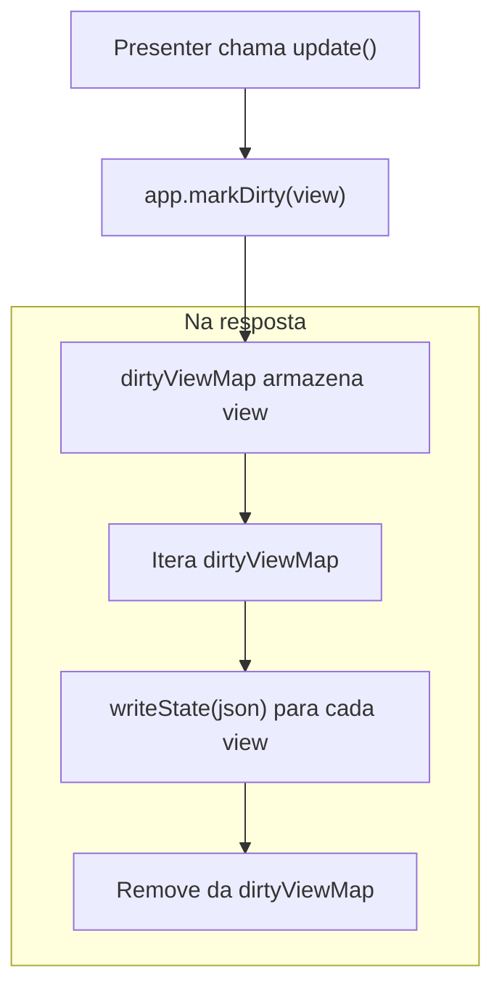
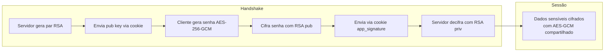
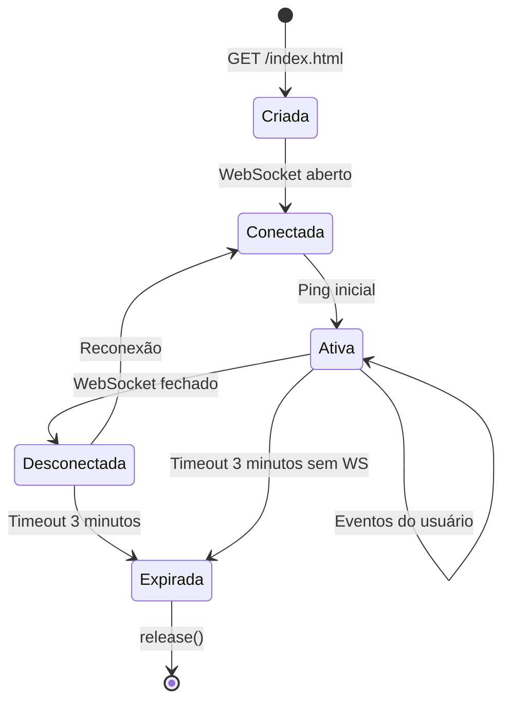
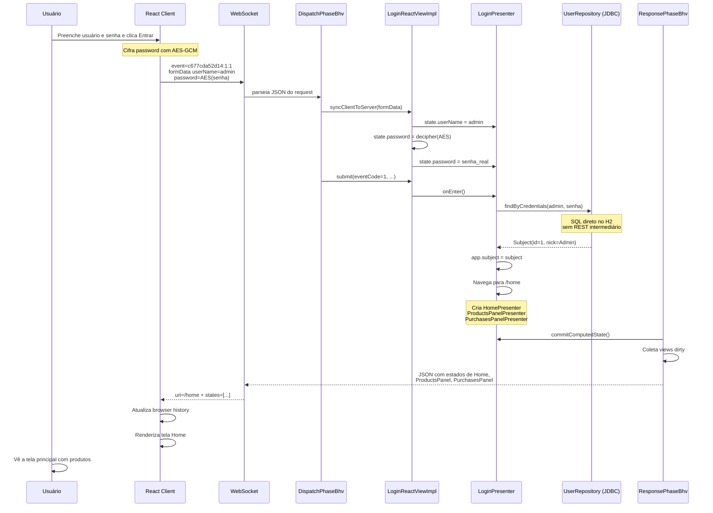

# Arquitetura React — View Remota com Presenters no Servidor

## Sumário

- [Visão Geral](#visão-geral)
- [Comparação: View Local vs View Remota](#comparação-view-local-vs-view-remota)
- [Estrutura de Módulos](#estrutura-de-módulos)
- [Ciclo de Comunicação](#ciclo-de-comunicação)
- [Estabelecimento de Sessão](#estabelecimento-de-sessão)
- [Protocolo WebSocket](#protocolo-websocket)
- [Skeleton — A Ponte entre Presenter e Cliente](#skeleton--a-ponte-entre-presenter-e-cliente)
- [Sincronização de Estado](#sincronização-de-estado)
- [Segurança](#segurança)
- [Gerenciamento de Sessão e Ciclo de Vida](#gerenciamento-de-sessão-e-ciclo-de-vida)
- [Vantagens da View Remota](#vantagens-da-view-remota)
- [Casos de Uso Ideais](#casos-de-uso-ideais)
- [Exemplo Completo: Fluxo de Login](#exemplo-completo-fluxo-de-login)

---

## Visão Geral

A arquitetura React implementa uma **view remota** onde a camada de apresentação (presenters) executa inteiramente no servidor. O cliente React é responsável apenas pela **renderização da interface**, sem conter lógica de negócio ou de apresentação. Toda a interação do usuário é transmitida ao servidor via WebSocket, e o servidor responde com o novo estado serializado em JSON.



Isso contrasta com a arquitetura Compose Multiplatform, onde os presenters executam no cliente e acessam dados via REST:



---

## Comparação: View Local vs View Remota

| Aspecto | Compose (View Local) | React (View Remota) |
|---------|---------------------|---------------------|
| **Execução dos Presenters** | No cliente | No servidor |
| **Acesso a dados** | Via REST (rede) | Direto JDBC (in-process) |
| **Latência de dados** | HTTP round-trip | Zero (mesma JVM) |
| **Estado da sessão** | No dispositivo | No servidor |
| **Lógica no cliente** | Presenters + UI | Apenas UI |
| **Protocolo** | HTTP/REST | WebSocket |
| **Segurança de dados** | API exposta | Dados nunca saem do servidor |
| **Escalabilidade** | Processamento no cliente | Processamento no servidor |
| **Funcionamento offline** | Possível | Requer conexão |

---

## Estrutura de Módulos



| Módulo | Papel |
|--------|-------|
| **react.client** | Renderização pura em React/TypeScript com Material UI. Recebe estados JSON e envia eventos do usuário. Empacotado com Parcel. |
| **react.skeleton** | Bridge server-side: cada `*ReactViewImpl` traduz eventos do cliente para chamadas no presenter e serializa o ViewState para JSON. |
| **backend** | Servidor Javalin que hospeda o WebSocket (`/dispatcher/{id}`), serve arquivos estáticos do React e expõe a REST API para clientes Compose. |
| **presentation** | Presenters compartilhados (KMP commonMain) — o mesmo código usado tanto pelo React quanto pelo Compose. |
| **persistence** | Implementação JDBC/H2 dos repositórios — usada diretamente pelos presenters na arquitetura React. |
| **persistence.rest** | Endpoints REST — usados pelos clientes Compose via `persistence.client`. |

---

## Ciclo de Comunicação



O ciclo completo acontece em uma única troca WebSocket — o cliente envia o evento, o servidor processa e responde com o novo estado. Não há chamadas REST intermediárias.

---

## Estabelecimento de Sessão

A sessão é estabelecida em duas etapas com troca de chaves criptográficas:



O `appId` é auto-assinado: `{random}.{HMAC(random)}` — isso impede a fabricação de IDs de sessão.

---

## Protocolo WebSocket

### Cliente → Servidor (Evento do Usuário)

```json
{
  "requestId": 42,
  "event": ["c677cda52d14:1:1"],
  "c677cda52d14:1": {
    "userName": "admin",
    "password": "<cifrado AES-GCM em Base64>"
  }
}
```

- **`event`**: lista de `vsid:eventCode` (qual view e qual ação)
- **`vsid`**: identificador da instância da view (`hexVID:instanceNumber`)
- **Dados do formulário**: indexados pelo `vsid`, campos sensíveis cifrados

### Servidor → Cliente (Resposta de Estado)

```json
{
  "requestId": 42,
  "uri": "/home",
  "states": [
    {
      "id": "473dbdd7a36a:3",
      "nickName": "Admin",
      "cartItemCount": 0,
      "productsPanelViewId": "a1b2c3d4e5f6:4",
      "purchasesPanelViewId": "b3c4d5e6f7a8:5"
    },
    {
      "id": "a1b2c3d4e5f6:4",
      "products": [...]
    }
  ]
}
```

- **`states`**: apenas as views que mudaram (dirty tracking)
- **`uri`**: novo fragmento de navegação (para o browser history)
- **Referências entre views**: campos `*ViewId` apontam para outras views

---

## Skeleton — A Ponte entre Presenter e Cliente

Cada presenter tem um `*ReactViewImpl` correspondente no módulo skeleton. Essa classe implementa `GenericViewImpl` e faz três coisas:

### 1. Sincroniza dados do formulário (cliente → servidor)

```kotlin
override fun syncClientToServer(formData: Map<String, Any?>) {
    val state = presenter.state
    if (formData.containsKey("userName")) {
        state.userName = CoerceUtils.asString(formData["userName"])
    }
    if (formData.containsKey("password")) {
        // Dados sensíveis são decifrados com AES
        state.password = app.getDataSecurity()
            .b64Decipher(CoerceUtils.asString(formData["password"]) ?: "")
    }
}
```

### 2. Despacha eventos para o presenter

```kotlin
override fun submit(eventCode: Int, eventQtde: Int, formData: Map<String, Any?>) {
    if (eventCode == 1) {
        presenter.onEnter()  // Mapeia código inteiro para método do presenter
    }
}
```

### 3. Serializa o estado para JSON

```kotlin
override fun writeState(json: ExtensibleObjectOutput) {
    presenter.state.write(instanceId(), json)
}
```

O mapeamento entre View IDs hexadecimais e views é fixo e compartilhado entre cliente e servidor:

| View | Hex VID | Cliente (TSX) | Servidor (Kotlin) |
|------|---------|---------------|-------------------|
| Browser | `7b32e816a191` | BrowserView.tsx | BrowserReactViewImpl.kt |
| Root | `f2d345c4a610` | RootView.tsx | RootReactViewImpl.kt |
| Login | `c677cda52d14` | LoginView.tsx | LoginReactViewImpl.kt |
| Home | `473dbdd7a36a` | HomeView.tsx | HomeReactViewImpl.kt |
| Cart | `7eb485e5f843` | CartView.tsx | CartReactViewImpl.kt |
| Product | `48b693f67410` | ProductView.tsx | ProductReactViewImpl.kt |
| Receipt | `e8d0bd8ae3bc` | ReceiptView.tsx | ReceiptReactViewImpl.kt |
| ProductsPanel | `a1b2c3d4e5f6` | ProductsPanel.tsx | ProductsPanelReactViewImpl.kt |
| PurchasesPanel | `b3c4d5e6f7a8` | PurchasesPanel.tsx | PurchasesPanelReactViewImpl.kt |

---

## Sincronização de Estado

### Dirty Tracking

Quando um presenter chama `view.update()`, a view é marcada como "dirty" no `ApplicationReactImpl`. Na resposta, apenas views dirty são serializadas:



### Server Push

Quando uma view é marcada dirty fora do ciclo de request/response (por exemplo, por uma operação assíncrona), o servidor agenda um push automático via WebSocket após 200ms:

```kotlin
fun markDirty(view: GenericViewImpl) {
    dirtyViewMap[view.instanceId()] = view
    if (!requestInProgress && wsSession != null) {
        schedulePush()  // Push com 200ms de delay
    }
}
```

### Garbage Collection de Views

O cliente mantém um sistema de referência para views. Quando um campo `*ViewId` muda no estado de uma view pai, a view filha anterior é liberada automaticamente após 4 segundos de inatividade.

---

## Segurança

### Camada de Transporte



- **Sessão ID**: auto-assinada com HMAC — impede fabricação
- **Campos sensíveis**: cifrados end-to-end com AES-256-GCM (ex: passwords)
- **Navegação**: URLs assinadas com hash para prevenir manipulação de parâmetros

### Segurança Inerente da Arquitetura

Na view remota, os dados do repositório **nunca trafegam diretamente para o cliente**. O presenter no servidor decide exatamente quais campos expor no ViewState. Isso elimina classes inteiras de vulnerabilidades:

- Não há API REST exposta para o cliente React — nenhum endpoint para atacar
- Não há tokens JWT no cliente — a autenticação é gerenciada na sessão do servidor
- Os dados sensíveis nunca saem da JVM — o presenter filtra antes de serializar

---

## Gerenciamento de Sessão e Ciclo de Vida



- **Criação**: ao acessar `/index.html`, cookies de sessão são definidos
- **Vida útil**: 3 minutos (`DEFAULT_TIME_SPAN`) — estendida a cada interação
- **Reconexão**: se o WebSocket cair, o cliente reconecta e encontra a mesma sessão (se não expirou)
- **Limpeza**: sessões expiradas sem WebSocket ativo são removidas periodicamente
- **Logout/Desconexão**: sessão não autenticada é liberada imediatamente ao fechar o WebSocket

---

## Vantagens da View Remota

### 1. Zero Latência de Dados

Os presenters acessam repositórios JDBC diretamente na mesma JVM. Não há serialização HTTP, parsing de JSON, ou round-trips de rede para cada consulta ao banco. Uma operação que no modelo Compose requer:

```
Cliente → HTTP Request → REST Endpoint → Repository → DB → Response → HTTP Response → Cliente
```

No modelo React se reduz a:

```
Presenter → Repository → DB → Presenter
```

### 2. Superfície de Ataque Mínima

- **Sem API REST exposta** ao cliente (os endpoints REST existem apenas para clientes Compose)
- **Sem dados sensíveis no cliente** — passwords, tokens, dados de pagamento nunca chegam ao browser
- **Sem lógica de negócio no cliente** — impossível fazer engenharia reversa da lógica
- **Sessão server-side** — sem JWT ou cookies de autenticação expostos

### 3. Cliente Ultraleve

O cliente React contém apenas:
- Componentes de renderização (TSX)
- Lógica de comunicação WebSocket
- Criptografia de campos sensíveis

Não contém: validações de negócio, acesso a dados, gerenciamento de estado complexo, rotas, ou lógica de navegação.

### 4. Consistência Transacional

Como presenters e repositórios compartilham a mesma JVM, é possível usar transações JDBC normais que abrangem múltiplas operações de dados — algo difícil de coordenar quando os dados trafegam via REST.

### 5. Atualização Instantânea

Mudanças na lógica de apresentação entram em vigor imediatamente no deploy do servidor, sem necessidade de atualizar clientes. O cliente React é cache-friendly e raramente muda.

### 6. Server Push Nativo

O WebSocket bidirecional permite que o servidor envie atualizações de estado ao cliente sem que ele precise pedir. Isso habilita notificações em tempo real, atualização de dashboards, e sincronização entre abas/usuários.

---

## Casos de Uso Ideais

A arquitetura de view remota é especialmente indicada para:

| Caso de Uso | Por quê |
|-------------|---------|
| **Aplicações corporativas/internas** | Rede controlada, segurança crítica, dados sensíveis |
| **Sistemas administrativos (backoffice)** | Muitas telas CRUD, lógica complexa, poucos usuários simultâneos |
| **Aplicações financeiras** | Dados nunca saem do servidor, auditoria simplificada |
| **Sistemas com dados regulamentados (LGPD/GDPR)** | Dados pessoais permanecem no servidor, client é stateless |
| **Dashboards em tempo real** | Server push via WebSocket é nativo |
| **Aplicações que exigem consistência forte** | Transações JDBC coordenadas no servidor |
| **Ambientes com baixa largura de banda** | Trafega apenas JSON de estado, não dados brutos |

### Quando NÃO usar

| Cenário | Motivo |
|---------|--------|
| **Funcionamento offline** | Requer conexão WebSocket permanente |
| **Escala massiva (milhões de usuários)** | Cada sessão consome memória no servidor |
| **Apps mobile nativos** | Compose Multiplatform é mais adequado |
| **Jogos ou animações complexas** | Latência do WebSocket pode ser perceptível |

---

## Exemplo Completo: Fluxo de Login



Observe que no fluxo inteiro:
1. O **password nunca trafega em texto claro** — é cifrado com AES-GCM no cliente e decifrado no servidor
2. O **acesso ao banco é direto** — `UserRepository` faz SQL na mesma JVM do presenter
3. O **cliente não sabe navegar** — o servidor decide que a próxima tela é Home e envia os estados correspondentes
4. Apenas **views que mudaram** são incluídas na resposta (dirty tracking)
