# Arquitetura Cube MVP

## Sumário

- [Visão Geral](#visão-geral)
- [Conceitos Fundamentais](#conceitos-fundamentais)
- [Camadas da Arquitetura](#camadas-da-arquitetura)
- [Ciclo de Vida e Navegação](#ciclo-de-vida-e-navegação)
- [Mecanismo de Atualização da View](#mecanismo-de-atualização-da-view)
- [Execução Assíncrona com safeCall](#execução-assíncrona-com-safecall)
- [Padrão de Loading](#padrão-de-loading)
- [Tratamento de Erros](#tratamento-de-erros)
- [Estrutura Multiplataforma](#estrutura-multiplataforma)
- [Exemplo Completo: Fluxo de Login](#exemplo-completo-fluxo-de-login)

---

## Visão Geral

Cube MVP é um framework arquitetural para aplicações Kotlin Multiplatform que implementa o padrão **Model-View-Presenter** com um sistema de navegação hierárquica baseado em **Places** (lugares). A arquitetura foi projetada para:

- **Separação total** entre lógica de apresentação e tecnologia de UI
- **Navegação declarativa** com suporte a deep-linking e histórico
- **Execução multiplataforma** — o mesmo código de apresentação roda em JVM, Android, iOS e WebAssembly
- **Serialização de estado** — cada tela pode persistir e restaurar seu estado via URL/parâmetros

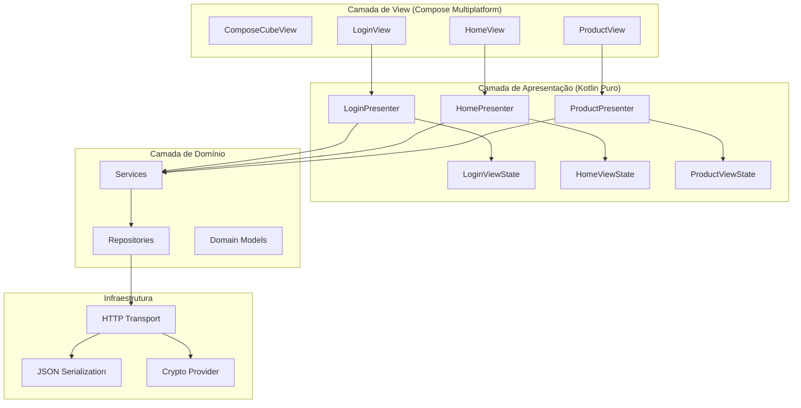

---

## Conceitos Fundamentais

### Place (Lugar)

Um **Place** representa um destino de navegação na aplicação. Cada Place possui:

- Um **id numérico** único para cache de presenters
- Um **nome simbólico** para deep-linking (ex: `"public/login"`, `"home"`, `"cart"`)
- Uma **factory de presenter** para criar ou reutilizar a instância associada

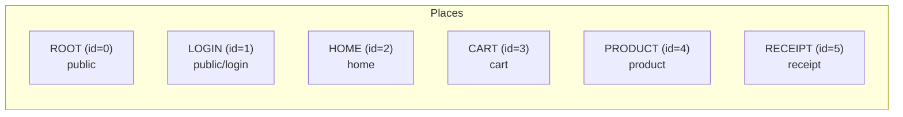

### Hierarquia de Navegação

A navegação no Cube MVP é **hierárquica** — cada rota é composta por uma sequência de **steps** (passos). O sistema cria/reutiliza presenters na ordem definida:

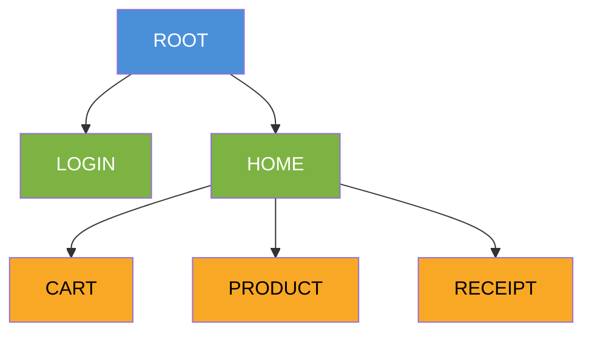

| Rota                      | Steps                            |
|---------------------------|----------------------------------|
| Login                     | `ROOT → LOGIN`                   |
| Home (lista de produtos)  | `ROOT → HOME`                    |
| Detalhe do produto        | `ROOT → HOME → PRODUCT`          |
| Carrinho                  | `ROOT → HOME → CART`             |
| Recibo da compra          | `ROOT → HOME → RECEIPT`          |

### CubeIntent (Intenção)

O **CubeIntent** é o container de dados que trafega pela hierarquia de navegação. Possui dois tipos de dados:

- **Parameters** — dados de rota serializáveis (ex: `productId`, `purchaseId`), usados para deep-linking e histórico
- **Attributes** — dados efêmeros da transação de navegação (ex: slots de view, flags temporárias)

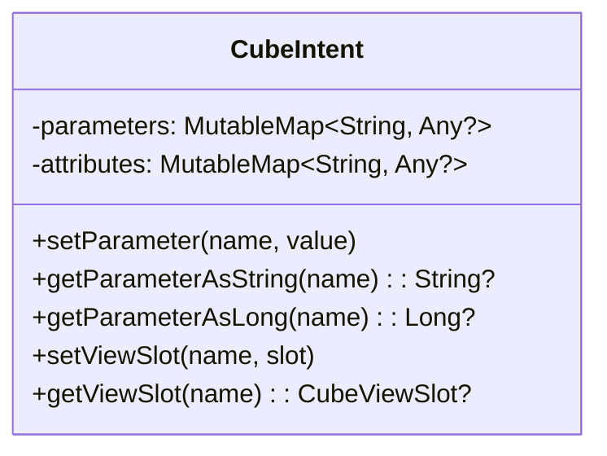

### ViewSlot (Encaixe de View)

O **CubeViewSlot** é o mecanismo pelo qual um presenter pai injeta a view de um presenter filho na posição correta da interface. É uma interface funcional simples:

```kotlin
fun interface CubeViewSlot {
    fun setView(view: CubeView)
}
```

O pai cria o slot e o passa via CubeIntent. O filho recebe o slot e insere sua view nele.

---

## Camadas da Arquitetura

### Diagrama de Módulos

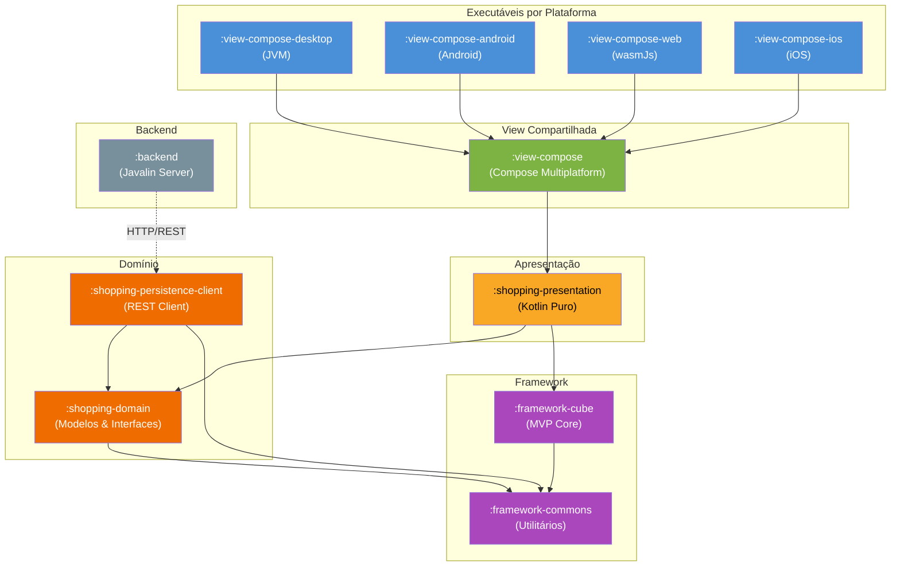

### Interfaces do Framework Core

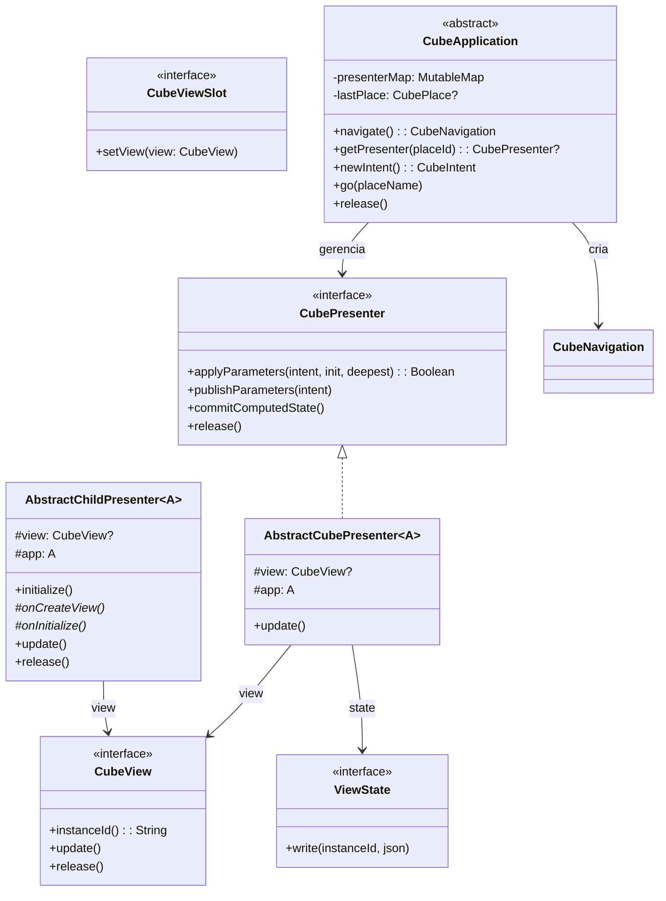

### Camada de Apresentação

Os **Presenters** encapsulam toda a lógica de negócio da tela. São classes Kotlin puras, sem dependência de framework de UI:

```kotlin
class LoginPresenter(app: ShoppingApplication) : AbstractCubePresenter<ShoppingApplication>(app) {

    val state = LoginViewState()

    private val loginService = LoginService(app)

    override fun applyParameters(intent: CubeIntent, initialization: Boolean, deepest: Boolean): Boolean {
        if (initialization) {
            ownerSlot = intent.getViewSlot(PlaceAttributes.SLOT_OWNER)
            view = createView?.invoke(this)
        }
        ownerSlot?.setView(view!!)
        return false
    }

    fun onEnter() {
        state.loading = true
        update()

        val subject = loginService.fetchSubject(state.userName ?: "", state.password ?: "")
        state.loading = false

        if (subject?.id != null) {
            app.subject = subject
            Routes.home(app)
        } else {
            state.errorMessage = "Usuário ou senha não reconhecido!"
            update()
        }
    }
}
```

O **ViewState** é um objeto simples que contém os dados que a view precisa para renderizar:

```kotlin
class LoginViewState : ViewState {
    var userName: String? = null
    var password: String? = null
    var errorCode: Int = 0
    var errorMessage: String? = null
    var loading: Boolean = false
}
```

### Camada de View (Compose)

A **ComposeCubeView** é a ponte entre o framework Cube MVP e o Jetpack Compose. Cada view estende essa classe e implementa o método `Render()`:

```kotlin
class LoginView(private val presenter: LoginPresenter) : ComposeCubeView("login-view") {

    @Composable
    override fun Render() {
        val rev = revision.value  // Subscreve para recomposição

        val state = presenter.state

        // ... renderiza UI usando state.userName, state.loading, etc.

        Button(onClick = { safeCall(presenter.app) { presenter.onEnter() } }) {
            if (state.loading) {
                CircularProgressIndicator()
            } else {
                Text("Entrar")
            }
        }
    }
}
```

---

## Ciclo de Vida e Navegação

### Transação de Navegação

Toda navegação é uma **transação atômica** gerenciada pelo `CubeNavigation`. Se qualquer passo falhar, o estado anterior é restaurado (rollback).

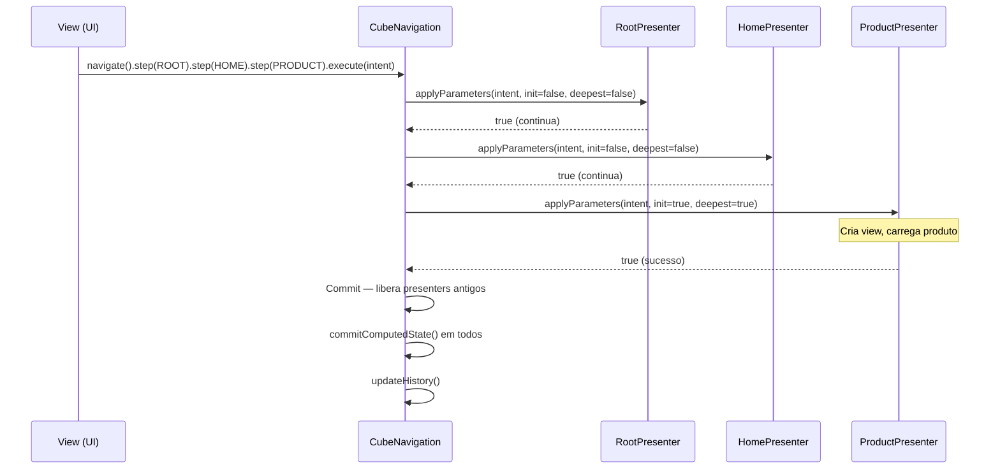

### Ciclo de Vida do Presenter

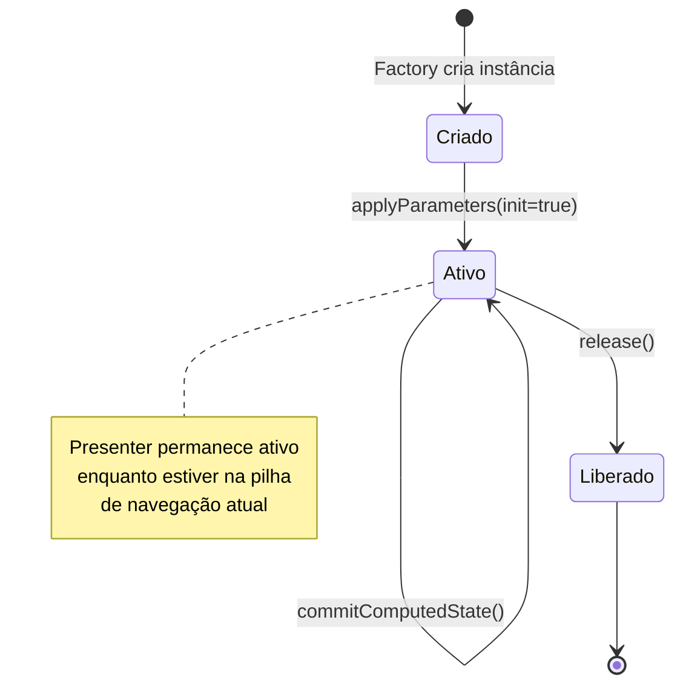

### Mecanismo de Slots

O slot é o mecanismo que conecta views pai e filho sem acoplamento direto:

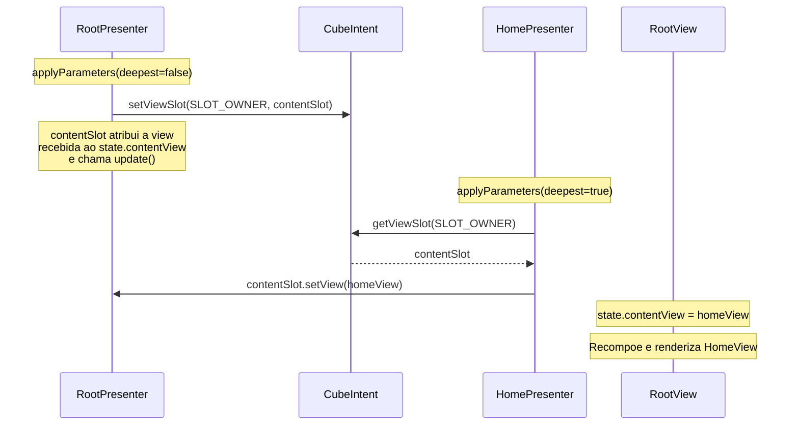

---

## Mecanismo de Atualização da View

O Cube MVP utiliza um mecanismo elegante de **revision counter** para integrar com o sistema de recomposição do Jetpack Compose:

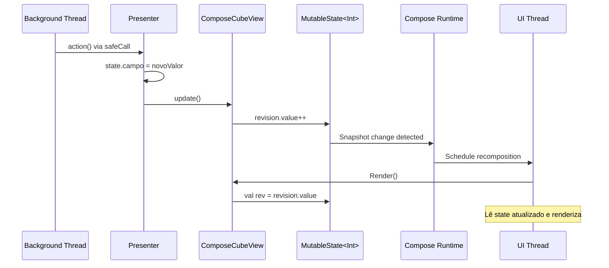

### Por que funciona?

1. O `MutableState` do Compose é **thread-safe** — mudanças em qualquer thread são detectadas pelo snapshot system
2. A leitura de `revision.value` no `@Composable` cria uma **subscrição** automática
3. Quando o valor muda, o Compose agenda uma **recomposição** na UI thread
4. Múltiplas chamadas a `update()` no mesmo frame são **coalescidas** em uma única recomposição

```kotlin
abstract class ComposeCubeView(private val id: String) : CubeView {
    val revision: MutableState<Int> = mutableIntStateOf(0)

    override fun update() {
        revision.value++  // Thread-safe, dispara recomposição
    }
}
```

---

## Execução Assíncrona com safeCall

### O Problema

No padrão MVP clássico, os presenters executam chamadas síncronas (HTTP, banco de dados). Se essas chamadas ocorressem na UI thread:

- A interface ficaria **congelada** durante a espera
- No Android, o **StrictMode** proíbe operações de rede na main thread
- A experiência do usuário seria degradada

### A Solução: Dispatcher Serial

O `safeCall` despacha a ação do presenter para uma **coroutine com paralelismo limitado a 1**, garantindo:

- **Execução serial** — as mutações de estado nunca concorrem entre si
- **UI thread livre** — a interface permanece responsiva durante chamadas lentas
- **Código síncrono** — o presenter continua escrevendo código simples e linear

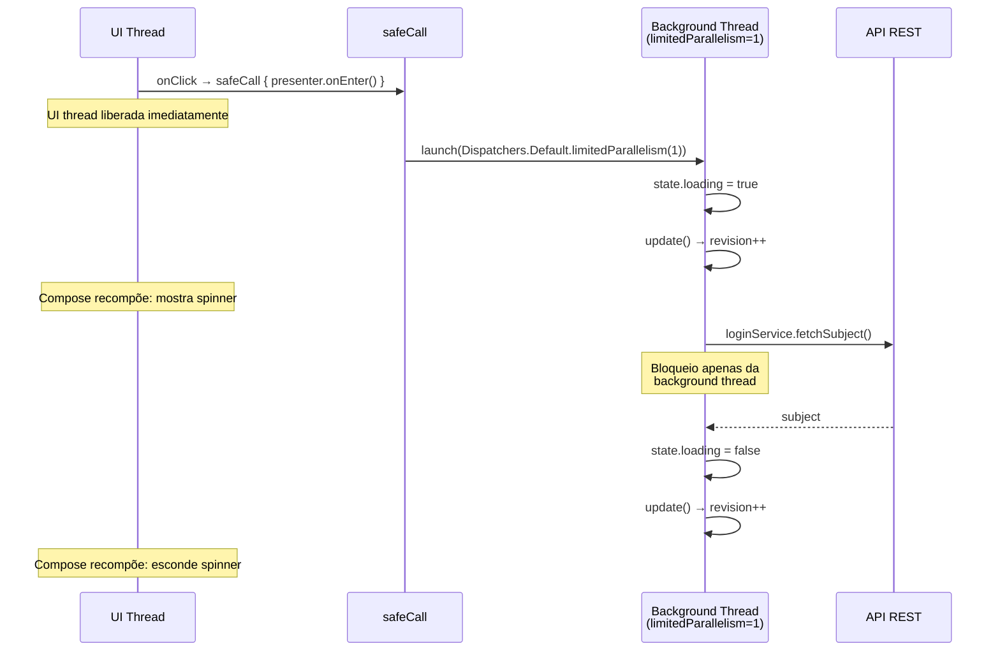

### Implementação

```kotlin
abstract class ComposeCubeView(private val id: String) : CubeView {

    protected fun safeCall(app: ShoppingApplication, action: () -> Unit) {
        presenterScope.launch {
            try {
                action()
            } catch (e: Exception) {
                app.alertUnexpectedError(LOG, "Erro inesperado em $id", e)
            }
        }
    }

    companion object {
        private val presenterScope = CoroutineScope(
            Dispatchers.Default.limitedParallelism(1)
        )
    }
}
```

### Serialização Garantida

O `limitedParallelism(1)` garante que, mesmo que múltiplas ações sejam disparadas rapidamente, elas executarão **uma de cada vez**, na ordem em que foram enfileiradas:

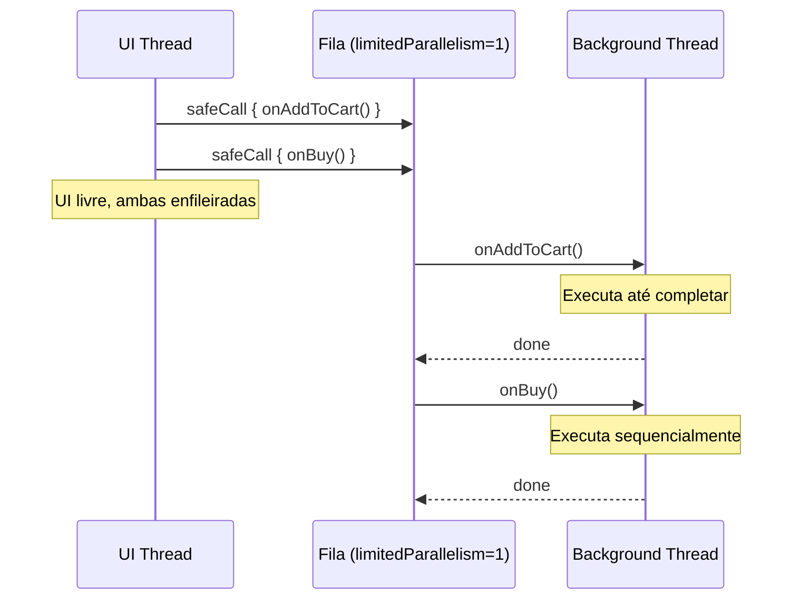

---

## Padrão de Loading

Com o `safeCall` executando fora da UI thread, é possível mostrar indicadores de carregamento de forma natural:

### No Presenter

```kotlin
fun onEnter() {
    // 1. Liga o loading e limpa erros anteriores
    state.loading = true
    state.errorCode = 0
    state.errorMessage = null
    update()  // → UI mostra spinner (UI thread livre para recompor)

    try {
        // 2. Chamada HTTP lenta (roda na background thread)
        val subject = loginService.fetchSubject(state.userName ?: "", state.password ?: "")

        // 3. Desliga o loading
        state.loading = false

        if (subject?.id != null) {
            app.subject = subject
            Routes.home(app)
        } else {
            state.errorMessage = "Usuário ou senha não reconhecido!"
            update()
        }
    } catch (caught: Exception) {
        state.loading = false
        state.errorMessage = "Falha de comunicação com o servidor."
        update()
    }
}
```

### Na View

```kotlin
@Composable
override fun Render() {
    val rev = revision.value
    val loading = presenter.state.loading

    OutlinedTextField(
        value = userName,
        enabled = !loading,  // Desabilita durante loading
        // ...
    )

    Button(
        onClick = { safeCall(presenter.app) { presenter.onEnter() } },
        enabled = !loading,  // Impede duplo-clique
    ) {
        if (loading) {
            CircularProgressIndicator(modifier = Modifier.size(24.dp))
        } else {
            Text("Entrar")
        }
    }
}
```

### Diagrama do Fluxo Visual

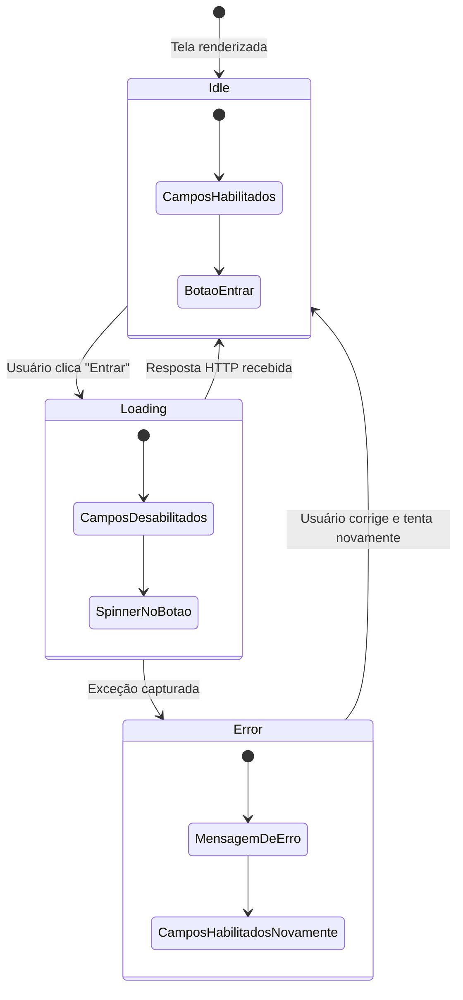

---

## Tratamento de Erros

### Hierarquia de Exceções

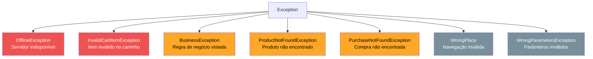

### Estratégia de Tratamento

Os erros são tratados em **dois níveis**:

1. **No Presenter** — erros esperados (login falhou, banco offline) são tratados com mensagens amigáveis no ViewState
2. **No safeCall** — erros inesperados são capturados e delegados ao `RootPresenter.alertUnexpectedError()`

```kotlin
// Nível 1: Tratamento específico no Presenter
fun onBuy() {
    try {
        val purchaseId = cart.commit(app.subject!!)
        Routes.receipt(app, intent)
    } catch (caught: InvalidCartItemException) {
        state.errorMessage = "Item com quantidade inválida"
        update()
    } catch (caught: OfflineException) {
        state.errorMessage = "Banco de dados fora do ar"
        update()
    }
}

// Nível 2: safeCall captura qualquer exceção não tratada
protected fun safeCall(app: ShoppingApplication, action: () -> Unit) {
    presenterScope.launch {
        try {
            action()
        } catch (e: Exception) {
            app.alertUnexpectedError(LOG, "Erro inesperado", e)
        }
    }
}
```

---

## Estrutura Multiplataforma

### Plataformas Suportadas

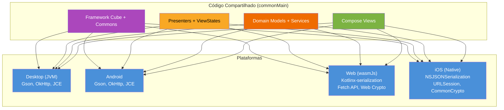

### Inicialização por Plataforma

Cada plataforma possui um entry point que:

1. **Configura dependências** específicas (JSON, HTTP, Crypto, Scheduler)
2. **Registra factories de view** (ligando Presenters a Views Compose)
3. **Cria a aplicação** e dispara a navegação inicial
4. **Renderiza** usando Compose

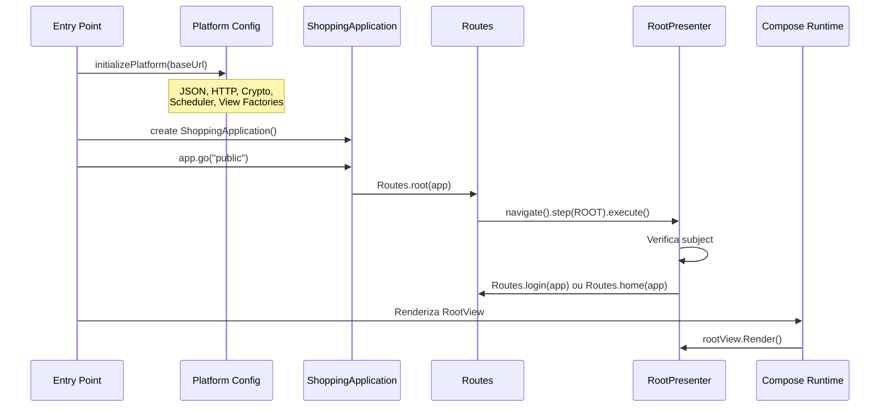

### Tabela de Implementações por Plataforma

| Componente         | JVM / Android         | wasmJs                  | iOS                     |
|--------------------|-----------------------|-------------------------|-------------------------|
| JSON               | Gson                  | Kotlinx-serialization   | NSJSONSerialization     |
| HTTP               | OkHttp                | Fetch API               | URLSession              |
| Crypto             | JCE                   | Web Crypto API          | CommonCrypto            |
| Scheduler          | ScheduledThreadPool   | setTimeout/setInterval  | dispatch_queue          |
| ThreadLocal        | java.lang.ThreadLocal | Variável global         | pthread_key             |

---

## Exemplo Completo: Fluxo de Login

O diagrama abaixo mostra o fluxo completo desde o clique no botão "Entrar" até a exibição da Home com os produtos:

```mermaid
sequenceDiagram
    actor User as Usuário
    participant LV as LoginView
    participant SC as safeCall
    participant LP as LoginPresenter
    participant LS as LoginService
    participant API as Backend REST
    participant Routes as Routes
    participant Nav as CubeNavigation
    participant HP as HomePresenter
    participant HV as HomeView

    User->>LV: Clica "Entrar"
    LV->>SC: safeCall { presenter.onEnter() }
    Note over LV: UI thread liberada

    SC->>LP: onEnter() [background thread]
    LP->>LP: state.loading = true; update()
    Note over LV: Recompõe: spinner + campos desabilitados

    LP->>LS: fetchSubject("admin", "***")
    LS->>API: POST /auth/login (challenge-response)
    API-->>LS: { subject: { id: 1, nick: "Admin" } }
    LS-->>LP: Subject(id=1, nick="Admin")

    LP->>LP: state.loading = false
    LP->>LP: app.subject = subject

    LP->>Routes: Routes.home(app)
    Routes->>Nav: navigate().step(ROOT).step(HOME).execute()

    Nav->>HP: applyParameters(init=true, deepest=true)
    Note over HP: Cria CartManager, ProductsPanel, PurchasesPanel
    HP->>HP: Injeta view no slot do Root

    Nav->>Nav: release LoginPresenter
    Nav->>Nav: commitComputedState()
    Nav->>Nav: updateHistory()

    Note over HV: Compose recompõe: renderiza Home com produtos
    HV->>User: Exibe tela principal
```

---

## Glossário

| Termo                | Definição |
|----------------------|-----------|
| **Place**            | Destino de navegação com id, nome e factory de presenter |
| **CubeIntent**       | Container de parâmetros e atributos para uma transação de navegação |
| **CubeViewSlot**     | Callback funcional para injeção de view filho em view pai |
| **Presenter**        | Controlador que encapsula a lógica de apresentação de uma tela |
| **ViewState**        | Objeto com os dados que a view precisa para renderizar |
| **ComposeCubeView**  | Ponte entre CubeView e Jetpack Compose, com mecanismo de revision |
| **safeCall**         | Despacho assíncrono serializado para ações do presenter |
| **CubeNavigation**   | Transação atômica de navegação com suporte a rollback |
| **CubeApplication**  | Container global de presenters e estado da aplicação |
| **revision**         | Contador MutableState que dispara recomposição do Compose |
