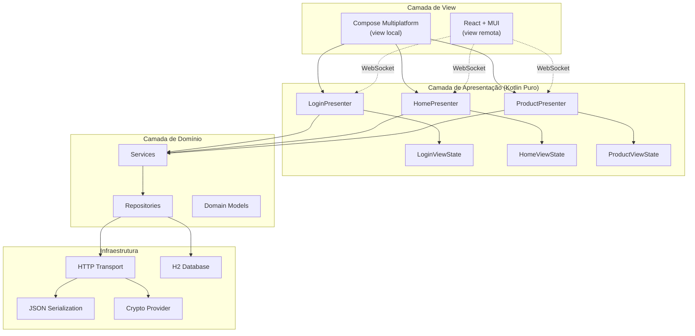
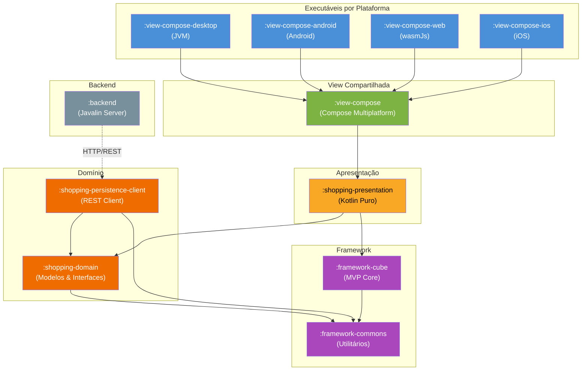
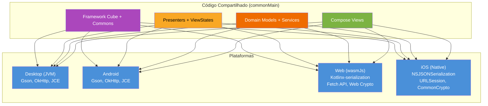
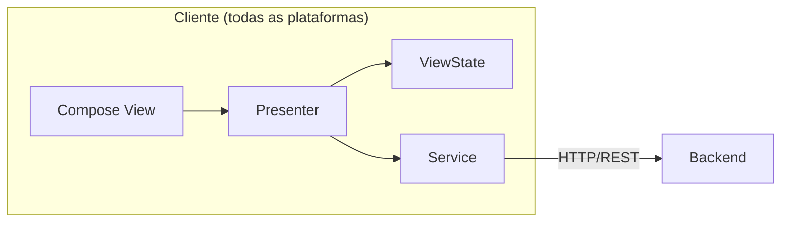
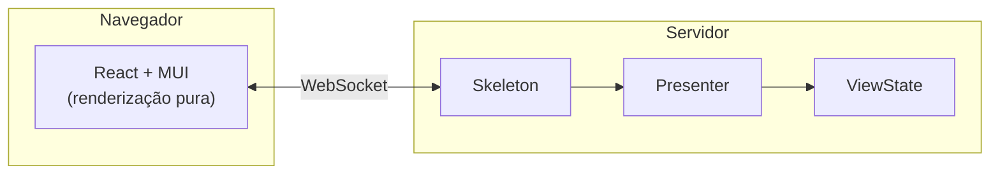
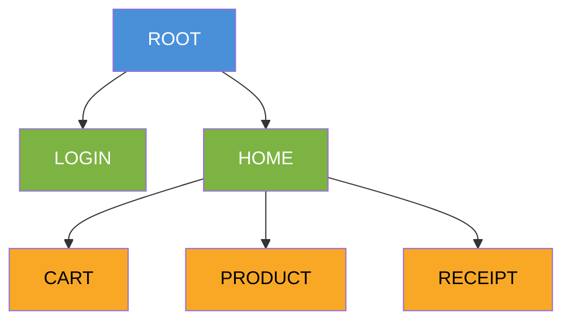
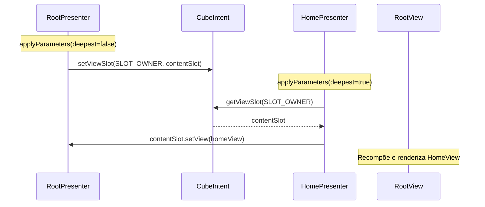
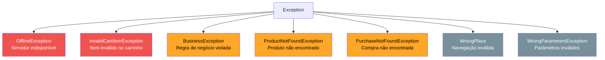
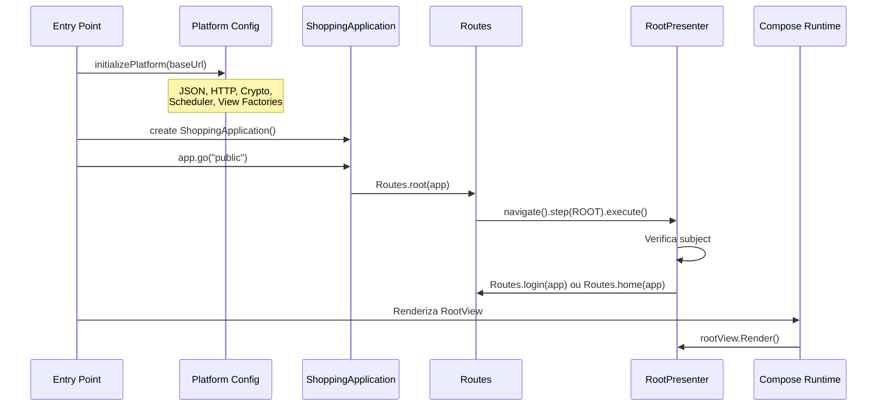
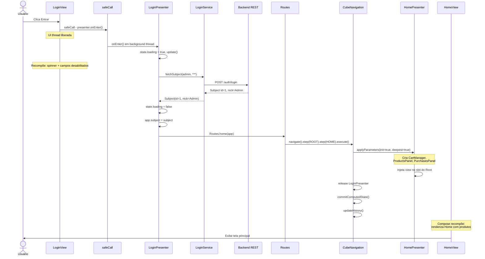

# Arquitetura do Projeto — Visão Geral

## Sumário

- [Introdução](#introdução)
- [Princípios Arquiteturais](#princípios-arquiteturais)
- [Camadas da Arquitetura](#camadas-da-arquitetura)
- [Diagrama de Módulos](#diagrama-de-módulos)
- [Estratégia Multiplataforma](#estratégia-multiplataforma)
- [Duas Modalidades de View](#duas-modalidades-de-view)
  - [View Local — Compose Multiplatform](#view-local--compose-multiplatform)
  - [View Remota — React + WebSocket](#view-remota--react--websocket)
- [Camada de Apresentação](#camada-de-apresentação)
- [Camada de Domínio](#camada-de-domínio)
- [Camada de Persistência](#camada-de-persistência)
- [Backend](#backend)
- [Integração com Compose Multiplatform](#integração-com-compose-multiplatform)
- [Tratamento de Erros](#tratamento-de-erros)
- [Inicialização por Plataforma](#inicialização-por-plataforma)
- [Exemplo Completo: Fluxo de Login](#exemplo-completo-fluxo-de-login)
- [Documentação Detalhada](#documentação-detalhada)
- [Glossário](#glossário)

---

## Introdução

Este projeto é uma aplicação de demonstração (**Shopping Demo**) construída sobre o framework **Cube MVP** em **Kotlin Multiplatform**. O objetivo é demonstrar como uma única base de código de apresentação pode ser compartilhada entre múltiplas plataformas e tecnologias de visualização distintas.

A arquitetura é centrada em três decisões fundamentais:

1. **Gerenciamento de estado com objetos mutáveis** — o framework Cube adota `ViewState` mutáveis, eliminando a cerimônia de cópias imutáveis e reducers
2. **Desacoplamento total entre apresentação e tecnologia de UI** — os presenters são classes Kotlin puras, sem dependência de framework de UI; a tecnologia de renderização é uma escolha do projeto
3. **Navegação transacional** — o `CubeNavigation` trata cada transição de tela como uma transação atômica com commit/rollback

---

## Princípios Arquiteturais

| Princípio | Descrição |
|-----------|-----------|
| **Separação de responsabilidades** | View renderiza, Presenter controla, Domain modela, Persistence acessa dados |
| **Apresentação agnóstica** | Presenters não conhecem Compose, React ou qualquer outra tecnologia de UI |
| **Estado mutável simples** | ViewState é um POJO com propriedades mutáveis — sem reducers, sem eventos, sem fluxo unidirecional |
| **Navegação como transação** | Cada navegação cria/reutiliza/descarta presenters atomicamente |
| **Multiplataforma real** | O mesmo código de apresentação roda em JVM, Android, iOS e WebAssembly |
| **Serialização de estado** | Cada tela persiste e restaura seu estado via URL/parâmetros (deep-linking) |

---

## Camadas da Arquitetura



---

## Diagrama de Módulos



| Módulo | Responsabilidade |
|--------|-----------------|
| `:framework-cube` | Motor MVP — navegação transacional, ciclo de vida de presenters, Places, Intent |
| `:framework-commons` | Utilitários compartilhados — logging, JSON, HTTP, crypto, schedulers |
| `:shopping-presentation` | Presenters e ViewStates — lógica de apresentação pura (sem UI) |
| `:shopping-domain` | Modelos de domínio, interfaces de repositório, serviços |
| `:shopping-persistence-client` | Implementação REST dos repositórios (cliente HTTP) |
| `:shopping-persistence` | Implementação JDBC dos repositórios (acesso direto ao banco) |
| `:view-compose` | Views Compose Multiplatform compartilhadas |
| `:view-compose-desktop` | Entry point JVM Desktop |
| `:view-compose-android` | Entry point Android |
| `:view-compose-web` | Entry point wasmJs (WebAssembly) |
| `:view-compose-ios` | Entry point iOS (via Xcode) |
| `:shopping-backend` | Servidor Javalin — REST API, WebSocket, H2 |
| `:shopping-scripts` | Migrations e scripts de banco |

---

## Estratégia Multiplataforma

### Plataformas Suportadas



### Implementações por Plataforma

| Componente         | JVM / Android         | wasmJs                  | iOS                     |
|--------------------|-----------------------|-------------------------|-------------------------|
| JSON               | Gson                  | Kotlinx-serialization   | NSJSONSerialization     |
| HTTP               | OkHttp                | Fetch API               | URLSession              |
| Crypto             | JCE                   | Web Crypto API          | CommonCrypto            |
| Scheduler          | ScheduledThreadPool   | setTimeout/setInterval  | dispatch_queue          |
| ThreadLocal        | java.lang.ThreadLocal | Variável global         | pthread_key             |

---

## Duas Modalidades de View

O projeto demonstra duas formas distintas de implementar a camada de visualização, ambas compartilhando a **mesma camada de apresentação**.

### View Local — Compose Multiplatform

Os presenters executam no **cliente**. A view Compose renderiza diretamente o `ViewState` do presenter local. A comunicação com o backend é feita via REST.



### View Remota — React + WebSocket

Os presenters executam no **servidor**. O cliente React é responsável apenas pela renderização. Toda interação do usuário é transmitida ao servidor via WebSocket, e o servidor responde com o novo estado serializado em JSON.



Veja [architecture-react.md](architecture-react.md) para detalhes completos desta modalidade.

---

## Camada de Apresentação

Os **Presenters** encapsulam toda a lógica de negócio da tela. São classes Kotlin puras, sem dependência de framework de UI:

```kotlin
class LoginPresenter(app: ShoppingApplication) : AbstractCubePresenter<ShoppingApplication>(app) {

    val state = LoginViewState()
    private val loginService = LoginService(app)

    override fun applyParameters(intent: CubeIntent, initialization: Boolean, deepest: Boolean): Boolean {
        if (initialization) {
            ownerSlot = intent.getViewSlot(PlaceAttributes.SLOT_OWNER)
            view = createView?.invoke(this)
        }
        ownerSlot?.setView(view!!)
        return false
    }

    fun onEnter() {
        state.loading = true
        update()

        val subject = loginService.fetchSubject(state.userName ?: "", state.password ?: "")
        state.loading = false

        if (subject?.id != null) {
            app.subject = subject
            Routes.home(app)
        } else {
            state.errorMessage = "Usuário ou senha não reconhecido!"
            update()
        }
    }
}
```

O **ViewState** é um objeto mutável simples que contém os dados que a view precisa para renderizar:

```kotlin
class LoginViewState : ViewState {
    var userName: String? = null
    var password: String? = null
    var errorCode: Int = 0
    var errorMessage: String? = null
    var loading: Boolean = false
}
```

A navegação hierárquica é feita via **Places** e **CubeNavigation**. Cada rota é uma sequência de steps:

| Rota                      | Steps                            |
|---------------------------|----------------------------------|
| Login                     | `ROOT → LOGIN`                   |
| Home (lista de produtos)  | `ROOT → HOME`                    |
| Detalhe do produto        | `ROOT → HOME → PRODUCT`          |
| Carrinho                  | `ROOT → HOME → CART`             |
| Recibo da compra          | `ROOT → HOME → RECEIPT`          |



O mecanismo de conexão entre views pai e filho usa **ViewSlots** — callbacks funcionais que desacoplam completamente o pai do filho:



Para detalhes completos do mecanismo de navegação transacional (commit, rollback, interrupção, migração de presenters), veja [architecture-cube.md](architecture-cube.md).

---

## Camada de Domínio

A camada de domínio contém:

- **Modelos** — entidades do negócio (`Product`, `Purchase`, `Subject`, etc.)
- **Interfaces de repositório** — contratos com critérios de busca (Query Object Pattern)
- **Serviços** — operações de negócio que coordenam repositórios

Os modelos e interfaces são compartilhados entre todas as plataformas (`commonMain`). As implementações de repositório variam: REST client para views locais, JDBC para o backend.

Veja [architecture-persistence.md](architecture-persistence.md) para detalhes do padrão de repositórios com critérios.

---

## Camada de Persistência

| Implementação | Módulo | Uso |
|---------------|--------|-----|
| **REST Client** | `:shopping-persistence-client` | Views locais (Compose) — chama o backend via HTTP |
| **JDBC/H2** | `:shopping-persistence` | Backend — acesso direto ao banco H2 |

A implementação REST converte critérios de domínio em query parameters HTTP. A implementação JDBC converte critérios em cláusulas SQL com bind parameters.

---

## Backend

Servidor HTTP baseado em **Javalin** (Java 21) com:

- **REST API** — endpoints para produtos, carrinho, compras, autenticação
- **WebSocket** — suporte para a modalidade de view remota (React)
- **H2 Database** — banco embarcado com migrations versionadas
- **JWT** — autenticação com access token + refresh token, sessões persistidas em banco

---

## Integração com Compose Multiplatform

A integração do Cube com Compose é feita pela classe `ComposeCubeView`, que resolve três problemas fundamentais:

- **Recomposição** — um `revision` counter (`MutableState<Int>`) é incrementado quando o presenter chama `update()`, disparando recomposição automática do Compose
- **Threading** — `safeCall` despacha ações de presenter para uma coroutine com `limitedParallelism(1)`, mantendo a UI thread livre e garantindo execução serial
- **Composição hierárquica** — `RenderSlot(view)` renderiza uma `CubeView` filha dentro de uma view pai, sem acoplamento de tipos

O padrão de **view factories** permite que cada plataforma registre suas views Compose no entry point, mantendo os presenters sem dependência de UI.

Veja [architecture-cube-compose.md](architecture-cube-compose.md) para detalhes completos: ponte ComposeCubeView, revision counter, safeCall, RenderSlot, registro de factories, inicialização por plataforma, deep-linking e padrão de loading.

---

## Tratamento de Erros

### Hierarquia de Exceções



### Estratégia de Tratamento

Os erros são tratados em **dois níveis**:

1. **No Presenter** — erros esperados (login falhou, banco offline) são tratados com mensagens amigáveis no ViewState
2. **No safeCall** — erros inesperados são capturados e delegados ao `RootPresenter.alertUnexpectedError()`

```kotlin
// Nível 1: Tratamento específico no Presenter
fun onBuy() {
    try {
        val purchaseId = cart.commit(app.subject!!)
        Routes.receipt(app, intent)
    } catch (caught: InvalidCartItemException) {
        state.errorMessage = "Item com quantidade inválida"
        update()
    } catch (caught: OfflineException) {
        state.errorMessage = "Banco de dados fora do ar"
        update()
    }
}

// Nível 2: safeCall captura qualquer exceção não tratada
protected fun safeCall(action: () -> Unit) {
    presenterScope.launch {
        try {
            action()
        } catch (e: Exception) {
            app.alertUnexpectedError(LOG, "Erro inesperado", e)
        }
    }
}
```

---

## Inicialização por Plataforma

Cada plataforma possui um entry point que:

1. **Configura dependências** específicas (JSON, HTTP, Crypto, Scheduler)
2. **Registra factories de view** (ligando Presenters a Views Compose)
3. **Cria a aplicação** e dispara a navegação inicial
4. **Renderiza** usando Compose



---

## Exemplo Completo: Fluxo de Login

O diagrama abaixo mostra o fluxo completo desde o clique no botão "Entrar" até a exibição da Home com os produtos:



---

## Documentação Detalhada

| Documento | Conteúdo |
|-----------|----------|
| [architecture-cube.md](architecture-cube.md) | Framework Cube — mecanismo de navegação transacional, ciclo de vida de presenters, interrupção e migração, commit/rollback, garantias |
| [architecture-cube-compose.md](architecture-cube-compose.md) | Integração Cube + Compose — ComposeCubeView, revision counter, safeCall, RenderSlot, view factories, inicialização por plataforma |
| [architecture-react.md](architecture-react.md) | Modalidade de view remota — React + WebSocket, Skeletons, sincronização de estado, segurança |
| [architecture-persistence.md](architecture-persistence.md) | Camada de persistência — repositórios com critérios, DbTable, Row com change tracking, SQL builder, transações |

---

## Glossário

| Termo                | Definição |
|----------------------|-----------|
| **Place**            | Destino de navegação com id, nome e factory de presenter |
| **CubeIntent**       | Container de parâmetros (serializáveis) e atributos (efêmeros) para uma transação de navegação |
| **CubeViewSlot**     | Callback funcional para injeção de view filho em view pai |
| **Presenter**        | Controlador que encapsula a lógica de apresentação de uma tela (Kotlin puro, sem dependência de UI) |
| **ViewState**        | Objeto mutável com os dados que a view precisa para renderizar |
| **ComposeCubeView**  | Ponte entre CubeView e Jetpack Compose, com mecanismo de revision counter |
| **safeCall**         | Despacho assíncrono serializado (limitedParallelism=1) para ações do presenter |
| **CubeNavigation**   | Transação atômica de navegação com commit, rollback e suporte a interrupções |
| **CubeApplication**  | Container global de presenters ativos e ponto de entrada para navegação |
| **Skeleton**         | Ponte servidor-cliente na modalidade React — serializa ViewState para WebSocket |
| **revision**         | Contador MutableState que dispara recomposição do Compose |
