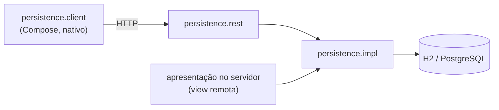

# persistence

A camada de persistência do Shopping: como os dados são guardados no servidor, expostos por HTTP e consumidos pelos clientes.

Os três subprojetos implementam, cada um do seu lado, os contratos de [shopping-domain](../br.com.wdc.kt.shopping.domain/) — os mesmos repositórios e o mesmo serviço de transação valem no servidor e no cliente.

## Subprojetos

| Subprojeto | Projeto Gradle | Plataforma | Papel |
|---|---|---|---|
| [persistence.impl/](persistence.impl/) | `:shopping-persistence` | JVM | Repositórios sobre jOOQ (H2 e PostgreSQL), classes do esquema, autenticação |
| [persistence.rest/](persistence.rest/) | `:persistence-rest` | JVM | API REST dos repositórios, com o controle de acesso; transação remota; OpenAPI |
| [persistence.client/](persistence.client/) | `:shopping-persistence-client` | KMP | Repositórios e serviço de transação sobre HTTP, com um transporte por plataforma |

O esquema do banco e as migrações ficam em [shopping-scripts](../br.com.wdc.kt.shopping.scripts/).

Veja a [arquitetura de persistência](../../../docs/architecture-persistence.md).
