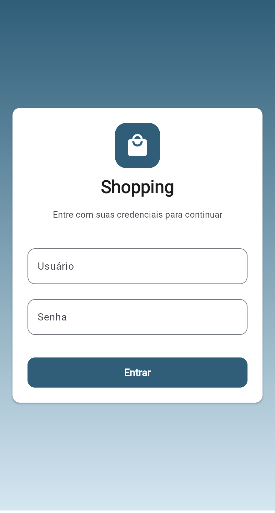
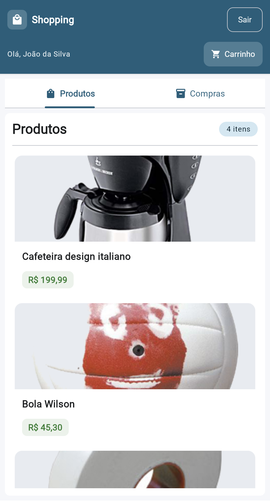
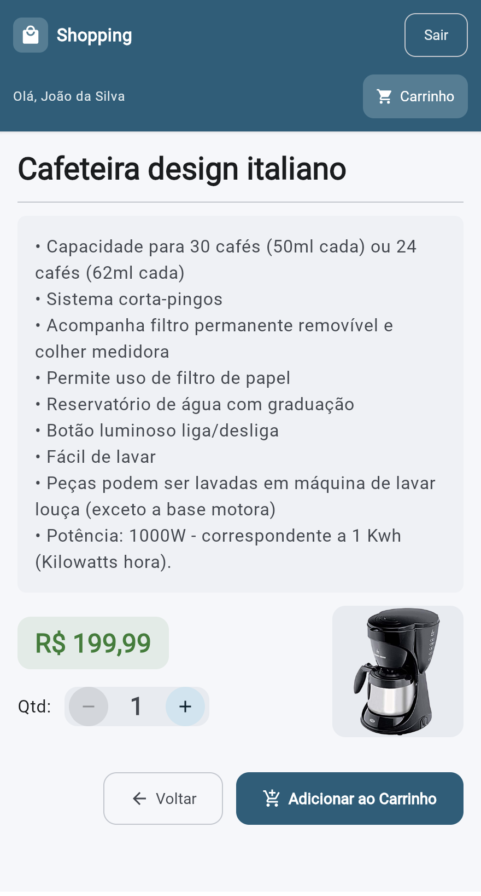
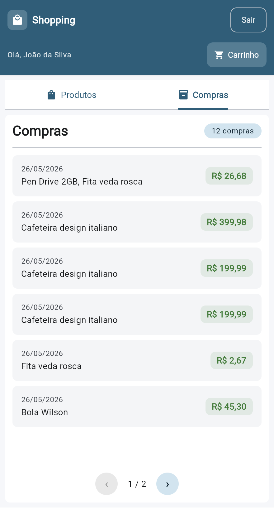
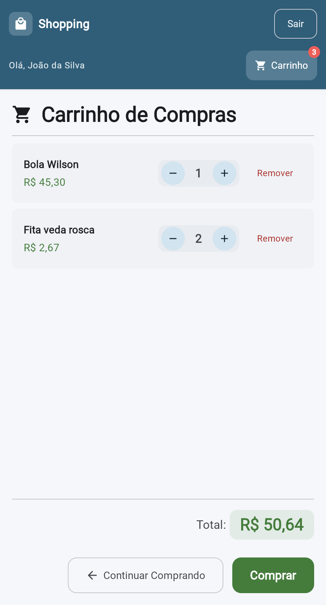

# view-compose

UI compartilhada em **Compose Multiplatform** com Material 3. Contém todas as telas e componentes comuns, consumidos pelos módulos de plataforma.

**Plataformas:** JVM, Android, iOS, wasmJs

Veja a [arquitetura Cube + Compose](../../../docs/architecture-cube-compose.md) para detalhes sobre a integração (ComposeCubeView, revision counter, safeCall, slots, view factories, inicialização por plataforma) e a [visão geral da arquitetura](../../../docs/architecture.md) para o contexto do projeto.

## Subprojetos por Plataforma

- [compose.web/](compose.web/) — Entrada Web (wasmJs/browser)
- [compose.ios/](compose.ios/) — Entrada iOS (framework nativo)
- [compose.android/](compose.android/) — Entrada Android (app)
- [compose.desktop/](compose.desktop/) — Entrada Desktop (JVM)

## Como rodar

```bash
cd fontes

# Desktop
./gradlew :view-compose-desktop:run

# Web (porta 8082)
./gradlew :view-compose-web:wasmJsBrowserDevelopmentRun

# Android
./gradlew :view-compose-android:assembleDebug

# iOS (via Xcode)
./gradlew :view-compose-ios:linkDebugFrameworkIosSimulatorArm64
```

## Telas

| Login | Produtos |
|:---:|:---:|
|  |  |

| Detalhes do Produto | Compras |
|:---:|:---:|
|  |  |

| Carrinho | Recibo |
|:---:|:---:|
|  |  |
