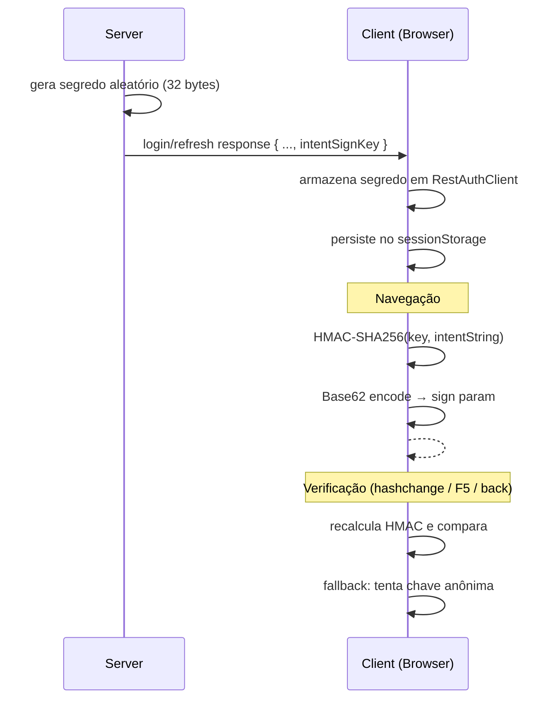

# compose.web

Ponto de entrada **Web** da aplicação Compose. Compila para **wasmJs** e roda no browser via webpack dev server (porta 8082).

```bash
cd fontes && ./gradlew :view-compose-web:wasmJsBrowserDevelopmentRun
```

O webpack proxy redireciona `/api/*` para o backend na porta 8080.

## Segurança de Navegação — Assinatura HMAC de Intents

Em uma SPA (Single Page Application), o estado de navegação fica exposto na URL
(hash fragment). Um usuário mal-intencionado poderia editar o hash manualmente
para acessar telas ou parâmetros que não lhe foram oferecidos pela aplicação.

Para mitigar isso, toda navegação é assinada com **HMAC-SHA256** e a assinatura é
incluída como parâmetro `sign` no hash fragment. Ao receber uma navegação
(inclusive F5 ou botão voltar), a assinatura é verificada localmente antes de
permitir o acesso à tela.

### Modelo: Segredo HMAC por Sessão

O design segue o modelo do **AWS Signature V4** — um segredo compartilhado por
sessão, sem round-trips ao backend para assinar ou verificar:



1. **No login/refresh**, o backend gera um segredo aleatório de 32 bytes
   (`AccessContextCache`) e o retorna no campo `intentSignKey` da resposta JSON.
2. **O client** armazena o segredo em `RestAuthClient.intentSignSecret` e o
   persiste no session storage (via `writeAuthState`/`readAuthState`).
3. **Ao navegar**, `Main.kt` calcula `HMAC-SHA256(key, intentString)` e codifica
   o resultado em Base62 (URL-safe). O hash resultante fica:
   `#restricted/product?id=42&sign=7kT9x...`
4. **Ao verificar** (hashchange, F5, back/forward), o HMAC é recalculado e
   comparado — tudo local, sem chamada ao servidor.

### Usuário Anônimo

Antes do login, uma chave fixa (`ANONYMOUS_SIGN_KEY`) é usada para assinar as
telas públicas. Após o login, a chave de sessão assume. Na verificação, ambas as
chaves são testadas para suportar a transição (ex: URL pública assinada com chave
anônima, verificada após login).

### Restauração de Sessão (F5)

No refresh da página, o auth state (incluindo `intentSignSecret`) é restaurado
do session storage **antes** da primeira navegação (`restoreAuthState` em
`main()`). Isso garante que URLs assinadas com a chave de sessão sejam
verificadas corretamente, sem cair no fallback anônimo.

### Fluxo no Código

| Etapa | Arquivo | Função/Campo |
|---|---|---|
| Geração do segredo | `AccessContextCache.kt` | `generateIntentSignSecret()` |
| Transporte no auth | `AuthResult.intentSignKey` | campo no JSON de login/refresh |
| Armazenamento client | `RestAuthClient.kt` | `intentSignSecret` |
| Persistência F5 | `RestAuthenticationService.kt` | `writeAuthState()` / `readAuthState()` |
| Restore antes do go | `Main.kt` | `restoreAuthState()` em `main()` |
| Assinatura local | `Main.kt` | `signIntent()` → `CryptoProvider.hmacSha256()` + `Base62` |
| Verificação local | `Main.kt` | `verifyIntent()` — tenta chave de sessão, fallback anônimo |

### Limitações

- **Não substitui autorização server-side.** Cada endpoint REST valida
  permissões via JWT. A assinatura de intents é uma camada de defesa em
  profundidade na UI.
- **A chave anônima é fixa e conhecida.** Telas públicas não têm proteção real
  contra manipulação de URL — o que é aceitável, pois são públicas.
- **Se o servidor reiniciar**, as sessões em memória são perdidas. O próximo
  request do client falha com 401, forçando re-autenticação e novo segredo.
