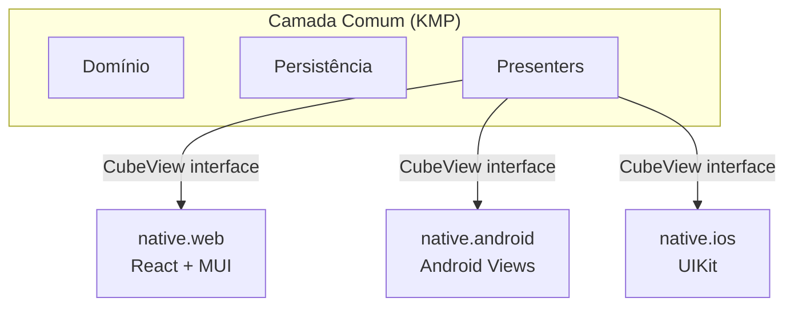

# view-native

Views implementadas com recursos **nativos de cada plataforma**, sem frameworks de abstração como Compose Multiplatform.

## Motivação

A principal motivação para o desenvolvimento de interfaces nativas é demonstrar que, mesmo utilizando apenas os recursos nativos de cada plataforma, é possível construir interfaces de qualidade equivalente às versões com frameworks declarativos.

O custo é construir com os recursos disponíveis na plataforma de destino — que pode não oferecer uma solução reativa nativa, ou pode carecer de alguns utilitários que facilitam a montagem de views. Contudo, as versões nativas **sempre terão menor desgaste de bateria** e **estarão alinhadas com as evoluções da plataforma**, sem depender de atualizações de terceiros.

## Subprojetos

| Subprojeto | Plataforma | Tecnologia de UI |
|---|---|---|
| [native.web/](native.web/) | Web (Kotlin/JS) | DOM API + React/MUI |
| [native.android/](native.android/) | Android | Android Views (programático) |
| [native.ios/](native.ios/) | iOS | UIKit via Kotlin/Native |

## Arquitetura Comum

Os três subprojetos compartilham a mesma camada de **presenters**, **domínio** e **persistência** — apenas a camada de view é específica por plataforma. A arquitetura segue o padrão **Cube MVP**:

### Padrões Transversais

- **View Factory**: cada presenter registra uma factory para sua view nativa no bootstrap da aplicação
- **ViewSlot**: container que gerencia a troca de views filhas por navegação
- **ListSlot**: sincronização eficiente de listas com reciclagem de views (grow/shrink/update-in-place)
- **FlowLayout**: grid responsivo que redistribui filhos conforme a largura disponível
- **Dirty-flag coalescing**: múltiplas chamadas `update()` são consolidadas em um único `doUpdate()` por frame
- **Layout responsivo**: breakpoints detectam largura disponível e alternam entre layouts compacto (mobile) e wide (tablet/desktop)

## Tela Principal (versão Web)

> Para capturar: acesse `http://localhost:8080/native/index.html` com o backend rodando e salve o screenshot em `screenshots/01-home-web.png`.

## Referências

- [Arquitetura Cube](../../../docs/architecture-cube.md) — mecanismo de navegação e ciclo de vida
- [Visão geral da arquitetura](../../../docs/architecture.md) — contexto do projeto
