# WDC Shopping — React Client

Frontend SPA do sistema Shopping, construído com **React 19**, **TypeScript** e **MUI 9**. Comunica-se com o backend Java via **WebSocket bidirecional**, recebendo estados serializados dos presenters e enviando eventos de volta.

## Stack

| Tecnologia | Versão | Finalidade |
|-----------|--------|------------|
| React | 19 | UI reativa |
| TypeScript | ES2024 | Tipagem estática |
| MUI (Material UI) | 9 | Componentes visuais |
| Emotion | 11 | CSS-in-JS (engine do MUI) |
| Parcel | 2.13.3 | Bundler |
| Prettier | 3.8.2 | Formatação de código |
| history | 5.3.0 | Navegação hash-based |
| universal-cookie | 7.2.2 | Gerenciamento de cookies |

## Estrutura do Projeto

```mermaid
graph TD
    src["src/"]
    src --> indexHtml["index.html"]
    src --> scripts["scripts/"]

    scripts --> indexTsx["index.tsx<br/><small>Bootstrap: tema, registro, render</small>"]
    scripts --> AppTsx["App.tsx<br/><small>Fachada da Application</small>"]

    scripts --> app["app/ — Infraestrutura"]
    app --> Application["Application.ts<br/><small>Views, formulários, WebSocket</small>"]
    app --> Flush["FlushRequestContext.ts<br/><small>Comunicação WS</small>"]
    app --> Reconnect["ReconnectController.ts<br/><small>Backoff progressivo</small>"]
    app --> DataSec["DataSecurity.ts<br/><small>RSA + AES-GCM</small>"]
    app --> ViewScope["ViewScope.ts<br/><small>Estado reativo</small>"]
    app --> ViewGC["ViewGarbageCollector.ts"]
    app --> constants["constants.ts + types.ts"]

    scripts --> utils["utils/ — Utilitários"]
    utils --> ViewUtils["ViewUtils.tsx<br/><small>Base classes</small>"]
    utils --> CryptoUtils["RSA.ts, Base64.ts, BigIntUtils.ts"]
    utils --> FormatUtils["DateUtils.ts, NumberUtils.ts"]
    utils --> OtherUtils["LangUtils.ts, EndpointUtils.ts, UTF8.ts"]

    scripts --> views["views/ — Componentes"]
    views --> BrowserView["BrowserView.tsx<br/><small>Conexão, alertas, loading</small>"]
    views --> RootView["RootView.tsx<br/><small>Container auth</small>"]
    views --> SlotView["SlotView.tsx<br/><small>Slot genérico</small>"]
    views --> LoginView["LoginView.tsx"]
    views --> HomeView["HomeView.tsx"]
    views --> ProductView["ProductView.tsx"]
    views --> CartView["CartView.tsx"]
    views --> ReceiptView["ReceiptView.tsx"]
    views --> home["home/<br/><small>HeaderPanel, ContentPanel,<br/>ProductsPanel, PurchasesPanel</small>"]
```



## Como Funciona

### Ciclo de Vida

1. **Bootstrap** (`index.tsx`): Cria o tema MUI, registra todas as views e renderiza a `BrowserView`
2. **Conexão** (`BrowserView`): Ao montar, chama `app.onStart()` que abre o WebSocket
3. **Recebimento de estado**: O backend envia `ViewStates` serializados via WebSocket → `Application.applyViewStates()` atualiza os `ViewScope`s → React re-renderiza
4. **Envio de eventos**: Ações do usuário chamam `app.submit(vsid, eventId)` que envia o evento ao presenter correspondente no backend via WebSocket

### Padrão de Views

Cada view é uma classe que estende `BaseViewClass<Props, State>` e é convertida em Functional Component via `BaseViewClass.FC()`:

```typescript
class LoginViewClass extends BaseViewClass<ViewProps, LoginViewState> {
  override render({ className }: ViewProps): React.ReactNode {
    const { state } = this
    // ... renderização baseada no state recebido do backend
  }
}

export default BaseViewClass.FC(LoginViewClass, 'c677cda52d14')
```

- O **estado** (`state`) vem do backend (presenter), não é gerenciado localmente
- **Eventos** são enviados ao backend via `app.submit(vsid, eventId)`
- **Dados de formulário** são anexados via `app.setFormField(vsid, field, value)` antes do submit
- Cada view é identificada por um **VIEW_ID** único (hash) que mapeia ao presenter no backend

### Comunicação WebSocket

- **Protocolo**: WebSocket com subprotocolo `wdc`
- **Keep-alive**: Automático a cada 15 segundos para manter a conexão ativa
- **Reconexão**: Backoff progressivo (2s, 4s, 6s, ... até 120s) com opção de reconectar imediatamente
- **Segurança**: Dados sensíveis cifrados com AES-GCM; chave trocada via RSA no handshake

### Indicador de Atividade

Um `LinearProgress` (MUI) aparece no topo da página durante submits do usuário. Características:

- `position: fixed` — não afeta o layout
- Debounce de 50ms — não pisca em operações rápidas
- Timeout de 15s — auto-limpa se a resposta não chegar
- Apenas para ações do usuário — keep-alive e ping são silenciosos

## Alias de Importação

O alias `@root/*` mapeia para `./src/scripts/*`:

```typescript
import app from '@root/App'
import { BaseViewClass } from '@root/utils/ViewUtils'
```

Configurado no `package.json` (Parcel) e `tsconfig.json` (TypeScript/IDE).

## Saída do Build

Os assets compilados são gerados diretamente no módulo `skeleton`:

```
../br.com.wdc.shopping.view.react.skeleton/src/main/resources/META-INF/resources/
```

Isso permite que o servidor Javalin sirva os arquivos estáticos automaticamente via classpath.

## Comandos

```bash
# Instalar dependências
npm install

# Desenvolvimento (watch mode com hot reload)
npm run watch

# Build de produção
npm run build

# Formatar código
npm run format

# Verificar formatação
npm run format:check
```

## Formatação (Prettier)

| Regra | Valor |
|-------|-------|
| Ponto-e-vírgula | Não |
| Aspas | Simples |
| Trailing comma | Todas |
| Largura | 120 colunas |
| Indentação | 2 espaços |
