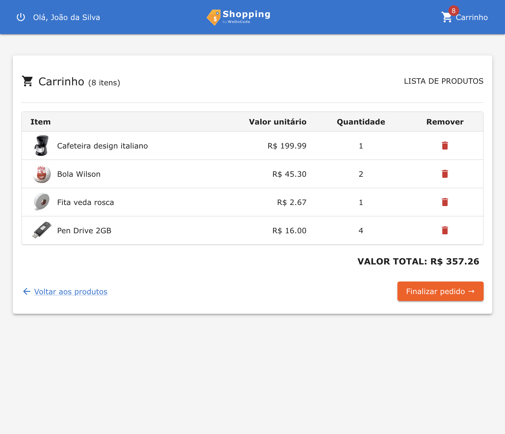
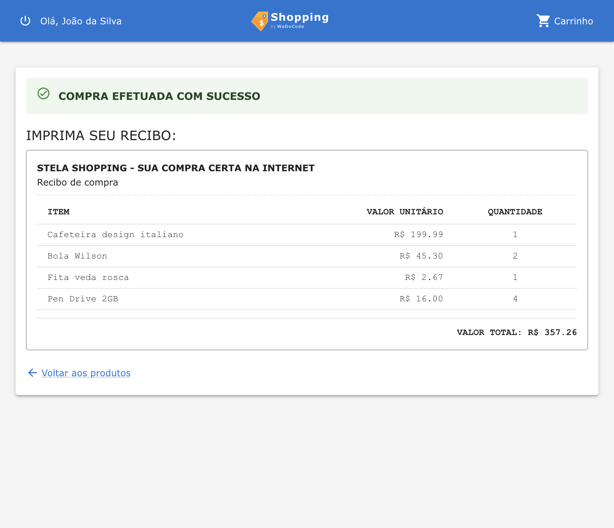

# view-react

Implementação da view usando **React** com arquitetura de **view remota** — os presenters executam no servidor e se comunicam com o cliente via WebSocket.

Veja a [documentação de arquitetura](../../../docs/architecture-react.md) para detalhes completos.

## Subprojetos

- [react.skeleton/](react.skeleton/) — Bridge server-side (Kotlin/JVM) entre presenters e cliente React
- [react.client/](react.client/) — Aplicação React/TypeScript (renderização pura)

## Telas

| Login | Home (Produtos + Compras) |
|:---:|:---:|
|  |  |

| Detalhes do Produto | Carrinho |
|:---:|:---:|
|  |  |

| Recibo |
|:---:|
|  |
